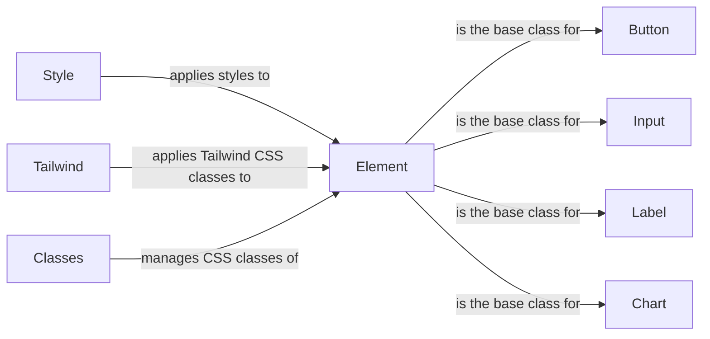

## Component Details

The Component Library and Styling subsystem in NiceGUI provides a set of reusable UI elements and styling mechanisms to facilitate the creation of visually appealing and interactive user interfaces. It includes basic components like buttons, inputs, and labels, as well as more complex components like charts and tables. The subsystem also offers tools for applying CSS styles, using Tailwind CSS, and managing CSS classes, enabling developers to customize the appearance of their applications.

### Element
The base class for all NiceGUI elements, providing core functionality for managing attributes, styles, and classes. It handles the element's lifecycle and serves as the foundation for all UI components.

**Related Classes/Methods**:

- <a href="https://github.com/zauberzeug/nicegui/blob/master/nicegui/element.py#L40-L562" target="_blank" rel="noopener noreferrer">`nicegui.element.Element` (40:562)</a>
- <a href="https://github.com/zauberzeug/nicegui/blob/master/nicegui/element.py#L245-L264" target="_blank" rel="noopener noreferrer">`nicegui.element.Element.default_classes` (245:264)</a>
- <a href="https://github.com/zauberzeug/nicegui/blob/master/nicegui/element.py#L272-L292" target="_blank" rel="noopener noreferrer">`nicegui.element.Element.default_style` (272:292)</a>

### Style
Provides a way to apply custom CSS styles to NiceGUI elements by specifying CSS properties and values. It parses the styles and applies them to the element's style attribute in the DOM, allowing for fine-grained control over the appearance of individual elements.

**Related Classes/Methods**:

- <a href="https://github.com/zauberzeug/nicegui/blob/master/nicegui/style.py#L9-L47" target="_blank" rel="noopener noreferrer">`nicegui.style.Style` (9:47)</a>
- <a href="https://github.com/zauberzeug/nicegui/blob/master/nicegui/style.py#L15-L36" target="_blank" rel="noopener noreferrer">`nicegui.style.Style.__call__` (15:36)</a>
- <a href="https://github.com/zauberzeug/nicegui/blob/master/nicegui/style.py#L39-L47" target="_blank" rel="noopener noreferrer">`nicegui.style.Style.parse` (39:47)</a>

### Tailwind
Provides a fluent interface for applying Tailwind CSS styles to NiceGUI elements. It allows specifying Tailwind classes, which are then applied to the element's underlying HTML representation, enabling rapid UI development with a consistent design system.

**Related Classes/Methods**:

- <a href="https://github.com/zauberzeug/nicegui/blob/master/nicegui/tailwind.py#L182-L1022" target="_blank" rel="noopener noreferrer">`nicegui.tailwind.Tailwind` (182:1022)</a>
- <a href="https://github.com/zauberzeug/nicegui/blob/master/nicegui/tailwind.py#L184-L185" target="_blank" rel="noopener noreferrer">`nicegui.tailwind.Tailwind.__init__` (184:185)</a>
- <a href="https://github.com/zauberzeug/nicegui/blob/master/nicegui/tailwind.py#L188-L189" target="_blank" rel="noopener noreferrer">`nicegui.tailwind.Tailwind.__call__` (188:189)</a>

### Classes
Manages the list of CSS classes applied to an element. It allows adding, removing, and toggling classes, and it automatically updates the element's class attribute in the DOM, providing a dynamic way to control the appearance of elements based on application state.

**Related Classes/Methods**:

- <a href="https://github.com/zauberzeug/nicegui/blob/master/nicegui/classes.py#L9-L56" target="_blank" rel="noopener noreferrer">`nicegui.classes.Classes` (9:56)</a>
- <a href="https://github.com/zauberzeug/nicegui/blob/master/nicegui/classes.py#L15-L36" target="_blank" rel="noopener noreferrer">`nicegui.classes.Classes.__call__` (15:36)</a>
- <a href="https://github.com/zauberzeug/nicegui/blob/master/nicegui/classes.py#L39-L56" target="_blank" rel="noopener noreferrer">`nicegui.classes.Classes.update_list` (39:56)</a>

### Button
A UI element that represents a button. It inherits from the `Element` class and provides specific functionality for handling button clicks and appearance, allowing users to trigger actions within the application.

**Related Classes/Methods**:

- <a href="https://github.com/zauberzeug/nicegui/blob/master/nicegui/elements/button.py#L13-L53" target="_blank" rel="noopener noreferrer">`nicegui.elements.button.Button` (13:53)</a>

### Input
A UI element that represents an input field. It inherits from the `Element` class and provides specific functionality for handling user input and validation, enabling users to enter data into the application.

**Related Classes/Methods**:

- <a href="https://github.com/zauberzeug/nicegui/blob/master/nicegui/elements/input.py#L10-L76" target="_blank" rel="noopener noreferrer">`nicegui.elements.input.Input` (10:76)</a>

### Label
A UI element that represents a label. It inherits from the `Element` class and provides specific functionality for displaying text, allowing developers to present information to the user.

**Related Classes/Methods**:

- <a href="https://github.com/zauberzeug/nicegui/blob/master/nicegui/elements/label.py#L4-L13" target="_blank" rel="noopener noreferrer">`nicegui.elements.label.Label` (4:13)</a>

### Chart
A UI element that represents a chart. It inherits from the `Element` class and provides specific functionality for displaying data visualizations, enabling developers to present data in a clear and informative way.

**Related Classes/Methods**:

- <a href="https://github.com/zauberzeug/nicegui/blob/master/nicegui/elements/aggrid.py#L12-L40" target="_blank" rel="noopener noreferrer">`nicegui.elements.chart.Chart` (12:40)</a>