```mermaid
graph LR
    Application_Core["Application Core"]
    Client_Management["Client Management"]
    UI_Elements["UI Elements"]
    User_Interface_API["User Interface API"]
    Event_Handling["Event Handling"]
    Page_Management["Page Management"]
    Data_Binding["Data Binding"]
    Persistence_Layer["Persistence Layer"]
    Server_Management["Server Management"]
    Testing_Utilities["Testing Utilities"]
    Core_Utilities["Core Utilities"]
    Application_Core -- "configures and manages" --> Server_Management
    Client_Management -- "manages interactions for" --> UI_Elements
    User_Interface_API -- "provides API for" --> UI_Elements
    UI_Elements -- "triggers and handles" --> Event_Handling
    Data_Binding -- "updates state via" --> UI_Elements
    Persistence_Layer -- "persists data for" --> Application_Core
    Testing_Utilities -- "simulates interactions with" --> User_Interface_API
    Server_Management -- "serves content from" --> Page_Management
    Page_Management -- "registers pages with" --> Application_Core
    Event_Handling -- "uses for client communication" --> Client_Management
    Client_Management -- "provides context to" --> Event_Handling
    User_Interface_API -- "relies on for element creation" --> Client_Management
    Server_Management -- "integrates with" --> Application_Core
    Application_Core -- "tests behavior of" --> Testing_Utilities
    Client_Management -- "manages client-side state for" --> Page_Management
    Core_Utilities -- "provides utility functions for" --> User_Interface_API
    Core_Utilities -- "utilizes for client-side operations" --> Client_Management
```

## Component Details

This architecture outlines the core components of a NiceGUI application, focusing on its structure, data flow, and purpose. The Application Core orchestrates the entire application lifecycle, integrating with Server Management to host web pages defined by Page Management. Client Management handles individual client interactions, enabling dynamic UI Elements built through the User Interface API. User interactions trigger events managed by the Event Handling component, while Data Binding ensures seamless synchronization between Python data and UI. The Persistence Layer provides data storage, and Core Utilities offer essential helper functions for common tasks. Finally, Testing Utilities support robust application development by facilitating automated testing.

### Application Core
The Application Core component is responsible for the overall setup and configuration of the NiceGUI application. It manages the application lifecycle, including starting and stopping the server, handling global settings, and providing the main application instance. It interacts with various other components to orchestrate the web application's behavior.

**Related Classes/Methods**:

- `nicegui.app.app` (full file reference)
- `nicegui.app.app_config` (full file reference)
- `nicegui.core` (full file reference)

### Client Management
The Client Management component handles the communication and state of individual clients connected to the NiceGUI application. It manages client-specific data, sends updates to the browser, and processes incoming messages from the client. This component is crucial for maintaining interactive user interfaces.

**Related Classes/Methods**:

- `nicegui.client` (full file reference)
- `nicegui.outbox` (full file reference)

### UI Elements
The UI Elements component provides the building blocks for creating the graphical user interface. It defines the base `Element` class and various specialized UI elements (buttons, inputs, displays, etc.). It manages their properties, styles, and how they are rendered and updated on the client side.

**Related Classes/Methods**:

- `nicegui.element` (full file reference)
- `nicegui.elements` (full file reference)
- `nicegui.classes` (full file reference)
- `nicegui.props` (full file reference)
- `nicegui.style` (full file reference)
- `nicegui.tailwind` (full file reference)

### User Interface API
The User Interface API component serves as the primary interface for developers to create and manipulate UI elements within NiceGUI. It provides convenient functions and classes to instantiate elements, define their behavior, and arrange them on a page. It acts as a facade to the underlying UI Elements and Client Management components.

**Related Classes/Methods**:

- `nicegui.ui` (full file reference)
- `nicegui.functions` (full file reference)

### Event Handling
The Event Handling component is responsible for managing and dispatching events triggered by user interactions or other application logic. It defines event classes and provides mechanisms to register event listeners, ensuring that appropriate actions are taken when events occur. It bridges client-side interactions with Python callbacks.

**Related Classes/Methods**:

- `nicegui.events` (full file reference)
- `nicegui.event_listener` (full file reference)
- `nicegui.awaitable_response` (full file reference)

### Page Management
The Page Management component is concerned with the structure and routing of individual web pages within the NiceGUI application. It defines how pages are created, their routes, and associated metadata like favicons and titles. It works closely with the Application Core and Client Management to serve content.

**Related Classes/Methods**:

- <a href="https://github.com/zauberzeug/nicegui/blob/master/nicegui/page.py#L21-L158" target="_blank" rel="noopener noreferrer">`nicegui.page` (21:158)</a>
- `nicegui.page_layout` (full file reference)
- `nicegui.api_router` (full file reference)
- `nicegui.favicon` (full file reference)

### Data Binding
The Data Binding component facilitates the synchronization of data between Python variables and UI elements. It provides mechanisms to automatically update UI elements when Python data changes and vice-versa, simplifying the development of reactive user interfaces.

**Related Classes/Methods**:

- `nicegui.binding` (full file reference)
- `nicegui.observables` (full file reference)

### Persistence Layer
The Persistence Layer component provides functionalities for storing and retrieving application data persistently. It offers different storage backends (e.g., file-based, Redis) and ensures that data can survive application restarts, contributing to a more robust user experience.

**Related Classes/Methods**:

- `nicegui.persistence` (full file reference)
- `nicegui.persistence.persistent_dict` (full file reference)
- `nicegui.persistence.file_persistent_dict` (full file reference)
- `nicegui.persistence.redis_persistent_dict` (full file reference)
- `nicegui.storage` (full file reference)

### Server Management
The Server Management component is responsible for running the underlying web server that hosts the NiceGUI application. It handles network connections, serves static files, and integrates with native desktop environments when applicable. It ensures the application is accessible to clients.

**Related Classes/Methods**:

- `nicegui.server` (full file reference)
- `nicegui.middlewares` (full file reference)
- `nicegui.native` (full file reference)
- `nicegui.native.native_config` (full file reference)
- `nicegui.ui_run` (full file reference)
- `nicegui.ui_run_with` (full file reference)

### Testing Utilities
The Testing Utilities component provides a set of tools and fixtures to facilitate automated testing of NiceGUI applications. It simulates user interactions, manages screen states, and helps verify the correct behavior of UI elements and application logic, ensuring the quality and reliability of the application.

**Related Classes/Methods**:

- `nicegui.testing` (full file reference)
- `nicegui.testing.screen` (full file reference)
- `nicegui.testing.user` (full file reference)
- `nicegui.testing.user_interaction` (full file reference)
- `nicegui.testing.plugin` (full file reference)
- `nicegui.testing.general_fixtures` (full file reference)

### Core Utilities
Offers a collection of general-purpose helper functions for common tasks like clipboard operations, file downloads, JavaScript execution, and notifications.

**Related Classes/Methods**:

- <a href="https://github.com/zauberzeug/nicegui/blob/master/nicegui/functions/clipboard.py#L1-L20" target="_blank" rel="noopener noreferrer">`nicegui.functions.clipboard` (1:20)</a>
- `nicegui.functions.download` (full file reference)
- `nicegui.functions.javascript` (full file reference)
- `nicegui.functions.navigate` (full file reference)
- <a href="https://github.com/zauberzeug/nicegui/blob/master/nicegui/functions/notify.py#L12-L53" target="_blank" rel="noopener noreferrer">`nicegui.functions.notify` (12:53)</a>
- <a href="https://github.com/zauberzeug/nicegui/blob/master/nicegui/functions/update.py#L4-L7" target="_blank" rel="noopener noreferrer">`nicegui.functions.update` (4:7)</a>
- <a href="https://github.com/zauberzeug/nicegui/blob/master/nicegui/helpers.py#L1-L100" target="_blank" rel="noopener noreferrer">`nicegui.helpers` (1:100)</a>

### [FAQ](https://github.com/CodeBoarding/GeneratedOnBoardings/tree/main?tab=readme-ov-file#faq)