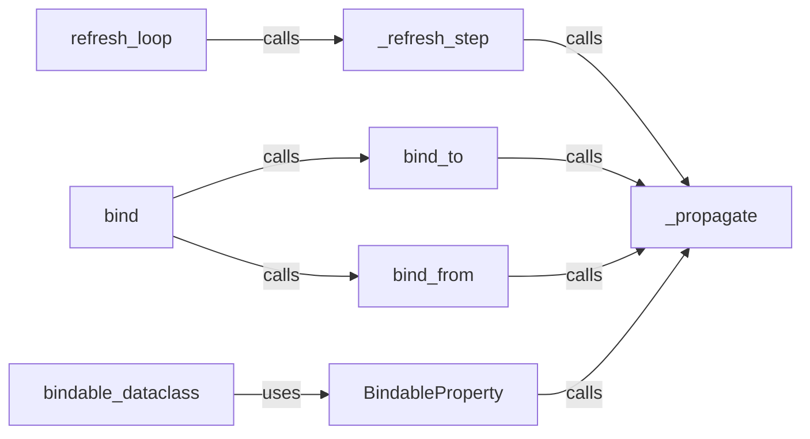

## Component Details

The data binding and synchronization mechanism in NiceGUI enables reactive updates between UI elements and Python variables. It revolves around the `BindableProperty` descriptor, which makes class attributes bindable. The `bind`, `bind_from`, and `bind_to` functions create bindings between properties, while the `refresh_loop` and `_refresh_step` functions periodically propagate changes. The `_propagate` function recursively updates bound properties, preventing infinite loops. This system ensures that changes in the UI are reflected in the Python code, and vice versa, providing a seamless and responsive user experience.

### refresh_loop
The `refresh_loop` function is an asynchronous loop that periodically calls `_refresh_step` to update bindings. It sleeps for a duration defined by `core.app.config.binding_refresh_interval` and handles cancellation errors to exit gracefully, ensuring continuous synchronization between UI elements and Python variables.

**Related Classes/Methods**:

- <a href="https://github.com/zauberzeug/nicegui/blob/master/nicegui/binding.py#L66-L73" target="_blank" rel="noopener noreferrer">`nicegui.binding.refresh_loop` (66:73)</a>

### _refresh_step
The `_refresh_step` function iterates through active links and propagates changes from source objects to target objects based on the defined transformations. It also logs a warning if the propagation takes longer than `MAX_PROPAGATION_TIME`, ensuring efficient and timely updates of bound properties.

**Related Classes/Methods**:

- <a href="https://github.com/zauberzeug/nicegui/blob/master/nicegui/binding.py#L90-L102" target="_blank" rel="noopener noreferrer">`nicegui.binding._refresh_step` (90:102)</a>

### _propagate
The `_propagate` function recursively propagates changes from a source object's attribute to all bound target objects' attributes, preventing infinite loops using a `propagation_visited` context. It retrieves the source value, transforms it, and sets it on the target object if it has changed, then recursively calls itself for the target object, ensuring that all bound properties are synchronized.

**Related Classes/Methods**:

- <a href="https://github.com/zauberzeug/nicegui/blob/master/nicegui/binding.py#L105-L123" target="_blank" rel="noopener noreferrer">`nicegui.binding._propagate` (105:123)</a>

### bind_to
The `bind_to` function creates a one-way binding from one object's property to another. It appends the binding information to the `bindings` dictionary and adds the link to `active_links` if it's a new bindable property. It also triggers an immediate propagation of the value, establishing a connection for reactive updates.

**Related Classes/Methods**:

- <a href="https://github.com/zauberzeug/nicegui/blob/master/nicegui/binding.py#L126-L141" target="_blank" rel="noopener noreferrer">`nicegui.binding.bind_to` (126:141)</a>

### bind_from
The `bind_from` function creates a one-way binding from one object's property to another. It appends the binding information to the `bindings` dictionary and adds the link to `active_links` if it's a new bindable property. It also triggers an immediate propagation of the value, establishing a connection for reactive updates.

**Related Classes/Methods**:

- <a href="https://github.com/zauberzeug/nicegui/blob/master/nicegui/binding.py#L144-L159" target="_blank" rel="noopener noreferrer">`nicegui.binding.bind_from` (144:159)</a>

### bind
The `bind` function creates a two-way binding between two object properties by calling both `bind_from` and `bind_to`. The backward binding takes precedence for the initial synchronization, ensuring bidirectional reactive updates.

**Related Classes/Methods**:

- <a href="https://github.com/zauberzeug/nicegui/blob/master/nicegui/binding.py#L162-L178" target="_blank" rel="noopener noreferrer">`nicegui.binding.bind` (162:178)</a>

### BindableProperty
The `BindableProperty` class is a descriptor that makes a class attribute bindable. When the attribute is set, it propagates the change to all bound properties. It uses `_make_copyable` to ensure the class is copyable and stores the value in a private attribute named `___<attribute_name>`, enabling reactive updates for class attributes.

**Related Classes/Methods**:

- <a href="https://github.com/zauberzeug/nicegui/blob/master/nicegui/binding.py#L181-L204" target="_blank" rel="noopener noreferrer">`nicegui.binding.BindableProperty` (181:204)</a>

### bindable_dataclass
The `bindable_dataclass` decorator transforms a class into a dataclass and makes specified fields bindable using `BindableProperty`. It supports specifying which fields should be bindable and forwards other arguments to `dataclasses.dataclass`, simplifying the creation of bindable data structures.

**Related Classes/Methods**:

- <a href="https://github.com/zauberzeug/nicegui/blob/master/nicegui/binding.py#L242-L279" target="_blank" rel="noopener noreferrer">`nicegui.binding.bindable_dataclass` (242:279)</a>