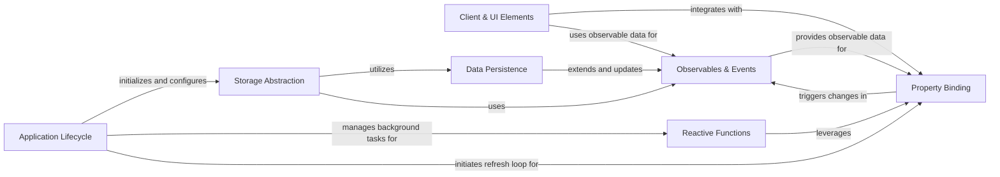

## Component Details

This system provides a comprehensive framework for managing data and ensuring reactivity within NiceGUI applications. It encompasses observable data structures that automatically trigger UI updates, mechanisms for two-way data binding between Python and UI elements, and robust solutions for persistent data storage across various scopes. Additionally, it supports reactive functions that re-execute upon dependency changes, all integrated within the application's lifecycle and client-side UI management.

### Observables & Events
This component provides observable data structures (dictionaries, lists, sets) that automatically trigger change events when modified. It also includes the core event handling mechanism for these changes, ensuring that UI elements can react to data modifications.

**Related Classes/Methods**:

- <a href="https://github.com/zauberzeug/nicegui/blob/master/nicegui/observables.py#L13-L71" target="_blank" rel="noopener noreferrer">`nicegui.observables.ObservableCollection` (13:71)</a>
- <a href="https://github.com/zauberzeug/nicegui/blob/master/nicegui/observables.py#L74-L130" target="_blank" rel="noopener noreferrer">`nicegui.observables.ObservableDict` (74:130)</a>
- <a href="https://github.com/zauberzeug/nicegui/blob/master/nicegui/observables.py#L133-L192" target="_blank" rel="noopener noreferrer">`nicegui.observables.ObservableList` (133:192)</a>
- <a href="https://github.com/zauberzeug/nicegui/blob/master/nicegui/observables.py#L195-L274" target="_blank" rel="noopener noreferrer">`nicegui.observables.ObservableSet` (195:274)</a>
- <a href="https://github.com/zauberzeug/nicegui/blob/master/nicegui/events.py#L41-L42" target="_blank" rel="noopener noreferrer">`nicegui.events.ObservableChangeEventArguments` (41:42)</a>
- <a href="https://github.com/zauberzeug/nicegui/blob/master/nicegui/events.py#L410-L453" target="_blank" rel="noopener noreferrer">`nicegui.events.handle_event` (410:453)</a>

### Client & UI Elements
This component manages the client-side representation of the UI, including the lifecycle of elements, their removal, and communication with the client via an outbox. It encompasses the base Element class and related utility classes for styling and properties.

**Related Classes/Methods**:

- <a href="https://github.com/zauberzeug/nicegui/blob/master/nicegui/client.py#L35-L385" target="_blank" rel="noopener noreferrer">`nicegui.client.Client` (35:385)</a>
- <a href="https://github.com/zauberzeug/nicegui/blob/master/nicegui/outbox.py#L26-L154" target="_blank" rel="noopener noreferrer">`nicegui.outbox.Outbox` (26:154)</a>
- <a href="https://github.com/zauberzeug/nicegui/blob/master/nicegui/element.py#L40-L562" target="_blank" rel="noopener noreferrer">`nicegui.element.Element` (40:562)</a>
- <a href="https://github.com/zauberzeug/nicegui/blob/master/nicegui/props.py#L39-L93" target="_blank" rel="noopener noreferrer">`nicegui.props.Props` (39:93)</a>
- <a href="https://github.com/zauberzeug/nicegui/blob/master/nicegui/classes.py#L9-L56" target="_blank" rel="noopener noreferrer">`nicegui.classes.Classes` (9:56)</a>

### Application Lifecycle
This component orchestrates the overall startup, shutdown, and configuration of the NiceGUI application. It handles global settings, native integration, and initial setup routines, including favicon and welcome page management.

**Related Classes/Methods**:

- <a href="https://github.com/zauberzeug/nicegui/blob/master/nicegui/app/app.py#L32-L302" target="_blank" rel="noopener noreferrer">`nicegui.app.app.App` (32:302)</a>
- <a href="https://github.com/zauberzeug/nicegui/blob/master/nicegui/native/native_config.py#L9-L13" target="_blank" rel="noopener noreferrer">`nicegui.native.native_config.NativeConfig` (9:13)</a>
- <a href="https://github.com/zauberzeug/nicegui/blob/master/nicegui/app/app_config.py#L10-L77" target="_blank" rel="noopener noreferrer">`nicegui.app.app_config.AppConfig` (10:77)</a>
- <a href="https://github.com/zauberzeug/nicegui/blob/master/nicegui/nicegui.py#L110-L138" target="_blank" rel="noopener noreferrer">`nicegui.nicegui._startup` (110:138)</a>
- <a href="https://github.com/zauberzeug/nicegui/blob/master/nicegui/nicegui.py#L141-L147" target="_blank" rel="noopener noreferrer">`nicegui.nicegui._shutdown` (141:147)</a>
- <a href="https://github.com/zauberzeug/nicegui/blob/master/nicegui/nicegui.py#L167-L182" target="_blank" rel="noopener noreferrer">`nicegui.nicegui._on_handshake` (167:182)</a>
- <a href="https://github.com/zauberzeug/nicegui/blob/master/nicegui/run.py#L20-L26" target="_blank" rel="noopener noreferrer">`nicegui.run.setup` (20:26)</a>
- <a href="https://github.com/zauberzeug/nicegui/blob/master/nicegui/welcome.py#L16-L31" target="_blank" rel="noopener noreferrer">`nicegui.welcome.collect_urls` (16:31)</a>
- <a href="https://github.com/zauberzeug/nicegui/blob/master/nicegui/favicon.py#L47-L61" target="_blank" rel="noopener noreferrer">`nicegui.favicon.get_favicon_response` (47:61)</a>
- <a href="https://github.com/zauberzeug/nicegui/blob/master/nicegui/air.py#L33-L268" target="_blank" rel="noopener noreferrer">`nicegui.air.Air` (33:268)</a>
- <a href="https://github.com/zauberzeug/nicegui/blob/master/nicegui/air.py#L271-L274" target="_blank" rel="noopener noreferrer">`nicegui.air.connect` (271:274)</a>

### Reactive Functions
This component provides decorators and utilities for creating functions that automatically re-execute and update the UI when their dependencies change. It leverages background tasks to manage asynchronous updates and maintain reactivity.

**Related Classes/Methods**:

- <a href="https://github.com/zauberzeug/nicegui/blob/master/nicegui/functions/refreshable.py#L20-L51" target="_blank" rel="noopener noreferrer">`nicegui.functions.refreshable.RefreshableTarget` (20:51)</a>
- <a href="https://github.com/zauberzeug/nicegui/blob/master/nicegui/functions/refreshable.py#L58-L131" target="_blank" rel="noopener noreferrer">`nicegui.functions.refreshable.refreshable` (58:131)</a>
- <a href="https://github.com/zauberzeug/nicegui/blob/master/nicegui/functions/refreshable.py#L134-L142" target="_blank" rel="noopener noreferrer">`nicegui.functions.refreshable.refreshable_method` (134:142)</a>
- <a href="https://github.com/zauberzeug/nicegui/blob/master/nicegui/helpers.py#L30-L38" target="_blank" rel="noopener noreferrer">`nicegui.helpers.is_coroutine_function` (30:38)</a>
- <a href="https://github.com/zauberzeug/nicegui/blob/master/nicegui/background_tasks.py#L17-L30" target="_blank" rel="noopener noreferrer">`nicegui.background_tasks.create` (17:30)</a>
- <a href="https://github.com/zauberzeug/nicegui/blob/master/nicegui/background_tasks.py#L33-L50" target="_blank" rel="noopener noreferrer">`nicegui.background_tasks.create_lazy` (33:50)</a>

### Data Persistence
This component manages the storage and retrieval of application data, supporting both Redis and file-based persistence mechanisms. It ensures data integrity and synchronization across sessions by extending observable data structures.

**Related Classes/Methods**:

- <a href="https://github.com/zauberzeug/nicegui/blob/master/nicegui/persistence/redis_persistent_dict.py#L13-L92" target="_blank" rel="noopener noreferrer">`nicegui.persistence.redis_persistent_dict.RedisPersistentDict` (13:92)</a>
- <a href="https://github.com/zauberzeug/nicegui/blob/master/nicegui/persistence/file_persistent_dict.py#L12-L60" target="_blank" rel="noopener noreferrer">`nicegui.persistence.file_persistent_dict.FilePersistentDict` (12:60)</a>
- <a href="https://github.com/zauberzeug/nicegui/blob/master/nicegui/persistence/persistent_dict.py#L6-L17" target="_blank" rel="noopener noreferrer">`nicegui.persistence.persistent_dict.PersistentDict` (6:17)</a>
- <a href="https://github.com/zauberzeug/nicegui/blob/master/nicegui/persistence/read_only_dict.py#L5-L24" target="_blank" rel="noopener noreferrer">`nicegui.persistence.read_only_dict.ReadOnlyDict` (5:24)</a>
- <a href="https://github.com/zauberzeug/nicegui/blob/master/nicegui/json/orjson_wrapper.py#L43-L48" target="_blank" rel="noopener noreferrer">`nicegui.json.orjson_wrapper.loads` (43:48)</a>
- <a href="https://github.com/zauberzeug/nicegui/blob/master/nicegui/json/orjson_wrapper.py#L14-L40" target="_blank" rel="noopener noreferrer">`nicegui.json.orjson_wrapper.dumps` (14:40)</a>
- <a href="https://github.com/zauberzeug/nicegui/blob/master/nicegui/optional_features.py#L24-L26" target="_blank" rel="noopener noreferrer">`nicegui.optional_features.has` (24:26)</a>

### Property Binding
This component implements the core logic for two-way data binding between Python variables and UI element properties. It includes mechanisms for propagating changes, managing bindable properties, and ensuring UI synchronization.

**Related Classes/Methods**:

- <a href="https://github.com/zauberzeug/nicegui/blob/master/nicegui/binding.py#L66-L73" target="_blank" rel="noopener noreferrer">`nicegui.binding.refresh_loop` (66:73)</a>
- <a href="https://github.com/zauberzeug/nicegui/blob/master/nicegui/binding.py#L90-L102" target="_blank" rel="noopener noreferrer">`nicegui.binding._refresh_step` (90:102)</a>
- <a href="https://github.com/zauberzeug/nicegui/blob/master/nicegui/binding.py#L105-L123" target="_blank" rel="noopener noreferrer">`nicegui.binding._propagate` (105:123)</a>
- <a href="https://github.com/zauberzeug/nicegui/blob/master/nicegui/binding.py#L126-L141" target="_blank" rel="noopener noreferrer">`nicegui.binding.bind_to` (126:141)</a>
- <a href="https://github.com/zauberzeug/nicegui/blob/master/nicegui/binding.py#L144-L159" target="_blank" rel="noopener noreferrer">`nicegui.binding.bind_from` (144:159)</a>
- <a href="https://github.com/zauberzeug/nicegui/blob/master/nicegui/binding.py#L162-L178" target="_blank" rel="noopener noreferrer">`nicegui.binding.bind` (162:178)</a>
- <a href="https://github.com/zauberzeug/nicegui/blob/master/nicegui/binding.py#L181-L204" target="_blank" rel="noopener noreferrer">`nicegui.binding.BindableProperty` (181:204)</a>
- <a href="https://github.com/zauberzeug/nicegui/blob/master/nicegui/binding.py#L242-L279" target="_blank" rel="noopener noreferrer">`nicegui.binding.bindable_dataclass` (242:279)</a>
- <a href="https://github.com/zauberzeug/nicegui/blob/master/nicegui/binding.py#L207-L228" target="_blank" rel="noopener noreferrer">`nicegui.binding.remove` (207:228)</a>

### Storage Abstraction
This component provides a unified interface for accessing different types of application storage, such as browser, user, client, and tab-specific storage. It abstracts the underlying persistence mechanisms and manages storage contexts.

**Related Classes/Methods**:

- <a href="https://github.com/zauberzeug/nicegui/blob/master/nicegui/storage.py#L50-L217" target="_blank" rel="noopener noreferrer">`nicegui.storage.Storage` (50:217)</a>
- <a href="https://github.com/zauberzeug/nicegui/blob/master/nicegui/storage.py#L39-L47" target="_blank" rel="noopener noreferrer">`nicegui.storage.set_storage_secret` (39:47)</a>
- <a href="https://github.com/zauberzeug/nicegui/blob/master/nicegui/storage.py#L1-L170" target="_blank" rel="noopener noreferrer">`nicegui.storage._is_in_auto_index_context` (1:170)</a>

### [FAQ](https://github.com/CodeBoarding/GeneratedOnBoardings/tree/main?tab=readme-ov-file#faq)