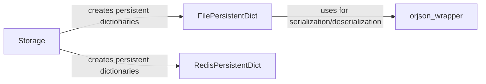

## Component Details

The Data Persistence component in NiceGUI provides a mechanism for storing and retrieving application data across user sessions and browser instances. It offers different storage options, including browser storage, user-specific storage, and session-based storage, with the ability to persist data using either files or Redis. The core of this component is the `Storage` class, which manages access to these different storage types by creating and providing persistent dictionaries. The `FilePersistentDict` and `RedisPersistentDict` classes provide dictionary-like interfaces for persisting data to files and Redis, respectively. The `orjson_wrapper` is used for fast JSON serialization and deserialization when using file storage.

### Storage
The Storage class manages different storage types (browser, user, client, tab) by creating and providing access to persistent dictionaries. It determines the appropriate storage based on the context (e.g., user, client, or tab) and initializes the corresponding persistent dictionary. It acts as a central point for accessing and managing application data.

**Related Classes/Methods**:

- <a href="https://github.com/zauberzeug/nicegui/blob/master/nicegui/storage.py#L50-L217" target="_blank" rel="noopener noreferrer">`nicegui.storage.Storage` (50:217)</a>
- <a href="https://github.com/zauberzeug/nicegui/blob/master/nicegui/storage.py#L66-L69" target="_blank" rel="noopener noreferrer">`nicegui.storage.Storage.__init__` (66:69)</a>
- <a href="https://github.com/zauberzeug/nicegui/blob/master/nicegui/storage.py#L79-L99" target="_blank" rel="noopener noreferrer">`nicegui.storage.Storage:browser` (79:99)</a>
- <a href="https://github.com/zauberzeug/nicegui/blob/master/nicegui/storage.py#L102-L118" target="_blank" rel="noopener noreferrer">`nicegui.storage.Storage:user` (102:118)</a>
- <a href="https://github.com/zauberzeug/nicegui/blob/master/nicegui/storage.py#L120-L123" target="_blank" rel="noopener noreferrer">`nicegui.storage.Storage:_create_user_storage` (120:123)</a>
- <a href="https://github.com/zauberzeug/nicegui/blob/master/nicegui/storage.py#L138-L147" target="_blank" rel="noopener noreferrer">`nicegui.storage.Storage:client` (138:147)</a>
- <a href="https://github.com/zauberzeug/nicegui/blob/master/nicegui/storage.py#L150-L161" target="_blank" rel="noopener noreferrer">`nicegui.storage.Storage:tab` (150:161)</a>
- <a href="https://github.com/zauberzeug/nicegui/blob/master/nicegui/storage.py#L163-L172" target="_blank" rel="noopener noreferrer">`nicegui.storage.Storage:_create_tab_storage` (163:172)</a>
- <a href="https://github.com/zauberzeug/nicegui/blob/master/nicegui/storage.py#L174-L181" target="_blank" rel="noopener noreferrer">`nicegui.storage.Storage:copy_tab` (174:181)</a>

### FilePersistentDict
The FilePersistentDict class provides a dictionary-like interface that persists data to a file using orjson for JSON serialization. It handles initialization, data backup, and loading data from the file. It's used when file-based persistence is desired.

**Related Classes/Methods**:

- <a href="https://github.com/zauberzeug/nicegui/blob/master/nicegui/persistence/file_persistent_dict.py#L12-L60" target="_blank" rel="noopener noreferrer">`nicegui.persistence.file_persistent_dict.FilePersistentDict` (12:60)</a>
- <a href="https://github.com/zauberzeug/nicegui/blob/master/nicegui/persistence/file_persistent_dict.py#L20-L29" target="_blank" rel="noopener noreferrer">`nicegui.persistence.file_persistent_dict.FilePersistentDict:initialize` (20:29)</a>
- <a href="https://github.com/zauberzeug/nicegui/blob/master/nicegui/persistence/file_persistent_dict.py#L31-L39" target="_blank" rel="noopener noreferrer">`nicegui.persistence.file_persistent_dict.FilePersistentDict:initialize_sync` (31:39)</a>
- <a href="https://github.com/zauberzeug/nicegui/blob/master/nicegui/persistence/file_persistent_dict.py#L41-L56" target="_blank" rel="noopener noreferrer">`nicegui.persistence.file_persistent_dict.FilePersistentDict:backup` (41:56)</a>

### RedisPersistentDict
The RedisPersistentDict class provides a dictionary-like interface that persists data to a Redis server. It handles initialization, listening for updates, and publishing changes to Redis channels. It's used when Redis-based persistence is desired, enabling data sharing and synchronization across multiple instances of the application.

**Related Classes/Methods**:

- <a href="https://github.com/zauberzeug/nicegui/blob/master/nicegui/persistence/redis_persistent_dict.py#L13-L92" target="_blank" rel="noopener noreferrer">`nicegui.persistence.redis_persistent_dict.RedisPersistentDict` (13:92)</a>
- <a href="https://github.com/zauberzeug/nicegui/blob/master/nicegui/persistence/redis_persistent_dict.py#L30-L37" target="_blank" rel="noopener noreferrer">`nicegui.persistence.redis_persistent_dict.RedisPersistentDict:initialize` (30:37)</a>
- <a href="https://github.com/zauberzeug/nicegui/blob/master/nicegui/persistence/redis_persistent_dict.py#L39-L53" target="_blank" rel="noopener noreferrer">`nicegui.persistence.redis_persistent_dict.RedisPersistentDict:initialize_sync` (39:53)</a>
- <a href="https://github.com/zauberzeug/nicegui/blob/master/nicegui/persistence/redis_persistent_dict.py#L55-L67" target="_blank" rel="noopener noreferrer">`nicegui.persistence.redis_persistent_dict.RedisPersistentDict:_start_listening` (55:67)</a>
- <a href="https://github.com/zauberzeug/nicegui/blob/master/nicegui/persistence/redis_persistent_dict.py#L69-L79" target="_blank" rel="noopener noreferrer">`nicegui.persistence.redis_persistent_dict.RedisPersistentDict:publish` (69:79)</a>

### orjson_wrapper
The orjson_wrapper module is a wrapper around the orjson library, used for fast JSON serialization and deserialization. It's used by FilePersistentDict for saving and loading data to/from files, providing efficient JSON handling.

**Related Classes/Methods**:

- <a href="https://github.com/zauberzeug/nicegui/blob/master/nicegui/json/orjson_wrapper.py#L43-L48" target="_blank" rel="noopener noreferrer">`nicegui.json.orjson_wrapper.loads` (43:48)</a>
- <a href="https://github.com/zauberzeug/nicegui/blob/master/nicegui/json/orjson_wrapper.py#L14-L40" target="_blank" rel="noopener noreferrer">`nicegui.json.orjson_wrapper.dumps` (14:40)</a>