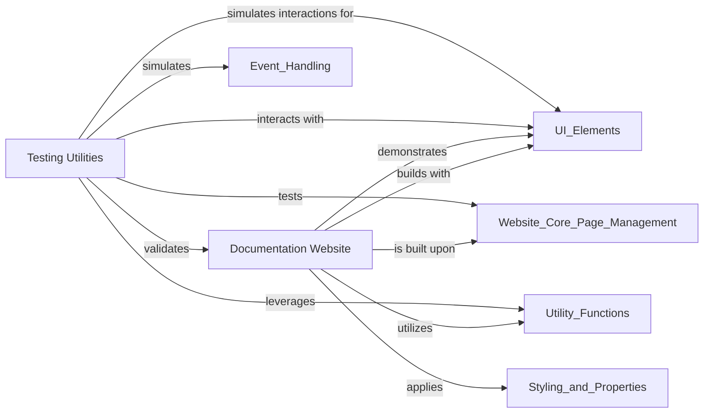

## Component Details

This subsystem encompasses the tools and code necessary for both generating the official NiceGUI documentation website and providing a robust framework for automated testing of NiceGUI applications. It ensures that the project is well-documented with interactive examples and that its functionality is thoroughly validated through simulated user interactions and environment control.

### Documentation Website
Contains the code for generating the NiceGUI documentation website, including content rendering, code example extraction, and interactive example cards.

**Related Classes/Methods**:

- `nicegui.website.main_page` (full file reference)
- `nicegui.website.documentation.content.button_documentation` (full file reference)
- `nicegui.website.documentation.code_extraction` (full file reference)
- `nicegui.website.example_card` (full file reference)

### Testing Utilities
Provides utilities and fixtures for writing and running automated tests for NiceGUI applications, simulating user interactions and managing the test environment.

**Related Classes/Methods**:

- <a href="https://github.com/zauberzeug/nicegui/blob/master/nicegui/testing/screen.py#L24-L266" target="_blank" rel="noopener noreferrer">`nicegui.testing.screen.Screen` (24:266)</a>
- <a href="https://github.com/zauberzeug/nicegui/blob/master/nicegui/testing/user_interaction.py#L18-L116" target="_blank" rel="noopener noreferrer">`nicegui.testing.user_interaction.UserInteraction` (18:116)</a>
- `nicegui.testing.conftest` (full file reference)
- `nicegui.testing.plugin` (full file reference)

### [FAQ](https://github.com/CodeBoarding/GeneratedOnBoardings/tree/main?tab=readme-ov-file#faq)