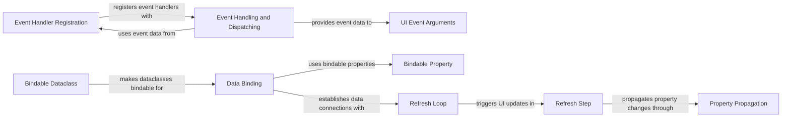

## Component Details

The Event Handling and Data Binding subsystem in NiceGUI manages user interactions and synchronizes data between UI elements and Python variables. It captures UI events, dispatches them to registered handlers, and provides mechanisms for binding UI elements to Python variables, ensuring that changes in one are reflected in the other. This system relies on event handling, data binding, and a refresh loop to keep the UI consistent with the underlying data.

### Event Handler Registration
This component allows UI elements to register event handlers for specific events. The `Element.on` method enables attaching event listeners, which are invoked when the corresponding event occurs on the element. This mechanism facilitates the creation of interactive UI elements that respond to user actions.

**Related Classes/Methods**:

- <a href="https://github.com/zauberzeug/nicegui/blob/master/nicegui/element.py#L344-L401" target="_blank" rel="noopener noreferrer">`nicegui.element.Element.on` (344:401)</a>

### Event Handling and Dispatching
This component is responsible for receiving events from the UI, processing them, and dispatching them to the appropriate handlers. The `handle_event` function extracts event data and invokes the registered callbacks, enabling the execution of custom logic in response to UI events.

**Related Classes/Methods**:

- <a href="https://github.com/zauberzeug/nicegui/blob/master/nicegui/events.py#L410-L453" target="_blank" rel="noopener noreferrer">`nicegui.events.handle_event` (410:453)</a>

### UI Event Arguments
This component encapsulates the arguments passed to event handlers. The `UiEventArguments` class provides a structured way to access event-related data, such as the target element, event type, and any additional event-specific information. This allows event handlers to easily access the context of the event.

**Related Classes/Methods**:

- <a href="https://github.com/zauberzeug/nicegui/blob/master/nicegui/events.py#L46-L48" target="_blank" rel="noopener noreferrer">`nicegui.events.UiEventArguments` (46:48)</a>

### Data Binding
This component provides the core functionality for binding UI elements to Python variables. The `bind`, `bind_from`, and `bind_to` functions establish connections between data sources and UI elements, ensuring that changes in one are reflected in the other. This enables the creation of dynamic UIs that automatically update in response to data changes.

**Related Classes/Methods**:

- <a href="https://github.com/zauberzeug/nicegui/blob/master/nicegui/binding.py#L162-L178" target="_blank" rel="noopener noreferrer">`nicegui.binding.bind` (162:178)</a>
- <a href="https://github.com/zauberzeug/nicegui/blob/master/nicegui/binding.py#L144-L159" target="_blank" rel="noopener noreferrer">`nicegui.binding.bind_from` (144:159)</a>
- <a href="https://github.com/zauberzeug/nicegui/blob/master/nicegui/binding.py#L126-L141" target="_blank" rel="noopener noreferrer">`nicegui.binding.bind_to` (126:141)</a>

### Bindable Property
This component makes properties bindable. When a property is an instance of `BindableProperty`, it can be used in data binding scenarios. This allows the data binding mechanism to track changes to the property and update the UI accordingly.

**Related Classes/Methods**:

- <a href="https://github.com/zauberzeug/nicegui/blob/master/nicegui/binding.py#L181-L204" target="_blank" rel="noopener noreferrer">`nicegui.binding.BindableProperty` (181:204)</a>

### Refresh Loop
The refresh loop is a background task that periodically checks for changes in bound variables and updates the UI accordingly. It ensures that the UI remains synchronized with the underlying data, even when changes occur outside of direct user interactions. This loop is essential for maintaining data consistency in the UI.

**Related Classes/Methods**:

- <a href="https://github.com/zauberzeug/nicegui/blob/master/nicegui/binding.py#L66-L73" target="_blank" rel="noopener noreferrer">`nicegui.binding:refresh_loop` (66:73)</a>

### Refresh Step
A single step in the refresh loop, responsible for propagating changes from data sources to UI elements. It iterates through the active bindings and updates the corresponding UI elements with the latest data. This step ensures that each binding is updated efficiently.

**Related Classes/Methods**:

- <a href="https://github.com/zauberzeug/nicegui/blob/master/nicegui/binding.py#L90-L102" target="_blank" rel="noopener noreferrer">`nicegui.binding:_refresh_step` (90:102)</a>

### Property Propagation
This component handles the actual propagation of changes between bound properties. When a property is modified, this component ensures that the corresponding UI element is updated with the new value. This is the final step in the data binding process, ensuring that the UI reflects the latest data.

**Related Classes/Methods**:

- <a href="https://github.com/zauberzeug/nicegui/blob/master/nicegui/binding.py#L105-L123" target="_blank" rel="noopener noreferrer">`nicegui.binding:_propagate` (105:123)</a>

### Bindable Dataclass
This component provides a decorator that makes dataclasses bindable. When a dataclass is decorated with `@bindable_dataclass`, its properties become bindable, allowing them to be used in data binding scenarios. This simplifies the process of creating data-driven UIs.

**Related Classes/Methods**:

- <a href="https://github.com/zauberzeug/nicegui/blob/master/nicegui/binding.py#L242-L279" target="_blank" rel="noopener noreferrer">`nicegui.binding:bindable_dataclass` (242:279)</a>