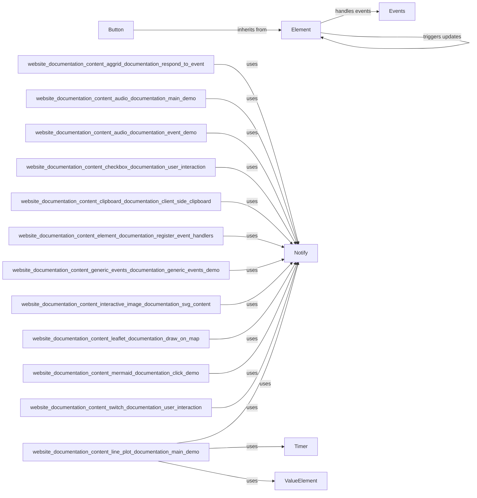

## Component Details

The Event Handling and User Interaction subsystem in NiceGUI manages the flow of events triggered by user interactions within the UI. It provides a mechanism for registering event handlers to UI elements, processing events, and updating the UI accordingly. The core components include the `Element` class, which serves as the base for all UI elements and provides methods for event registration, and the `Events` module, which handles event dispatching and execution. User interactions, such as button clicks, trigger events that are processed by the `handle_event` function, which in turn executes the registered event handlers and updates the UI. Other components like `Button`, `Notify`, `Timer`, and `ValueElement` extend the basic event handling capabilities to provide specific functionalities for different UI elements and scenarios.

### Element
The Element class is the base class for all UI elements in NiceGUI. It provides core functionalities for managing events, updating properties, and handling client-side interactions. It maintains the element's state and ensures that changes are reflected in the user interface. It also provides methods for registering event handlers.

**Related Classes/Methods**:

- <a href="https://github.com/zauberzeug/nicegui/blob/master/nicegui/element.py#L40-L562" target="_blank" rel="noopener noreferrer">`nicegui.element.Element` (40:562)</a>
- <a href="https://github.com/zauberzeug/nicegui/blob/master/nicegui/element.py#L344-L401" target="_blank" rel="noopener noreferrer">`nicegui.element.Element.on` (344:401)</a>
- <a href="https://github.com/zauberzeug/nicegui/blob/master/nicegui/element.py#L409-L413" target="_blank" rel="noopener noreferrer">`nicegui.element.Element.update` (409:413)</a>
- <a href="https://github.com/zauberzeug/nicegui/blob/master/nicegui/element.py#L415-L427" target="_blank" rel="noopener noreferrer">`nicegui.element.Element.run_method` (415:427)</a>
- <a href="https://github.com/zauberzeug/nicegui/blob/master/nicegui/element.py#L49-L87" target="_blank" rel="noopener noreferrer">`nicegui.element.Element.__init__` (49:87)</a>
- <a href="https://github.com/zauberzeug/nicegui/blob/master/nicegui/element.py#L167-L186" target="_blank" rel="noopener noreferrer">`nicegui.element.Element.add_slot` (167:186)</a>

### Events
The events module is responsible for handling user interactions and other events within the NiceGUI application. It provides mechanisms for registering event handlers, processing events, and managing the flow of data between the client and server. The `handle_event` function is central to this process, coordinating the execution of event handlers and updating the UI accordingly.

**Related Classes/Methods**:

- <a href="https://github.com/zauberzeug/nicegui/blob/master/nicegui/events.py#L410-L453" target="_blank" rel="noopener noreferrer">`nicegui.events.handle_event` (410:453)</a>
- <a href="https://github.com/zauberzeug/nicegui/blob/master/nicegui/events.py#L444-L451" target="_blank" rel="noopener noreferrer">`nicegui.events.handle_event.wait_for_result` (444:451)</a>
- <a href="https://github.com/zauberzeug/nicegui/blob/master/nicegui/events.py#L46-L48" target="_blank" rel="noopener noreferrer">`nicegui.events.UiEventArguments` (46:48)</a>

### Button
The Button element represents a clickable button in the user interface. It allows users to trigger actions and interact with the application. The Button class extends the Element class and provides specific functionality for handling click events and managing the button's appearance.

**Related Classes/Methods**:

- <a href="https://github.com/zauberzeug/nicegui/blob/master/nicegui/elements/button.py#L13-L53" target="_blank" rel="noopener noreferrer">`nicegui.elements.button.Button` (13:53)</a>
- <a href="https://github.com/zauberzeug/nicegui/blob/master/nicegui/elements/button.py#L15-L38" target="_blank" rel="noopener noreferrer">`nicegui.elements.button.Button.__init__` (15:38)</a>
- <a href="https://github.com/zauberzeug/nicegui/blob/master/nicegui/elements/button.py#L40-L43" target="_blank" rel="noopener noreferrer">`nicegui.elements.button.Button.on_click` (40:43)</a>

### Notify
The notify function provides a way to display notifications to the user. It's a simple way to provide feedback and communicate important information to the user.

**Related Classes/Methods**:

- <a href="https://github.com/zauberzeug/nicegui/blob/master/nicegui/functions/notify.py#L12-L53" target="_blank" rel="noopener noreferrer">`nicegui.functions.notify.notify` (12:53)</a>

### Timer
The Timer element allows to execute a function in a regular interval. It's used to update the UI or perform other tasks periodically.

**Related Classes/Methods**:

- <a href="https://github.com/zauberzeug/nicegui/blob/master/nicegui/elements/timer.py#L10-L47" target="_blank" rel="noopener noreferrer">`nicegui.elements.timer.Timer` (10:47)</a>

### ValueElement
The ValueElement mixin provides a way to bind values to UI elements. It's used to synchronize the value of an element with a variable in the application.

**Related Classes/Methods**:

- <a href="https://github.com/zauberzeug/nicegui/blob/master/nicegui/elements/mixins/value_element.py#L103-L108" target="_blank" rel="noopener noreferrer">`nicegui.elements.mixins.value_element.ValueElement.set_value` (103:108)</a>
- <a href="https://github.com/zauberzeug/nicegui/blob/master/nicegui/elements/mixins/value_element.py#L83-L101" target="_blank" rel="noopener noreferrer">`nicegui.elements.mixins.value_element.ValueElement.bind_value` (83:101)</a>