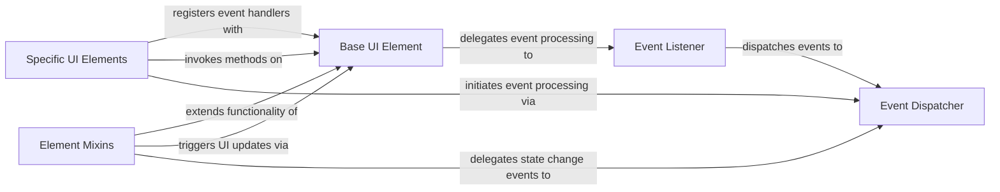

## Component Details

The Event System in NiceGUI is a core subsystem responsible for managing all user interactions and internal application events. It provides robust mechanisms for event handling, dispatching, and listener management, ensuring that UI components can react dynamically to user input and application state changes. This system facilitates a responsive and interactive user experience by efficiently processing and routing events to their respective handlers.

### Event Dispatcher
This component is central to NiceGUI's event system, defining various event argument types and providing mechanisms for handling and dispatching events. It processes event callbacks, potentially scheduling them as background tasks, and ensures proper context management for event handling. It also manages the registration and triggering of event listeners.

**Related Classes/Methods**:

- <a href="https://github.com/zauberzeug/nicegui/blob/master/nicegui/events.py#L410-L453" target="_blank" rel="noopener noreferrer">`nicegui.events:handle_event` (410:453)</a>
- <a href="https://github.com/zauberzeug/nicegui/blob/master/nicegui/events.py#L46-L48" target="_blank" rel="noopener noreferrer">`nicegui.events.UiEventArguments` (46:48)</a>
- <a href="https://github.com/zauberzeug/nicegui/blob/master/nicegui/events.py#L52-L53" target="_blank" rel="noopener noreferrer">`nicegui.events.GenericEventArguments` (52:53)</a>
- <a href="https://github.com/zauberzeug/nicegui/blob/master/nicegui/events.py#L57-L58" target="_blank" rel="noopener noreferrer">`nicegui.events.ClickEventArguments` (57:58)</a>
- <a href="https://github.com/zauberzeug/nicegui/blob/master/nicegui/events.py#L149-L150" target="_blank" rel="noopener noreferrer">`nicegui.events.ValueChangeEventArguments` (149:150)</a>
- <a href="https://github.com/zauberzeug/nicegui/blob/master/nicegui/events.py#L135-L138" target="_blank" rel="noopener noreferrer">`nicegui.events.UploadEventArguments` (135:138)</a>
- <a href="https://github.com/zauberzeug/nicegui/blob/master/nicegui/events.py#L142-L145" target="_blank" rel="noopener noreferrer">`nicegui.events.MultiUploadEventArguments` (142:145)</a>
- <a href="https://github.com/zauberzeug/nicegui/blob/master/nicegui/events.py#L154-L155" target="_blank" rel="noopener noreferrer">`nicegui.events.TableSelectionEventArguments` (154:155)</a>
- <a href="https://github.com/zauberzeug/nicegui/blob/master/nicegui/events.py#L159-L162" target="_blank" rel="noopener noreferrer">`nicegui.events.KeyboardAction` (159:162)</a>
- <a href="https://github.com/zauberzeug/nicegui/blob/master/nicegui/events.py#L166-L176" target="_blank" rel="noopener noreferrer">`nicegui.events.KeyboardModifiers` (166:176)</a>
- <a href="https://github.com/zauberzeug/nicegui/blob/master/nicegui/events.py#L180-L373" target="_blank" rel="noopener noreferrer">`nicegui.events.KeyboardKey` (180:373)</a>
- <a href="https://github.com/zauberzeug/nicegui/blob/master/nicegui/events.py#L377-L380" target="_blank" rel="noopener noreferrer">`nicegui.events.KeyEventArguments` (377:380)</a>
- <a href="https://github.com/zauberzeug/nicegui/blob/master/nicegui/events.py#L384-L392" target="_blank" rel="noopener noreferrer">`nicegui.events.ScrollEventArguments` (384:392)</a>
- <a href="https://github.com/zauberzeug/nicegui/blob/master/nicegui/events.py#L396-L397" target="_blank" rel="noopener noreferrer">`nicegui.events.JsonEditorSelectEventArguments` (396:397)</a>
- <a href="https://github.com/zauberzeug/nicegui/blob/master/nicegui/events.py#L401-L403" target="_blank" rel="noopener noreferrer">`nicegui.events.JsonEditorChangeEventArguments` (401:403)</a>
- <a href="https://github.com/zauberzeug/nicegui/blob/master/nicegui/events.py#L89-L96" target="_blank" rel="noopener noreferrer">`nicegui.events.SceneClickEventArguments` (89:96)</a>
- <a href="https://github.com/zauberzeug/nicegui/blob/master/nicegui/events.py#L80-L85" target="_blank" rel="noopener noreferrer">`nicegui.events.SceneClickHit` (80:85)</a>
- <a href="https://github.com/zauberzeug/nicegui/blob/master/nicegui/events.py#L100-L106" target="_blank" rel="noopener noreferrer">`nicegui.events.SceneDragEventArguments` (100:106)</a>
- <a href="https://github.com/zauberzeug/nicegui/blob/master/nicegui/events.py#L110-L111" target="_blank" rel="noopener noreferrer">`nicegui.events.ColorPickEventArguments` (110:111)</a>
- <a href="https://github.com/zauberzeug/nicegui/blob/master/nicegui/events.py#L115-L124" target="_blank" rel="noopener noreferrer">`nicegui.events.MouseEventArguments` (115:124)</a>
- <a href="https://github.com/zauberzeug/nicegui/blob/master/nicegui/events.py#L128-L131" target="_blank" rel="noopener noreferrer">`nicegui.events.JoystickEventArguments` (128:131)</a>
- <a href="https://github.com/zauberzeug/nicegui/blob/master/nicegui/events.py#L62-L63" target="_blank" rel="noopener noreferrer">`nicegui.events.SlideEventArguments` (62:63)</a>
- <a href="https://github.com/zauberzeug/nicegui/blob/master/nicegui/observables.py#L10-L12" target="_blank" rel="noopener noreferrer">`nicegui.observables.ObservableChangeEventArguments` (10:12)</a>

### Event Listener
This component manages the registration and triggering of event listeners for UI elements. It acts as an intermediary, receiving raw events and forwarding them to the Event Dispatcher for processing.

**Related Classes/Methods**:

- <a href="https://github.com/zauberzeug/nicegui/blob/master/nicegui/event_listener.py#L11-L44" target="_blank" rel="noopener noreferrer">`nicegui.event_listener.EventListener` (11:44)</a>
- <a href="https://github.com/zauberzeug/nicegui/blob/master/nicegui/event_listener.py#L10-L29" target="_blank" rel="noopener noreferrer">`nicegui.event_listener.EventListener:__init__` (10:29)</a>

### Base UI Element
Serving as the fundamental building block for all user interface components, this component manages core element attributes like HTML tags, classes, styles, and properties. It provides mechanisms for attaching event listeners, updating the client-side representation, and executing JavaScript methods on the client.

**Related Classes/Methods**:

- <a href="https://github.com/zauberzeug/nicegui/blob/master/nicegui/element.py#L40-L562" target="_blank" rel="noopener noreferrer">`nicegui.element.Element` (40:562)</a>
- <a href="https://github.com/zauberzeug/nicegui/blob/master/nicegui/element.py#L344-L401" target="_blank" rel="noopener noreferrer">`nicegui.element.Element:on` (344:401)</a>
- <a href="https://github.com/zauberzeug/nicegui/blob/master/nicegui/element.py#L403-L407" target="_blank" rel="noopener noreferrer">`nicegui.element.Element:_handle_event` (403:407)</a>
- <a href="https://github.com/zauberzeug/nicegui/blob/master/nicegui/element.py#L409-L413" target="_blank" rel="noopener noreferrer">`nicegui.element.Element.update` (409:413)</a>
- <a href="https://github.com/zauberzeug/nicegui/blob/master/nicegui/element.py#L415-L427" target="_blank" rel="noopener noreferrer">`nicegui.element.Element.run_method` (415:427)</a>

### Element Mixins
This component comprises mixin classes that extend the functionality of base UI elements, specifically for handling common interactive behaviors such as value changes and selection states. These mixins integrate with the event system to propagate state changes and update the UI accordingly.

**Related Classes/Methods**:

- <a href="https://github.com/zauberzeug/nicegui/blob/master/nicegui/elements/mixins/value_element.py#L10-L125" target="_blank" rel="noopener noreferrer">`nicegui.elements.mixins.value_element.ValueElement` (10:125)</a>
- <a href="https://github.com/zauberzeug/nicegui/blob/master/nicegui/elements/mixins/value_element.py#L110-L116" target="_blank" rel="noopener noreferrer">`nicegui.elements.mixins.value_element.ValueElement:_handle_value_change` (110:116)</a>
- <a href="https://github.com/zauberzeug/nicegui/blob/master/nicegui/elements/mixins/selectable_element.py#L10-L109" target="_blank" rel="noopener noreferrer">`nicegui.elements.mixins.selectable_element.SelectableElement` (10:109)</a>
- <a href="https://github.com/zauberzeug/nicegui/blob/master/nicegui/elements/mixins/selectable_element.py#L100-L109" target="_blank" rel="noopener noreferrer">`nicegui.elements.mixins.selectable_element.SelectableElement:_handle_selection_change` (100:109)</a>

### Specific UI Elements
This component encompasses a variety of concrete UI elements, each designed for specific user interactions like button clicks, file uploads, table manipulations, or joystick inputs. These elements leverage the Base UI Element and Element Mixins to define their appearance and behavior, and they initiate events that are processed by the Event Dispatcher.

**Related Classes/Methods**:

- <a href="https://github.com/zauberzeug/nicegui/blob/master/nicegui/elements/button.py#L40-L43" target="_blank" rel="noopener noreferrer">`nicegui.elements.button.Button:on_click` (40:43)</a>
- <a href="https://github.com/zauberzeug/nicegui/blob/master/nicegui/elements/upload.py#L85-L107" target="_blank" rel="noopener noreferrer">`nicegui.elements.upload.Upload:handle_uploads` (85:107)</a>
- <a href="https://github.com/zauberzeug/nicegui/blob/master/nicegui/elements/table.py#L31-L98" target="_blank" rel="noopener noreferrer">`nicegui.elements.table.Table:__init__` (31:98)</a>
- <a href="https://github.com/zauberzeug/nicegui/blob/master/nicegui/elements/json_editor.py#L48-L53" target="_blank" rel="noopener noreferrer">`nicegui.elements.json_editor.JsonEditor:on_change` (48:53)</a>
- <a href="https://github.com/zauberzeug/nicegui/blob/master/nicegui/elements/keyboard.py#L71-L99" target="_blank" rel="noopener noreferrer">`nicegui.elements.keyboard.Keyboard:_handle_key` (71:99)</a>

### [FAQ](https://github.com/CodeBoarding/GeneratedOnBoardings/tree/main?tab=readme-ov-file#faq)