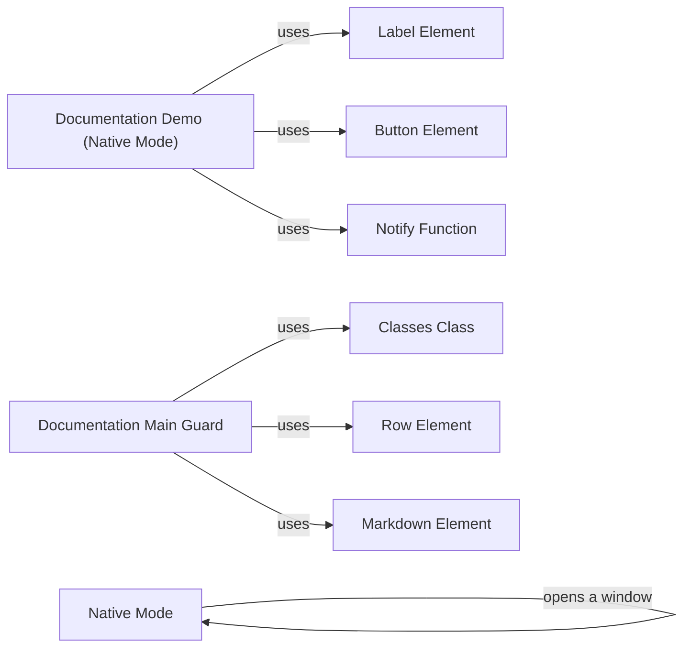

## Component Details

The Native Mode Integration enables running NiceGUI applications as standalone desktop applications. It centers around the `native_mode` module, which provides the core functionality for creating and managing native windows. The process involves opening a native window, starting a method executor to handle events within the window, and integrating with UI elements like labels, buttons, and notifications to provide a user experience similar to a desktop application. The documentation showcases how to deploy NiceGUI applications in native mode, including the use of a main guard and styling with CSS classes.

### Native Mode
Handles the creation and management of native windows for the NiceGUI application. It includes opening a window and starting a method executor for handling events within the native window.

**Related Classes/Methods**:

- <a href="https://github.com/zauberzeug/nicegui/blob/master/nicegui/native/native_mode.py#L29-L52" target="_blank" rel="noopener noreferrer">`nicegui.native.native_mode._open_window` (29:52)</a>
- <a href="https://github.com/zauberzeug/nicegui/blob/master/nicegui/native/native_mode.py#L55-L97" target="_blank" rel="noopener noreferrer">`nicegui.native.native_mode._start_window_method_executor` (55:97)</a>

### Documentation Demo (Native Mode)
Represents a demo within the NiceGUI documentation that showcases the native mode functionality. It utilizes elements like labels and buttons, and likely uses notifications to provide feedback to the user.

**Related Classes/Methods**:

- <a href="https://github.com/zauberzeug/nicegui/blob/master/website/documentation/content/section_configuration_deployment.py#L41-L53" target="_blank" rel="noopener noreferrer">`website.documentation.content.section_configuration_deployment:native_mode_demo` (41:53)</a>
- <a href="https://github.com/zauberzeug/nicegui/blob/master/nicegui/elements/label.py#L4-L13" target="_blank" rel="noopener noreferrer">`nicegui.elements.label.Label` (4:13)</a>
- <a href="https://github.com/zauberzeug/nicegui/blob/master/nicegui/elements/button.py#L13-L53" target="_blank" rel="noopener noreferrer">`nicegui.elements.button.Button` (13:53)</a>
- <a href="https://github.com/zauberzeug/nicegui/blob/master/nicegui/functions/notify.py#L12-L53" target="_blank" rel="noopener noreferrer">`nicegui.functions.notify.notify` (12:53)</a>

### Documentation Main Guard
Part of the NiceGUI documentation, specifically related to a main guard. It uses elements like rows and markdown to display information, and likely uses classes for styling.

**Related Classes/Methods**:

- <a href="https://github.com/zauberzeug/nicegui/blob/master/website/documentation/content/section_configuration_deployment.py#L68-L91" target="_blank" rel="noopener noreferrer">`website.documentation.content.section_configuration_deployment:native_main_guard` (68:91)</a>
- <a href="https://github.com/zauberzeug/nicegui/blob/master/nicegui/classes.py#L9-L56" target="_blank" rel="noopener noreferrer">`nicegui.classes.Classes` (9:56)</a>
- <a href="https://github.com/zauberzeug/nicegui/blob/master/nicegui/elements/row.py#L6-L25" target="_blank" rel="noopener noreferrer">`nicegui.elements.row.Row` (6:25)</a>
- <a href="https://github.com/zauberzeug/nicegui/blob/master/nicegui/elements/markdown.py#L12-L43" target="_blank" rel="noopener noreferrer">`nicegui.elements.markdown.Markdown` (12:43)</a>

### Label Element
A basic UI element for displaying text.

**Related Classes/Methods**:

- <a href="https://github.com/zauberzeug/nicegui/blob/master/nicegui/elements/label.py#L4-L13" target="_blank" rel="noopener noreferrer">`nicegui.elements.label.Label` (4:13)</a>

### Button Element
A basic UI element for triggering actions.

**Related Classes/Methods**:

- <a href="https://github.com/zauberzeug/nicegui/blob/master/nicegui/elements/button.py#L13-L53" target="_blank" rel="noopener noreferrer">`nicegui.elements.button.Button` (13:53)</a>

### Notify Function
A function for displaying notifications to the user.

**Related Classes/Methods**:

- <a href="https://github.com/zauberzeug/nicegui/blob/master/nicegui/functions/notify.py#L12-L53" target="_blank" rel="noopener noreferrer">`nicegui.functions.notify.notify` (12:53)</a>

### Classes Class
A class for managing CSS classes of UI elements.

**Related Classes/Methods**:

- <a href="https://github.com/zauberzeug/nicegui/blob/master/nicegui/classes.py#L9-L56" target="_blank" rel="noopener noreferrer">`nicegui.classes.Classes` (9:56)</a>

### Row Element
A layout element for arranging elements in a row.

**Related Classes/Methods**:

- <a href="https://github.com/zauberzeug/nicegui/blob/master/nicegui/elements/row.py#L6-L25" target="_blank" rel="noopener noreferrer">`nicegui.elements.row.Row` (6:25)</a>

### Markdown Element
A UI element for rendering Markdown content.

**Related Classes/Methods**:

- <a href="https://github.com/zauberzeug/nicegui/blob/master/nicegui/elements/markdown.py#L12-L43" target="_blank" rel="noopener noreferrer">`nicegui.elements.markdown.Markdown` (12:43)</a>