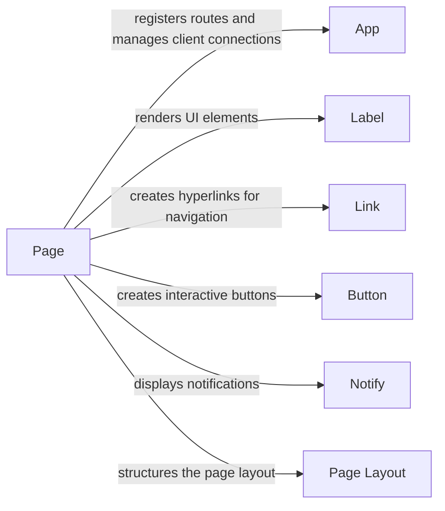

## Component Details

The Page Routing and Management component in NiceGUI is responsible for handling the creation, management, and routing of web pages within the application. It defines routes, associates them with UI content, manages page metadata, and enables navigation between pages. The core of this component revolves around the `page` module, which interacts closely with the `app` module to register routes and manage client connections. UI elements like labels, links, and buttons are rendered within these pages, and layout components structure the page. Styling and properties are applied to customize the appearance and behavior of the pages.

### Page
The `page` module is central to NiceGUI's routing and display mechanism. It's responsible for creating and managing web pages, associating them with specific URLs, and rendering UI elements within those pages. It interacts with the `app` module to register routes and manage client connections.

**Related Classes/Methods**:

- <a href="https://github.com/zauberzeug/nicegui/blob/master/nicegui/page.py#L21-L158" target="_blank" rel="noopener noreferrer">`nicegui.page.page` (21:158)</a>

### App
The `app` module is the core of a NiceGUI application. It manages the server, routes, and client connections. It interacts with the `page` module to register routes and handle requests for specific pages.

**Related Classes/Methods**:

- <a href="https://github.com/zauberzeug/nicegui/blob/master/nicegui/app/app.py#L290-L302" target="_blank" rel="noopener noreferrer">`nicegui.app.app.App.clients` (290:302)</a>

### Label
The `elements.label` module provides a simple way to display text on the UI. It's a fundamental building block for creating user interfaces and is used extensively throughout the example code. It interacts with the underlying front-end framework to render the text.

**Related Classes/Methods**:

- <a href="https://github.com/zauberzeug/nicegui/blob/master/nicegui/elements/label.py#L4-L13" target="_blank" rel="noopener noreferrer">`nicegui.elements.label.Label` (4:13)</a>

### Link
The `elements.link` module allows creating hyperlinks that navigate to other pages or external websites. It's used for navigation and providing references to other resources. It interacts with the front-end to create clickable links.

**Related Classes/Methods**:

- <a href="https://github.com/zauberzeug/nicegui/blob/master/nicegui/elements/link.py#L8-L33" target="_blank" rel="noopener noreferrer">`nicegui.elements.link.Link` (8:33)</a>

### Button
The `elements.button` module creates interactive buttons that trigger actions when clicked. It's used for user interaction and event handling. It interacts with the front-end to render clickable buttons and send events to the server.

**Related Classes/Methods**:

- <a href="https://github.com/zauberzeug/nicegui/blob/master/nicegui/elements/button.py#L13-L53" target="_blank" rel="noopener noreferrer">`nicegui.elements.button.Button` (13:53)</a>

### Notify
The `functions.notify` module provides a way to display notifications to the user. It's used for providing feedback and alerts. It interacts with the front-end to display notification messages.

**Related Classes/Methods**:

- <a href="https://github.com/zauberzeug/nicegui/blob/master/nicegui/functions/notify.py#L12-L53" target="_blank" rel="noopener noreferrer">`nicegui.functions.notify.notify` (12:53)</a>

### Page Layout
The `page_layout` module provides layout components like Header, Footer, LeftDrawer and RightDrawer to structure the page.

**Related Classes/Methods**:

- <a href="https://github.com/zauberzeug/nicegui/blob/master/nicegui/page_layout.py#L22-L83" target="_blank" rel="noopener noreferrer">`nicegui.page_layout.Header` (22:83)</a>
- <a href="https://github.com/zauberzeug/nicegui/blob/master/nicegui/page_layout.py#L160-L195" target="_blank" rel="noopener noreferrer">`nicegui.page_layout.LeftDrawer` (160:195)</a>
- <a href="https://github.com/zauberzeug/nicegui/blob/master/nicegui/page_layout.py#L198-L233" target="_blank" rel="noopener noreferrer">`nicegui.page_layout.RightDrawer` (198:233)</a>
- <a href="https://github.com/zauberzeug/nicegui/blob/master/nicegui/page_layout.py#L236-L283" target="_blank" rel="noopener noreferrer">`nicegui.page_layout.Footer` (236:283)</a>