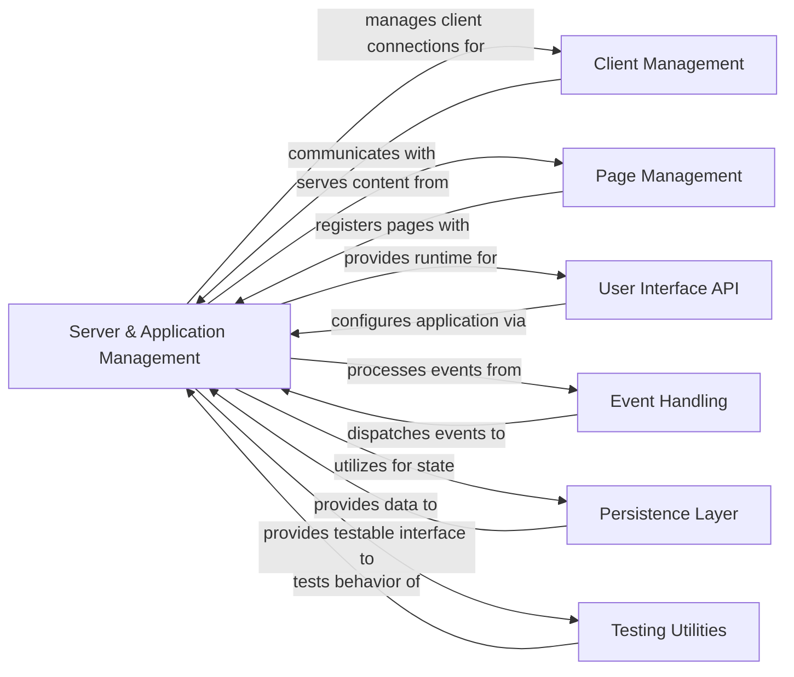

## Component Details

This overview describes the Server & Application Management component, which is central to the NiceGUI application's lifecycle, server operations, and integration. It details its structure, purpose, and interactions with key components like Client Management, Page Management, User Interface API, Event Handling, Persistence Layer, and Testing Utilities, illustrating how it orchestrates the application's core functionalities.

### Server & Application Management
Manages the core application lifecycle, server operations, routing, background tasks, favicon serving, global error handling, and native desktop integration.

**Related Classes/Methods**:

- <a href="https://github.com/zauberzeug/nicegui/blob/master/nicegui/app/app.py#L1-L240" target="_blank" rel="noopener noreferrer">`nicegui.app.app` (1:240)</a>
- <a href="https://github.com/zauberzeug/nicegui/blob/master/nicegui/nicegui.py#L1-L140" target="_blank" rel="noopener noreferrer">`nicegui.nicegui` (1:140)</a>
- <a href="https://github.com/zauberzeug/nicegui/blob/master/nicegui/server.py#L1-L27" target="_blank" rel="noopener noreferrer">`nicegui.server` (1:27)</a>
- <a href="https://github.com/zauberzeug/nicegui/blob/master/nicegui/page.py#L21-L158" target="_blank" rel="noopener noreferrer">`nicegui.page` (21:158)</a>
- <a href="https://github.com/zauberzeug/nicegui/blob/master/nicegui/api_router.py#L1-L30" target="_blank" rel="noopener noreferrer">`nicegui.api_router` (1:30)</a>
- <a href="https://github.com/zauberzeug/nicegui/blob/master/nicegui/background_tasks.py#L1-L80" target="_blank" rel="noopener noreferrer">`nicegui.background_tasks` (1:80)</a>
- <a href="https://github.com/zauberzeug/nicegui/blob/master/nicegui/favicon.py#L1-L90" target="_blank" rel="noopener noreferrer">`nicegui.favicon` (1:90)</a>
- <a href="https://github.com/zauberzeug/nicegui/blob/master/nicegui/error.py#L1-L29" target="_blank" rel="noopener noreferrer">`nicegui.error` (1:29)</a>
- `nicegui.ui_run` (full file reference)
- `nicegui.ui_run_with` (full file reference)
- <a href="https://github.com/zauberzeug/nicegui/blob/master/nicegui/native/native.py#L1-L160" target="_blank" rel="noopener noreferrer">`nicegui.native.native` (1:160)</a>
- `nicegui.native.native_config` (full file reference)
- `nicegui.native.native_mode` (full file reference)

### Client Management
The Client Management component handles the communication and state of individual clients connected to the NiceGUI application. It manages client-specific data, sends updates to the browser, and processes incoming messages from the client. This component is crucial for maintaining interactive user interfaces.

**Related Classes/Methods**:

- `nicegui.client` (full file reference)
- `nicegui.outbox` (full file reference)

### Page Management
The Page Management component is concerned with the structure and routing of individual web pages within the NiceGUI application. It defines how pages are created, their routes, and associated metadata like favicons and titles. It works closely with the Application Core and Client Management to serve content.

**Related Classes/Methods**:

- <a href="https://github.com/zauberzeug/nicegui/blob/master/nicegui/page.py#L21-L158" target="_blank" rel="noopener noreferrer">`nicegui.page` (21:158)</a>
- `nicegui.page_layout` (full file reference)
- `nicegui.api_router` (full file reference)
- `nicegui.favicon` (full file reference)

### User Interface API
The User Interface API component serves as the primary interface for developers to create and manipulate UI elements within NiceGUI. It provides convenient functions and classes to instantiate elements, define their behavior, and arrange them on a page. It acts as a facade to the underlying UI Elements and Client Management components.

**Related Classes/Methods**:

- `nicegui.ui` (full file reference)
- `nicegui.functions` (full file reference)

### Event Handling
The Event Handling component is responsible for managing and dispatching events triggered by user interactions or other application logic. It defines event classes and provides mechanisms to register event listeners, ensuring that appropriate actions are taken when events occur. It bridges client-side interactions with Python callbacks.

**Related Classes/Methods**:

- `nicegui.events` (full file reference)
- `nicegui.event_listener` (full file reference)
- `nicegui.awaitable_response` (full file reference)

### Persistence Layer
The Persistence Layer component provides functionalities for storing and retrieving application data persistently. It offers different storage backends (e.g., file-based, Redis) and ensures that data can survive application restarts, contributing to a more robust user experience.

**Related Classes/Methods**:

- `nicegui.persistence` (full file reference)
- `nicegui.persistence.persistent_dict` (full file reference)
- `nicegui.persistence.file_persistent_dict` (full file reference)
- `nicegui.persistence.redis_persistent_dict` (full file reference)
- `nicegui.storage` (full file reference)

### Testing Utilities
The Testing Utilities component provides a set of tools and fixtures to facilitate automated testing of NiceGUI applications. It simulates user interactions, manages screen states, and helps verify the correct behavior of UI elements and application logic, ensuring the quality and reliability of the application.

**Related Classes/Methods**:

- `nicegui.testing` (full file reference)
- `nicegui.testing.screen` (full file reference)
- `nicegui.testing.user` (full file reference)
- `nicegui.testing.user_interaction` (full file reference)
- `nicegui.testing.plugin` (full file reference)
- `nicegui.testing.general_fixtures` (full file reference)

### [FAQ](https://github.com/CodeBoarding/GeneratedOnBoardings/tree/main?tab=readme-ov-file#faq)