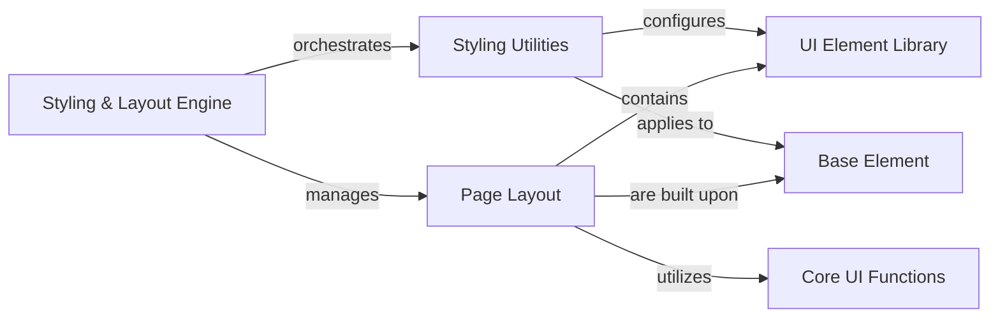

## Component Details

The Styling & Layout Engine is a core subsystem responsible for defining and applying the visual presentation and structural organization of UI elements within NiceGUI applications. It integrates various styling mechanisms, including direct CSS class manipulation, inline style application, and comprehensive Tailwind CSS utility integration. Furthermore, it provides foundational components for structuring page layouts, such as headers, footers, and drawers, ensuring a consistent and responsive user interface.

### Styling & Layout Engine
Manages the visual appearance and arrangement of UI elements, including CSS classes, inline styles, Tailwind CSS integration, and page layouts. It orchestrates the application of styles and defines the structural organization of pages.

**Related Classes/Methods**:

- <a href="https://github.com/zauberzeug/nicegui/blob/master/nicegui/classes.py#L9-L56" target="_blank" rel="noopener noreferrer">`nicegui.classes.Classes` (9:56)</a>
- <a href="https://github.com/zauberzeug/nicegui/blob/master/nicegui/style.py#L9-L47" target="_blank" rel="noopener noreferrer">`nicegui.style.Style` (9:47)</a>
- <a href="https://github.com/zauberzeug/nicegui/blob/master/nicegui/tailwind.py#L182-L1000" target="_blank" rel="noopener noreferrer">`nicegui.tailwind.Tailwind` (182:1000)</a>
- <a href="https://github.com/zauberzeug/nicegui/blob/master/nicegui/page_layout.py#L22-L83" target="_blank" rel="noopener noreferrer">`nicegui.page_layout.Header` (22:83)</a>
- <a href="https://github.com/zauberzeug/nicegui/blob/master/nicegui/page_layout.py#L86-L157" target="_blank" rel="noopener noreferrer">`nicegui.page_layout.Drawer` (86:157)</a>
- <a href="https://github.com/zauberzeug/nicegui/blob/master/nicegui/page_layout.py#L160-L195" target="_blank" rel="noopener noreferrer">`nicegui.page_layout.LeftDrawer` (160:195)</a>
- <a href="https://github.com/zauberzeug/nicegui/blob/master/nicegui/page_layout.py#L198-L233" target="_blank" rel="noopener noreferrer">`nicegui.page_layout.RightDrawer` (198:233)</a>
- <a href="https://github.com/zauberzeug/nicegui/blob/master/nicegui/page_layout.py#L236-L283" target="_blank" rel="noopener noreferrer">`nicegui.page_layout.Footer` (236:283)</a>
- <a href="https://github.com/zauberzeug/nicegui/blob/master/nicegui/page_layout.py#L286-L307" target="_blank" rel="noopener noreferrer">`nicegui.page_layout.PageSticky` (286:307)</a>

### Styling Utilities
A collection of utilities and classes dedicated to applying and managing visual styles and properties for UI elements, including direct CSS class manipulation, property setting, and integration with Tailwind CSS.

**Related Classes/Methods**:

- <a href="https://github.com/zauberzeug/nicegui/blob/master/nicegui/classes.py#L9-L56" target="_blank" rel="noopener noreferrer">`nicegui.classes.Classes` (9:56)</a>
- <a href="https://github.com/zauberzeug/nicegui/blob/master/nicegui/props.py#L39-L93" target="_blank" rel="noopener noreferrer">`nicegui.props.Props` (39:93)</a>
- <a href="https://github.com/zauberzeug/nicegui/blob/master/nicegui/style.py#L9-L47" target="_blank" rel="noopener noreferrer">`nicegui.style.Style` (9:47)</a>
- <a href="https://github.com/zauberzeug/nicegui/blob/master/nicegui/tailwind.py#L182-L1000" target="_blank" rel="noopener noreferrer">`nicegui.tailwind.Tailwind` (182:1000)</a>
- <a href="https://github.com/zauberzeug/nicegui/blob/master/nicegui/tailwind.py#L629-L632" target="_blank" rel="noopener noreferrer">`nicegui.tailwind.Tailwind.background_color` (629:632)</a>
- <a href="https://github.com/zauberzeug/nicegui/blob/master/nicegui/tailwind.py#L544-L547" target="_blank" rel="noopener noreferrer">`nicegui.tailwind.Tailwind.text_color` (544:547)</a>
- <a href="https://github.com/zauberzeug/nicegui/blob/master/nicegui/tailwind.py#L499-L502" target="_blank" rel="noopener noreferrer">`nicegui.tailwind.Tailwind.font_weight` (499:502)</a>
- <a href="https://github.com/zauberzeug/nicegui/blob/master/nicegui/tailwind.py#L204-L207" target="_blank" rel="noopener noreferrer">`nicegui.tailwind.Tailwind.apply` (204:207)</a>

### Page Layout
Manages the structural layout components of a NiceGUI page, such as headers, footers, and drawers, allowing for organized and responsive page designs.

**Related Classes/Methods**:

- <a href="https://github.com/zauberzeug/nicegui/blob/master/nicegui/page_layout.py#L160-L195" target="_blank" rel="noopener noreferrer">`nicegui.page_layout.LeftDrawer` (160:195)</a>
- <a href="https://github.com/zauberzeug/nicegui/blob/master/nicegui/page_layout.py#L22-L83" target="_blank" rel="noopener noreferrer">`nicegui.page_layout.Header` (22:83)</a>
- <a href="https://github.com/zauberzeug/nicegui/blob/master/nicegui/page_layout.py#L236-L283" target="_blank" rel="noopener noreferrer">`nicegui.page_layout.Footer` (236:283)</a>
- <a href="https://github.com/zauberzeug/nicegui/blob/master/nicegui/page_layout.py#L86-L157" target="_blank" rel="noopener noreferrer">`nicegui.page_layout.Drawer` (86:157)</a>
- <a href="https://github.com/zauberzeug/nicegui/blob/master/nicegui/page_layout.py#L286-L307" target="_blank" rel="noopener noreferrer">`nicegui.page_layout.PageSticky` (286:307)</a>

### Base Element
The fundamental base class for all visual components in NiceGUI, providing core functionalities such as event handling, property management, and basic rendering capabilities that are inherited by all derived UI elements.

**Related Classes/Methods**:

- <a href="https://github.com/zauberzeug/nicegui/blob/master/nicegui/element.py#L40-L562" target="_blank" rel="noopener noreferrer">`nicegui.element.Element` (40:562)</a>
- <a href="https://github.com/zauberzeug/nicegui/blob/master/nicegui/element.py#L344-L401" target="_blank" rel="noopener noreferrer">`nicegui.element.Element.on` (344:401)</a>
- <a href="https://github.com/zauberzeug/nicegui/blob/master/nicegui/element.py#L461-L466" target="_blank" rel="noopener noreferrer">`nicegui.element.Element.clear` (461:466)</a>
- <a href="https://github.com/zauberzeug/nicegui/blob/master/nicegui/element.py#L167-L186" target="_blank" rel="noopener noreferrer">`nicegui.element.Element.add_slot` (167:186)</a>
- <a href="https://github.com/zauberzeug/nicegui/blob/master/nicegui/element.py#L334-L342" target="_blank" rel="noopener noreferrer">`nicegui.element.Element.tooltip` (334:342)</a>
- <a href="https://github.com/zauberzeug/nicegui/blob/master/nicegui/element.py#L245-L264" target="_blank" rel="noopener noreferrer">`nicegui.element.Element.default_classes` (245:264)</a>
- <a href="https://github.com/zauberzeug/nicegui/blob/master/nicegui/element.py#L272-L292" target="_blank" rel="noopener noreferrer">`nicegui.element.Element.default_style` (272:292)</a>
- <a href="https://github.com/zauberzeug/nicegui/blob/master/nicegui/element.py#L322-L332" target="_blank" rel="noopener noreferrer">`nicegui.element.Element.mark` (322:332)</a>

### Core UI Functions
Provides essential utility functions for interacting with the client-side, managing styles, handling navigation, and displaying notifications, enabling dynamic and responsive web applications.

**Related Classes/Methods**:

- <a href="https://github.com/zauberzeug/nicegui/blob/master/nicegui/functions/style.py#L16-L28" target="_blank" rel="noopener noreferrer">`nicegui.functions.style.add_css` (16:28)</a>
- <a href="https://github.com/zauberzeug/nicegui/blob/master/nicegui/functions/javascript.py#L5-L23" target="_blank" rel="noopener noreferrer">`nicegui.functions.javascript.run_javascript` (5:23)</a>
- <a href="https://github.com/zauberzeug/nicegui/blob/master/nicegui/functions/navigate.py#L44-L69" target="_blank" rel="noopener noreferrer">`nicegui.functions.navigate.Navigate.to` (44:69)</a>
- <a href="https://github.com/zauberzeug/nicegui/blob/master/nicegui/functions/html.py#L5-L17" target="_blank" rel="noopener noreferrer">`nicegui.functions.html.add_head_html` (5:17)</a>
- <a href="https://github.com/zauberzeug/nicegui/blob/master/nicegui/functions/page_title.py#L5-L17" target="_blank" rel="noopener noreferrer">`nicegui.functions.page_title.page_title` (5:17)</a>
- <a href="https://github.com/zauberzeug/nicegui/blob/master/nicegui/functions/notify.py#L12-L53" target="_blank" rel="noopener noreferrer">`nicegui.functions.notify.notify` (12:53)</a>
- <a href="https://github.com/zauberzeug/nicegui/blob/master/nicegui/functions/clipboard.py#L33-L47" target="_blank" rel="noopener noreferrer">`nicegui.functions.clipboard.write` (33:47)</a>
- <a href="https://github.com/zauberzeug/nicegui/blob/master/nicegui/functions/clipboard.py#L15-L30" target="_blank" rel="noopener noreferrer">`nicegui.functions.clipboard.read` (15:30)</a>
- <a href="https://github.com/zauberzeug/nicegui/blob/master/nicegui/functions/clipboard.py#L50-L76" target="_blank" rel="noopener noreferrer">`nicegui.functions.clipboard.read_image` (50:76)</a>
- <a href="https://github.com/zauberzeug/nicegui/blob/master/nicegui/functions/style.py#L31-L47" target="_blank" rel="noopener noreferrer">`nicegui.functions.style.add_scss` (31:47)</a>
- <a href="https://github.com/zauberzeug/nicegui/blob/master/nicegui/functions/style.py#L50-L60" target="_blank" rel="noopener noreferrer">`nicegui.functions.style.add_sass` (50:60)</a>

### UI Element Library
Provides a comprehensive set of pre-built, interactive user interface components such as buttons, inputs, layouts, and specialized widgets like scenes and tables, serving as the fundamental building blocks for NiceGUI applications.

**Related Classes/Methods**:

- <a href="https://github.com/zauberzeug/nicegui/blob/master/nicegui/elements/link.py#L8-L33" target="_blank" rel="noopener noreferrer">`nicegui.elements.link.Link` (8:33)</a>
- <a href="https://github.com/zauberzeug/nicegui/blob/master/nicegui/elements/button.py#L13-L53" target="_blank" rel="noopener noreferrer">`nicegui.elements.button.Button` (13:53)</a>
- <a href="https://github.com/zauberzeug/nicegui/blob/master/nicegui/elements/input.py#L10-L76" target="_blank" rel="noopener noreferrer">`nicegui.elements.input.Input` (10:76)</a>
- <a href="https://github.com/zauberzeug/nicegui/blob/master/nicegui/elements/table.py#L29-L453" target="_blank" rel="noopener noreferrer">`nicegui.elements.table.Table` (29:453)</a>
- <a href="https://github.com/zauberzeug/nicegui/blob/master/nicegui/elements/scene.py#L41-L288" target="_blank" rel="noopener noreferrer">`nicegui.elements.scene.Scene` (41:288)</a>

### [FAQ](https://github.com/CodeBoarding/GeneratedOnBoardings/tree/main?tab=readme-ov-file#faq)