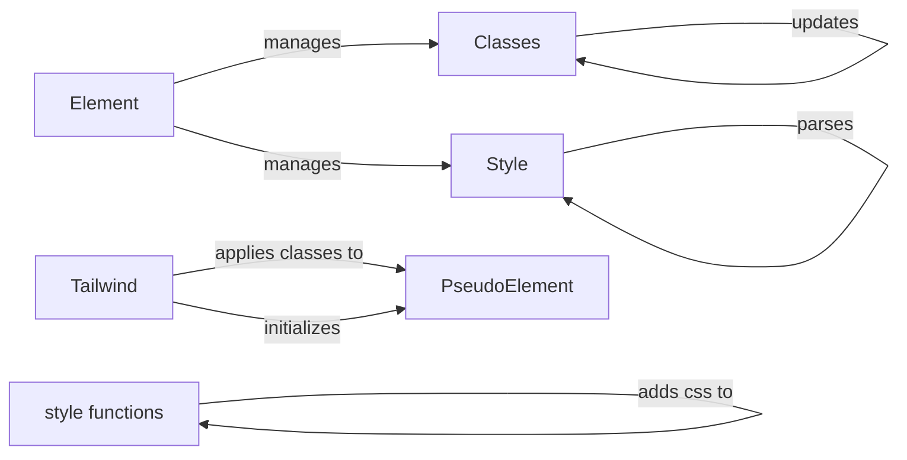

## Component Details

The Styling and Appearance component in NiceGUI provides a comprehensive system for customizing the look and feel of UI elements. It encompasses classes and functions for applying CSS styles, leveraging Tailwind CSS, and managing element classes. The core functionality revolves around the `Element` class, which serves as the base for all UI elements and integrates with `Classes` and `Style` to handle CSS classes and styles, respectively. The `Tailwind` class offers a fluent interface for applying Tailwind CSS classes, while `PseudoElement` aids in managing styles for pseudo-elements. Additionally, the `style` functions module allows for adding custom CSS and SCSS styles to the application, extending the styling capabilities beyond the built-in Tailwind support.

### Element
The `Element` class is the base class for all NiceGUI elements. It provides fundamental properties and methods for managing the element's appearance, including default classes and styles. It serves as the foundation upon which all other UI elements are built and provides the basic styling capabilities.

**Related Classes/Methods**:

- <a href="https://github.com/zauberzeug/nicegui/blob/master/nicegui/element.py#L40-L562" target="_blank" rel="noopener noreferrer">`nicegui.element.Element` (40:562)</a>
- <a href="https://github.com/zauberzeug/nicegui/blob/master/nicegui/element.py#L245-L264" target="_blank" rel="noopener noreferrer">`nicegui.element.Element:default_classes` (245:264)</a>
- <a href="https://github.com/zauberzeug/nicegui/blob/master/nicegui/element.py#L272-L292" target="_blank" rel="noopener noreferrer">`nicegui.element.Element:default_style` (272:292)</a>

### Classes
The `Classes` class manages the CSS classes applied to an element. It provides methods for adding, removing, and updating classes, ensuring that the element's appearance is consistent with the desired styles. It interacts closely with the `Element` class to apply and manage the classes.

**Related Classes/Methods**:

- <a href="https://github.com/zauberzeug/nicegui/blob/master/nicegui/classes.py#L9-L56" target="_blank" rel="noopener noreferrer">`nicegui.classes.Classes` (9:56)</a>
- <a href="https://github.com/zauberzeug/nicegui/blob/master/nicegui/classes.py#L15-L36" target="_blank" rel="noopener noreferrer">`nicegui.classes.Classes:__call__` (15:36)</a>
- <a href="https://github.com/zauberzeug/nicegui/blob/master/nicegui/classes.py#L39-L56" target="_blank" rel="noopener noreferrer">`nicegui.classes.Classes:update_list` (39:56)</a>

### Style
The `Style` class allows applying CSS styles to NiceGUI elements. It handles parsing and applying style properties, providing a way to customize the appearance of elements beyond what's possible with classes alone. It interacts with the `Element` class to apply the styles.

**Related Classes/Methods**:

- <a href="https://github.com/zauberzeug/nicegui/blob/master/nicegui/style.py#L9-L47" target="_blank" rel="noopener noreferrer">`nicegui.style.Style` (9:47)</a>
- <a href="https://github.com/zauberzeug/nicegui/blob/master/nicegui/style.py#L15-L36" target="_blank" rel="noopener noreferrer">`nicegui.style.Style:__call__` (15:36)</a>
- <a href="https://github.com/zauberzeug/nicegui/blob/master/nicegui/style.py#L39-L47" target="_blank" rel="noopener noreferrer">`nicegui.style.Style:parse` (39:47)</a>

### Tailwind
The `Tailwind` class provides a way to apply Tailwind CSS styles to NiceGUI elements. It offers a fluent interface for specifying Tailwind classes, which are then applied to the element's underlying HTML. It uses `PseudoElement` to manage styles for pseudo-elements.

**Related Classes/Methods**:

- <a href="https://github.com/zauberzeug/nicegui/blob/master/nicegui/tailwind.py#L182-L1022" target="_blank" rel="noopener noreferrer">`nicegui.tailwind.Tailwind` (182:1022)</a>
- <a href="https://github.com/zauberzeug/nicegui/blob/master/nicegui/tailwind.py#L184-L185" target="_blank" rel="noopener noreferrer">`nicegui.tailwind.Tailwind:__init__` (184:185)</a>
- <a href="https://github.com/zauberzeug/nicegui/blob/master/nicegui/tailwind.py#L188-L189" target="_blank" rel="noopener noreferrer">`nicegui.tailwind.Tailwind:__call__` (188:189)</a>
- <a href="https://github.com/zauberzeug/nicegui/blob/master/nicegui/tailwind.py#L177-L179" target="_blank" rel="noopener noreferrer">`nicegui.tailwind.PseudoElement:classes` (177:179)</a>

### PseudoElement
The `PseudoElement` class is a helper class used by `Tailwind` to manage CSS classes for pseudo-elements like `hover`, `focus`, and `active`. It allows for a more organized and readable way to define styles for these states. It is tightly coupled with the `Tailwind` class.

**Related Classes/Methods**:

- <a href="https://github.com/zauberzeug/nicegui/blob/master/nicegui/tailwind.py#L172-L179" target="_blank" rel="noopener noreferrer">`nicegui.tailwind.PseudoElement` (172:179)</a>

### style functions
The `style` functions module provides functions for adding custom CSS and SCSS styles to the application. This allows for extending the styling capabilities beyond the built-in Tailwind support. These functions directly manipulate the application's style sheets.

**Related Classes/Methods**:

- <a href="https://github.com/zauberzeug/nicegui/blob/master/nicegui/functions/style.py#L1-L24" target="_blank" rel="noopener noreferrer">`nicegui.functions.style` (1:24)</a>
- <a href="https://github.com/zauberzeug/nicegui/blob/master/nicegui/functions/style.py#L31-L47" target="_blank" rel="noopener noreferrer">`nicegui.functions.style:add_scss` (31:47)</a>
- <a href="https://github.com/zauberzeug/nicegui/blob/master/nicegui/functions/style.py#L16-L28" target="_blank" rel="noopener noreferrer">`nicegui.functions.style:add_css` (16:28)</a>