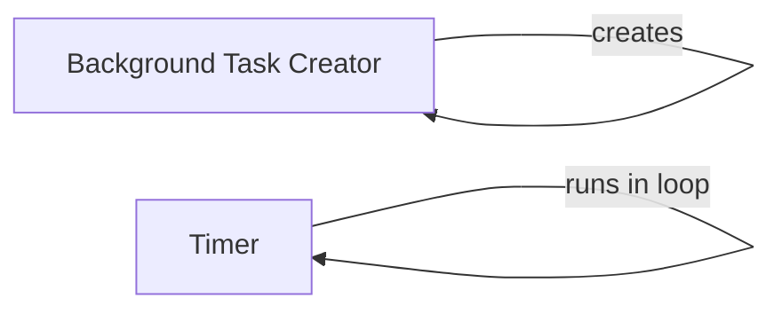

## Component Details

The Task Management and Scheduling component in NiceGUI provides the ability to execute functions asynchronously in the background and schedule functions to be called periodically. This allows for long-running operations to be performed without blocking the main UI thread, and for tasks to be executed at regular intervals. The core functionality revolves around creating background tasks and utilizing timers for scheduled execution.

### Background Task Creator
This component is responsible for creating and managing background tasks. It ensures that the provided function is a coroutine and then schedules it for execution in the background. It allows the main application to remain responsive while long-running or asynchronous operations are performed.

**Related Classes/Methods**:

- <a href="https://github.com/zauberzeug/nicegui/blob/master/nicegui/background_tasks.py#L17-L30" target="_blank" rel="noopener noreferrer">`nicegui.background_tasks.create` (17:30)</a>
- <a href="https://github.com/zauberzeug/nicegui/blob/master/nicegui/background_tasks.py#L33-L50" target="_blank" rel="noopener noreferrer">`nicegui.background_tasks.create_lazy` (33:50)</a>
- <a href="https://github.com/zauberzeug/nicegui/blob/master/nicegui/background_tasks.py#L65-L72" target="_blank" rel="noopener noreferrer">`nicegui.background_tasks._ensure_coroutine` (65:72)</a>

### Timer
The Timer component provides a mechanism for repeatedly executing a callback function at a specified interval. It manages the timer's lifecycle, including starting, stopping, and invoking the callback. It integrates with the application's event loop to ensure timely execution of the callback.

**Related Classes/Methods**:

- <a href="https://github.com/zauberzeug/nicegui/blob/master/nicegui/timer.py#L11-L116" target="_blank" rel="noopener noreferrer">`nicegui.timer.Timer` (11:116)</a>
- <a href="https://github.com/zauberzeug/nicegui/blob/master/nicegui/timer.py#L15-L45" target="_blank" rel="noopener noreferrer">`nicegui.timer.Timer.__init__` (15:45)</a>
- <a href="https://github.com/zauberzeug/nicegui/blob/master/nicegui/timer.py#L63-L72" target="_blank" rel="noopener noreferrer">`nicegui.timer.Timer._run_once` (63:72)</a>
- <a href="https://github.com/zauberzeug/nicegui/blob/master/nicegui/timer.py#L74-L94" target="_blank" rel="noopener noreferrer">`nicegui.timer.Timer._run_in_loop` (74:94)</a>