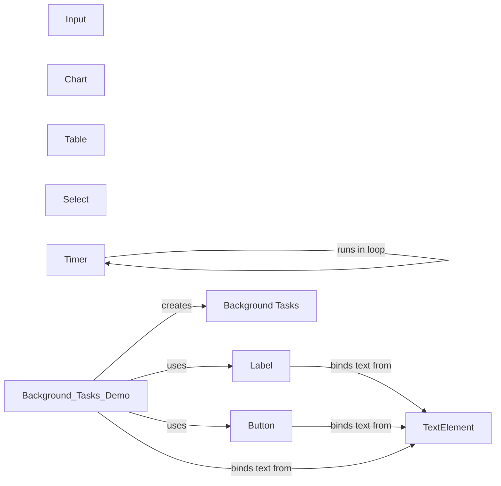

## Component Details

The UI Component Library provides a set of reusable UI elements that simplify the creation of user interfaces. These components, such as buttons, inputs, labels, charts, tables, and selects, offer a higher level of abstraction and pre-built functionality for common UI patterns. They handle user interactions, data display, and event management, allowing developers to quickly assemble complex UIs without needing to implement each element from scratch. The library also includes base classes and mixins that provide common functionality for text-based elements and background task management, ensuring consistency and efficiency across the UI.

### Button
Represents a button element in the user interface, enabling users to trigger actions through clicks. It supports customization with text, icons, and event handlers.

**Related Classes/Methods**:

- <a href="https://github.com/zauberzeug/nicegui/blob/master/nicegui/elements/button.py#L13-L53" target="_blank" rel="noopener noreferrer">`nicegui.elements.button.Button` (13:53)</a>

### Input
Represents an input field for users to enter text or numerical data. It offers configuration options for input types, validation rules, and event handlers.

**Related Classes/Methods**:

- <a href="https://github.com/zauberzeug/nicegui/blob/master/nicegui/elements/input.py#L10-L76" target="_blank" rel="noopener noreferrer">`nicegui.elements.input.Input` (10:76)</a>

### Label
Represents a label element for displaying static text or dynamic values. It supports data binding for automatic content updates.

**Related Classes/Methods**:

- <a href="https://github.com/zauberzeug/nicegui/blob/master/nicegui/elements/label.py#L4-L13" target="_blank" rel="noopener noreferrer">`nicegui.elements.label.Label` (4:13)</a>

### Chart
Represents a chart element for visualizing data in graphical formats, including line, bar, and pie charts.

**Related Classes/Methods**:

- `nicegui.elements.chart.Chart` (full file reference)

### Table
Represents a table element for displaying data in a tabular format, with support for sorting, filtering, and pagination.

**Related Classes/Methods**:

- <a href="https://github.com/zauberzeug/nicegui/blob/master/nicegui/elements/table.py#L29-L453" target="_blank" rel="noopener noreferrer">`nicegui.elements.table.Table` (29:453)</a>

### Select
Represents a select element, allowing users to choose an option from a predefined list of values.

**Related Classes/Methods**:

- <a href="https://github.com/zauberzeug/nicegui/blob/master/nicegui/elements/select.py#L12-L169" target="_blank" rel="noopener noreferrer">`nicegui.elements.select.Select` (12:169)</a>

### TextElement
Provides a base class for elements that display text, offering functionality for binding text content to data sources. It serves as a foundation for other text-based elements like labels and buttons.

**Related Classes/Methods**:

- <a href="https://github.com/zauberzeug/nicegui/blob/master/nicegui/elements/mixins/text_element.py#L35-L50" target="_blank" rel="noopener noreferrer">`nicegui.elements.mixins.text_element.TextElement.bind_text_from` (35:50)</a>

### Background Tasks
Provides functionality for running tasks in the background, ensuring the main application remains responsive. It includes functions for creating background tasks, ensuring they are coroutines, and managing their lifecycle.

**Related Classes/Methods**:

- <a href="https://github.com/zauberzeug/nicegui/blob/master/nicegui/background_tasks.py#L33-L50" target="_blank" rel="noopener noreferrer">`nicegui.background_tasks:create_lazy` (33:50)</a>
- <a href="https://github.com/zauberzeug/nicegui/blob/master/nicegui/background_tasks.py#L65-L72" target="_blank" rel="noopener noreferrer">`nicegui.background_tasks:_ensure_coroutine` (65:72)</a>
- <a href="https://github.com/zauberzeug/nicegui/blob/master/nicegui/background_tasks.py#L84-L102" target="_blank" rel="noopener noreferrer">`nicegui.background_tasks:teardown` (84:102)</a>
- <a href="https://github.com/zauberzeug/nicegui/blob/master/nicegui/background_tasks.py#L17-L30" target="_blank" rel="noopener noreferrer">`nicegui.background_tasks.create` (17:30)</a>

### Timer
Provides a mechanism for executing a callback function repeatedly at a specified interval, integrating with the application's event loop for timely execution.

**Related Classes/Methods**:

- <a href="https://github.com/zauberzeug/nicegui/blob/master/nicegui/timer.py#L15-L45" target="_blank" rel="noopener noreferrer">`nicegui.timer.Timer:__init__` (15:45)</a>
- <a href="https://github.com/zauberzeug/nicegui/blob/master/nicegui/timer.py#L63-L72" target="_blank" rel="noopener noreferrer">`nicegui.timer.Timer:_run_once` (63:72)</a>
- <a href="https://github.com/zauberzeug/nicegui/blob/master/nicegui/timer.py#L74-L94" target="_blank" rel="noopener noreferrer">`nicegui.timer.Timer:_run_in_loop` (74:94)</a>