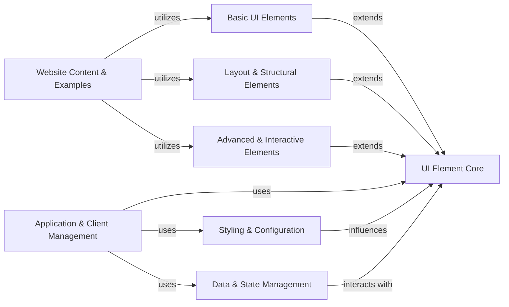

## Component Details

This graph illustrates the core components of the NiceGUI UI framework, focusing on how user interface elements are structured, managed, and interact within the application. It covers the foundational UI element classes, various categories of pre-built UI elements (basic, layout, advanced), and the underlying systems for application lifecycle, client communication, styling, and data management. The purpose is to provide a clear overview of the modular design that enables rapid web application development with NiceGUI.

### UI Element Core
Provides the foundational classes and mixins for all UI elements in NiceGUI, handling common properties, events, and rendering mechanisms. It defines how elements are initialized, updated, and interact with the client.

**Related Classes/Methods**:

- <a href="https://github.com/zauberzeug/nicegui/blob/master/nicegui/element.py#L40-L562" target="_blank" rel="noopener noreferrer">`nicegui.element.Element` (40:562)</a>
- <a href="https://github.com/zauberzeug/nicegui/blob/master/nicegui/elements/mixins/visibility.py#L13-L109" target="_blank" rel="noopener noreferrer">`nicegui.elements.mixins.visibility.Visibility` (13:109)</a>
- <a href="https://github.com/zauberzeug/nicegui/blob/master/nicegui/elements/mixins/value_element.py#L10-L125" target="_blank" rel="noopener noreferrer">`nicegui.elements.mixins.value_element.ValueElement` (10:125)</a>
- <a href="https://github.com/zauberzeug/nicegui/blob/master/nicegui/elements/mixins/validation_element.py#L12-L99" target="_blank" rel="noopener noreferrer">`nicegui.elements.mixins.validation_element.ValidationElement` (12:99)</a>
- <a href="https://github.com/zauberzeug/nicegui/blob/master/nicegui/elements/mixins/text_element.py#L9-L88" target="_blank" rel="noopener noreferrer">`nicegui.elements.mixins.text_element.TextElement` (9:88)</a>
- <a href="https://github.com/zauberzeug/nicegui/blob/master/nicegui/elements/mixins/label_element.py#L9-L89" target="_blank" rel="noopener noreferrer">`nicegui.elements.mixins.label_element.LabelElement` (9:89)</a>
- <a href="https://github.com/zauberzeug/nicegui/blob/master/nicegui/elements/mixins/icon_element.py#L9-L89" target="_blank" rel="noopener noreferrer">`nicegui.elements.mixins.icon_element.IconElement` (9:89)</a>
- <a href="https://github.com/zauberzeug/nicegui/blob/master/nicegui/elements/mixins/disableable_element.py#L9-L97" target="_blank" rel="noopener noreferrer">`nicegui.elements.mixins.disableable_element.DisableableElement` (9:97)</a>
- <a href="https://github.com/zauberzeug/nicegui/blob/master/nicegui/elements/mixins/source_element.py#L12-L109" target="_blank" rel="noopener noreferrer">`nicegui.elements.mixins.source_element.SourceElement` (12:109)</a>
- <a href="https://github.com/zauberzeug/nicegui/blob/master/nicegui/elements/mixins/content_element.py#L9-L88" target="_blank" rel="noopener noreferrer">`nicegui.elements.mixins.content_element.ContentElement` (9:88)</a>
- <a href="https://github.com/zauberzeug/nicegui/blob/master/nicegui/elements/mixins/filter_element.py#L9-L86" target="_blank" rel="noopener noreferrer">`nicegui.elements.mixins.filter_element.FilterElement` (9:86)</a>
- <a href="https://github.com/zauberzeug/nicegui/blob/master/nicegui/elements/mixins/name_element.py#L9-L85" target="_blank" rel="noopener noreferrer">`nicegui.elements.mixins.name_element.NameElement` (9:85)</a>
- <a href="https://github.com/zauberzeug/nicegui/blob/master/nicegui/elements/mixins/color_elements.py#L29-L39" target="_blank" rel="noopener noreferrer">`nicegui.elements.mixins.color_elements.TextColorElement` (29:39)</a>
- <a href="https://github.com/zauberzeug/nicegui/blob/master/nicegui/slot.py#L14-L65" target="_blank" rel="noopener noreferrer">`nicegui.slot.Slot` (14:65)</a>
- <a href="https://github.com/zauberzeug/nicegui/blob/master/nicegui/dependencies.py#L1-L120" target="_blank" rel="noopener noreferrer">`nicegui.dependencies` (1:120)</a>

### Basic UI Elements
A collection of fundamental and commonly used graphical user interface elements for building simple interactive web pages. These elements provide basic input, display, and interaction capabilities.

**Related Classes/Methods**:

- <a href="https://github.com/zauberzeug/nicegui/blob/master/nicegui/elements/label.py#L4-L13" target="_blank" rel="noopener noreferrer">`nicegui.elements.label.Label` (4:13)</a>
- <a href="https://github.com/zauberzeug/nicegui/blob/master/nicegui/elements/button.py#L13-L53" target="_blank" rel="noopener noreferrer">`nicegui.elements.button.Button` (13:53)</a>
- <a href="https://github.com/zauberzeug/nicegui/blob/master/nicegui/elements/input.py#L10-L76" target="_blank" rel="noopener noreferrer">`nicegui.elements.input.Input` (10:76)</a>
- <a href="https://github.com/zauberzeug/nicegui/blob/master/nicegui/elements/checkbox.py#L9-L20" target="_blank" rel="noopener noreferrer">`nicegui.elements.checkbox.Checkbox` (9:20)</a>
- <a href="https://github.com/zauberzeug/nicegui/blob/master/nicegui/elements/switch.py#L9-L20" target="_blank" rel="noopener noreferrer">`nicegui.elements.switch.Switch` (9:20)</a>
- <a href="https://github.com/zauberzeug/nicegui/blob/master/nicegui/elements/slider.py#L8-L30" target="_blank" rel="noopener noreferrer">`nicegui.elements.slider.Slider` (8:30)</a>
- <a href="https://github.com/zauberzeug/nicegui/blob/master/nicegui/elements/number.py#L9-L135" target="_blank" rel="noopener noreferrer">`nicegui.elements.number.Number` (9:135)</a>
- <a href="https://github.com/zauberzeug/nicegui/blob/master/nicegui/elements/select.py#L12-L169" target="_blank" rel="noopener noreferrer">`nicegui.elements.select.Select` (12:169)</a>
- <a href="https://github.com/zauberzeug/nicegui/blob/master/nicegui/elements/toggle.py#L8-L35" target="_blank" rel="noopener noreferrer">`nicegui.elements.toggle.Toggle` (8:35)</a>
- <a href="https://github.com/zauberzeug/nicegui/blob/master/nicegui/elements/radio.py#L8-L32" target="_blank" rel="noopener noreferrer">`nicegui.elements.radio.Radio` (8:32)</a>
- <a href="https://github.com/zauberzeug/nicegui/blob/master/nicegui/elements/link.py#L8-L33" target="_blank" rel="noopener noreferrer">`nicegui.elements.link.Link` (8:33)</a>
- <a href="https://github.com/zauberzeug/nicegui/blob/master/nicegui/elements/icon.py#L7-L28" target="_blank" rel="noopener noreferrer">`nicegui.elements.icon.Icon` (7:28)</a>
- <a href="https://github.com/zauberzeug/nicegui/blob/master/nicegui/elements/image.py#L18-L45" target="_blank" rel="noopener noreferrer">`nicegui.elements.image.Image` (18:45)</a>
- <a href="https://github.com/zauberzeug/nicegui/blob/master/nicegui/elements/video.py#L7-L51" target="_blank" rel="noopener noreferrer">`nicegui.elements.video.Video` (7:51)</a>
- <a href="https://github.com/zauberzeug/nicegui/blob/master/nicegui/elements/audio.py#L7-L51" target="_blank" rel="noopener noreferrer">`nicegui.elements.audio.Audio` (7:51)</a>
- <a href="https://github.com/zauberzeug/nicegui/blob/master/nicegui/elements/spinner.py#L32-L51" target="_blank" rel="noopener noreferrer">`nicegui.elements.spinner.Spinner` (32:51)</a>
- <a href="https://github.com/zauberzeug/nicegui/blob/master/nicegui/elements/progress.py#L8-L32" target="_blank" rel="noopener noreferrer">`nicegui.elements.progress.LinearProgress` (8:32)</a>
- <a href="https://github.com/zauberzeug/nicegui/blob/master/nicegui/elements/progress.py#L35-L67" target="_blank" rel="noopener noreferrer">`nicegui.elements.progress.CircularProgress` (35:67)</a>
- <a href="https://github.com/zauberzeug/nicegui/blob/master/nicegui/elements/separator.py#L4-L13" target="_blank" rel="noopener noreferrer">`nicegui.elements.separator.Separator` (4:13)</a>
- <a href="https://github.com/zauberzeug/nicegui/blob/master/nicegui/elements/space.py#L4-L13" target="_blank" rel="noopener noreferrer">`nicegui.elements.space.Space` (4:13)</a>
- <a href="https://github.com/zauberzeug/nicegui/blob/master/nicegui/elements/avatar.py#L7-L41" target="_blank" rel="noopener noreferrer">`nicegui.elements.avatar.Avatar` (7:41)</a>
- <a href="https://github.com/zauberzeug/nicegui/blob/master/nicegui/elements/badge.py#L7-L26" target="_blank" rel="noopener noreferrer">`nicegui.elements.badge.Badge` (7:26)</a>
- <a href="https://github.com/zauberzeug/nicegui/blob/master/nicegui/elements/chip.py#L14-L60" target="_blank" rel="noopener noreferrer">`nicegui.elements.chip.Chip` (14:60)</a>
- <a href="https://github.com/zauberzeug/nicegui/blob/master/nicegui/elements/tooltip.py#L4-L16" target="_blank" rel="noopener noreferrer">`nicegui.elements.tooltip.Tooltip` (4:16)</a>

### Layout & Structural Elements
Components designed to organize and structure other UI elements on a page, enabling responsive and well-arranged user interfaces. This includes containers, drawers, and navigation components.

**Related Classes/Methods**:

- <a href="https://github.com/zauberzeug/nicegui/blob/master/nicegui/elements/row.py#L6-L25" target="_blank" rel="noopener noreferrer">`nicegui.elements.row.Row` (6:25)</a>
- <a href="https://github.com/zauberzeug/nicegui/blob/master/nicegui/elements/column.py#L6-L24" target="_blank" rel="noopener noreferrer">`nicegui.elements.column.Column` (6:24)</a>
- <a href="https://github.com/zauberzeug/nicegui/blob/master/nicegui/elements/card.py#L8-L33" target="_blank" rel="noopener noreferrer">`nicegui.elements.card.Card` (8:33)</a>
- <a href="https://github.com/zauberzeug/nicegui/blob/master/nicegui/elements/card.py#L36-L43" target="_blank" rel="noopener noreferrer">`nicegui.elements.card.CardSection` (36:43)</a>
- <a href="https://github.com/zauberzeug/nicegui/blob/master/nicegui/elements/card.py#L46-L53" target="_blank" rel="noopener noreferrer">`nicegui.elements.card.CardActions` (46:53)</a>
- <a href="https://github.com/zauberzeug/nicegui/blob/master/nicegui/elements/grid.py#L6-L30" target="_blank" rel="noopener noreferrer">`nicegui.elements.grid.Grid` (6:30)</a>
- <a href="https://github.com/zauberzeug/nicegui/blob/master/nicegui/elements/expansion.py#L10-L46" target="_blank" rel="noopener noreferrer">`nicegui.elements.expansion.Expansion` (10:46)</a>
- <a href="https://github.com/zauberzeug/nicegui/blob/master/nicegui/elements/splitter.py#L8-L41" target="_blank" rel="noopener noreferrer">`nicegui.elements.splitter.Splitter` (8:41)</a>
- <a href="https://github.com/zauberzeug/nicegui/blob/master/nicegui/elements/tabs.py#L13-L30" target="_blank" rel="noopener noreferrer">`nicegui.elements.tabs.Tabs` (13:30)</a>
- <a href="https://github.com/zauberzeug/nicegui/blob/master/nicegui/elements/tabs.py#L33-L49" target="_blank" rel="noopener noreferrer">`nicegui.elements.tabs.Tab` (33:49)</a>
- <a href="https://github.com/zauberzeug/nicegui/blob/master/nicegui/elements/tabs.py#L52-L83" target="_blank" rel="noopener noreferrer">`nicegui.elements.tabs.TabPanels` (52:83)</a>
- <a href="https://github.com/zauberzeug/nicegui/blob/master/nicegui/elements/tabs.py#L86-L97" target="_blank" rel="noopener noreferrer">`nicegui.elements.tabs.TabPanel` (86:97)</a>
- <a href="https://github.com/zauberzeug/nicegui/blob/master/nicegui/elements/list.py#L4-L12" target="_blank" rel="noopener noreferrer">`nicegui.elements.list.List` (4:12)</a>
- <a href="https://github.com/zauberzeug/nicegui/blob/master/nicegui/elements/item.py#L10-L37" target="_blank" rel="noopener noreferrer">`nicegui.elements.item.Item` (10:37)</a>
- <a href="https://github.com/zauberzeug/nicegui/blob/master/nicegui/elements/item.py#L40-L51" target="_blank" rel="noopener noreferrer">`nicegui.elements.item.ItemSection` (40:51)</a>
- <a href="https://github.com/zauberzeug/nicegui/blob/master/nicegui/elements/item.py#L54-L63" target="_blank" rel="noopener noreferrer">`nicegui.elements.item.ItemLabel` (54:63)</a>
- <a href="https://github.com/zauberzeug/nicegui/blob/master/nicegui/elements/tree.py#L9-L167" target="_blank" rel="noopener noreferrer">`nicegui.elements.tree.Tree` (9:167)</a>
- <a href="https://github.com/zauberzeug/nicegui/blob/master/nicegui/elements/timeline.py#L7-L27" target="_blank" rel="noopener noreferrer">`nicegui.elements.timeline.Timeline` (7:27)</a>
- <a href="https://github.com/zauberzeug/nicegui/blob/master/nicegui/elements/timeline.py#L30-L72" target="_blank" rel="noopener noreferrer">`nicegui.elements.timeline.TimelineEntry` (30:72)</a>
- <a href="https://github.com/zauberzeug/nicegui/blob/master/nicegui/elements/button_group.py#L4-L12" target="_blank" rel="noopener noreferrer">`nicegui.elements.button_group.ButtonGroup` (4:12)</a>
- <a href="https://github.com/zauberzeug/nicegui/blob/master/nicegui/elements/button_dropdown.py#L11-L66" target="_blank" rel="noopener noreferrer">`nicegui.elements.button_dropdown.DropdownButton` (11:66)</a>
- <a href="https://github.com/zauberzeug/nicegui/blob/master/nicegui/elements/stepper.py#L13-L52" target="_blank" rel="noopener noreferrer">`nicegui.elements.stepper.Stepper` (13:52)</a>
- <a href="https://github.com/zauberzeug/nicegui/blob/master/nicegui/elements/stepper.py#L55-L72" target="_blank" rel="noopener noreferrer">`nicegui.elements.stepper.Step` (55:72)</a>
- <a href="https://github.com/zauberzeug/nicegui/blob/master/nicegui/elements/stepper.py#L75-L87" target="_blank" rel="noopener noreferrer">`nicegui.elements.stepper.StepperNavigation` (75:87)</a>
- <a href="https://github.com/zauberzeug/nicegui/blob/master/nicegui/page_layout.py#L22-L83" target="_blank" rel="noopener noreferrer">`nicegui.page_layout.Header` (22:83)</a>
- <a href="https://github.com/zauberzeug/nicegui/blob/master/nicegui/page_layout.py#L160-L195" target="_blank" rel="noopener noreferrer">`nicegui.page_layout.LeftDrawer` (160:195)</a>
- <a href="https://github.com/zauberzeug/nicegui/blob/master/nicegui/page_layout.py#L198-L233" target="_blank" rel="noopener noreferrer">`nicegui.page_layout.RightDrawer` (198:233)</a>
- <a href="https://github.com/zauberzeug/nicegui/blob/master/nicegui/page_layout.py#L236-L283" target="_blank" rel="noopener noreferrer">`nicegui.page_layout.Footer` (236:283)</a>
- <a href="https://github.com/zauberzeug/nicegui/blob/master/nicegui/page_layout.py#L286-L307" target="_blank" rel="noopener noreferrer">`nicegui.page_layout.PageSticky` (286:307)</a>
- <a href="https://github.com/zauberzeug/nicegui/blob/master/nicegui/elements/link.py#L36-L46" target="_blank" rel="noopener noreferrer">`nicegui.elements.link.LinkTarget` (36:46)</a>

### Advanced & Interactive Elements
Provides specialized and highly interactive UI components, including data visualization tools, editors, and elements for complex user interactions.

**Related Classes/Methods**:

- <a href="https://github.com/zauberzeug/nicegui/blob/master/nicegui/elements/dialog.py#L7-L59" target="_blank" rel="noopener noreferrer">`nicegui.elements.dialog.Dialog` (7:59)</a>
- <a href="https://github.com/zauberzeug/nicegui/blob/master/nicegui/elements/menu.py#L10-L40" target="_blank" rel="noopener noreferrer">`nicegui.elements.menu.Menu` (10:40)</a>
- <a href="https://github.com/zauberzeug/nicegui/blob/master/nicegui/elements/menu.py#L43-L73" target="_blank" rel="noopener noreferrer">`nicegui.elements.menu.MenuItem` (43:73)</a>
- <a href="https://github.com/zauberzeug/nicegui/blob/master/nicegui/elements/context_menu.py#L4-L23" target="_blank" rel="noopener noreferrer">`nicegui.elements.context_menu.ContextMenu` (4:23)</a>
- <a href="https://github.com/zauberzeug/nicegui/blob/master/nicegui/elements/upload.py#L13-L135" target="_blank" rel="noopener noreferrer">`nicegui.elements.upload.Upload` (13:135)</a>
- <a href="https://github.com/zauberzeug/nicegui/blob/master/nicegui/elements/keyboard.py#L18-L104" target="_blank" rel="noopener noreferrer">`nicegui.elements.keyboard.Keyboard` (18:104)</a>
- <a href="https://github.com/zauberzeug/nicegui/blob/master/nicegui/elements/joystick.py#L9-L79" target="_blank" rel="noopener noreferrer">`nicegui.elements.joystick.Joystick` (9:79)</a>
- <a href="https://github.com/zauberzeug/nicegui/blob/master/nicegui/elements/color_input.py#L11-L59" target="_blank" rel="noopener noreferrer">`nicegui.elements.color_input.ColorInput` (11:59)</a>
- <a href="https://github.com/zauberzeug/nicegui/blob/master/nicegui/elements/color_picker.py#L10-L42" target="_blank" rel="noopener noreferrer">`nicegui.elements.color_picker.ColorPicker` (10:42)</a>
- <a href="https://github.com/zauberzeug/nicegui/blob/master/nicegui/elements/date.py#L8-L33" target="_blank" rel="noopener noreferrer">`nicegui.elements.date.Date` (8:33)</a>
- <a href="https://github.com/zauberzeug/nicegui/blob/master/nicegui/elements/time.py#L8-L25" target="_blank" rel="noopener noreferrer">`nicegui.elements.time.Time` (8:25)</a>
- <a href="https://github.com/zauberzeug/nicegui/blob/master/nicegui/elements/range.py#L8-L66" target="_blank" rel="noopener noreferrer">`nicegui.elements.range.Range` (8:66)</a>
- <a href="https://github.com/zauberzeug/nicegui/blob/master/nicegui/elements/code.py#L13-L55" target="_blank" rel="noopener noreferrer">`nicegui.elements.code.Code` (13:55)</a>
- <a href="https://github.com/zauberzeug/nicegui/blob/master/nicegui/elements/editor.py#L8-L33" target="_blank" rel="noopener noreferrer">`nicegui.elements.editor.Editor` (8:33)</a>
- <a href="https://github.com/zauberzeug/nicegui/blob/master/nicegui/elements/json_editor.py#L16-L81" target="_blank" rel="noopener noreferrer">`nicegui.elements.json_editor.JsonEditor` (16:81)</a>
- <a href="https://github.com/zauberzeug/nicegui/blob/master/nicegui/elements/mermaid.py#L6-L36" target="_blank" rel="noopener noreferrer">`nicegui.elements.mermaid.Mermaid` (6:36)</a>
- <a href="https://github.com/zauberzeug/nicegui/blob/master/nicegui/elements/pyplot.py#L36-L75" target="_blank" rel="noopener noreferrer">`nicegui.elements.pyplot.Pyplot` (36:75)</a>
- <a href="https://github.com/zauberzeug/nicegui/blob/master/nicegui/elements/pyplot.py#L78-L102" target="_blank" rel="noopener noreferrer">`nicegui.elements.pyplot.Matplotlib` (78:102)</a>
- <a href="https://github.com/zauberzeug/nicegui/blob/master/nicegui/elements/line_plot.py#L6-L103" target="_blank" rel="noopener noreferrer">`nicegui.elements.line_plot.LinePlot` (6:103)</a>
- <a href="https://github.com/zauberzeug/nicegui/blob/master/nicegui/elements/echart.py#L20-L125" target="_blank" rel="noopener noreferrer">`nicegui.elements.echart.EChart` (20:125)</a>
- <a href="https://github.com/zauberzeug/nicegui/blob/master/nicegui/elements/plotly.py#L15-L61" target="_blank" rel="noopener noreferrer">`nicegui.elements.plotly.Plotly` (15:61)</a>
- <a href="https://github.com/zauberzeug/nicegui/blob/master/nicegui/elements/aggrid.py#L21-L280" target="_blank" rel="noopener noreferrer">`nicegui.elements.aggrid.AgGrid` (21:280)</a>
- <a href="https://github.com/zauberzeug/nicegui/blob/master/nicegui/elements/interactive_image.py#L23-L114" target="_blank" rel="noopener noreferrer">`nicegui.elements.interactive_image.InteractiveImage` (23:114)</a>
- <a href="https://github.com/zauberzeug/nicegui/blob/master/nicegui/elements/interactive_image.py#L117-L134" target="_blank" rel="noopener noreferrer">`nicegui.elements.interactive_image.InteractiveImageLayer` (117:134)</a>
- <a href="https://github.com/zauberzeug/nicegui/blob/master/nicegui/elements/scene.py#L41-L288" target="_blank" rel="noopener noreferrer">`nicegui.elements.scene.Scene` (41:288)</a>
- <a href="https://github.com/zauberzeug/nicegui/blob/master/nicegui/elements/scene_object3d.py#L13-L348" target="_blank" rel="noopener noreferrer">`nicegui.elements.scene_object3d.Object3D` (13:348)</a>
- <a href="https://github.com/zauberzeug/nicegui/blob/master/nicegui/elements/scene_objects.py#L7-L15" target="_blank" rel="noopener noreferrer">`nicegui.elements.scene_objects.Group` (7:15)</a>
- <a href="https://github.com/zauberzeug/nicegui/blob/master/nicegui/elements/scene_objects.py#L18-L36" target="_blank" rel="noopener noreferrer">`nicegui.elements.scene_objects.Box` (18:36)</a>
- <a href="https://github.com/zauberzeug/nicegui/blob/master/nicegui/elements/scene_objects.py#L39-L57" target="_blank" rel="noopener noreferrer">`nicegui.elements.scene_objects.Sphere` (39:57)</a>
- <a href="https://github.com/zauberzeug/nicegui/blob/master/nicegui/elements/scene_objects.py#L60-L82" target="_blank" rel="noopener noreferrer">`nicegui.elements.scene_objects.Cylinder` (60:82)</a>
- <a href="https://github.com/zauberzeug/nicegui/blob/master/nicegui/elements/scene_objects.py#L85-L110" target="_blank" rel="noopener noreferrer">`nicegui.elements.scene_objects.Ring` (85:110)</a>
- <a href="https://github.com/zauberzeug/nicegui/blob/master/nicegui/elements/scene_objects.py#L113-L140" target="_blank" rel="noopener noreferrer">`nicegui.elements.scene_objects.QuadraticBezierTube` (113:140)</a>
- <a href="https://github.com/zauberzeug/nicegui/blob/master/nicegui/elements/scene_objects.py#L143-L159" target="_blank" rel="noopener noreferrer">`nicegui.elements.scene_objects.Extrusion` (143:159)</a>
- <a href="https://github.com/zauberzeug/nicegui/blob/master/nicegui/elements/scene_objects.py#L162-L175" target="_blank" rel="noopener noreferrer">`nicegui.elements.scene_objects.Stl` (162:175)</a>
- <a href="https://github.com/zauberzeug/nicegui/blob/master/nicegui/elements/scene_objects.py#L178-L189" target="_blank" rel="noopener noreferrer">`nicegui.elements.scene_objects.Gltf` (178:189)</a>
- <a href="https://github.com/zauberzeug/nicegui/blob/master/nicegui/elements/scene_objects.py#L192-L206" target="_blank" rel="noopener noreferrer">`nicegui.elements.scene_objects.Line` (192:206)</a>
- <a href="https://github.com/zauberzeug/nicegui/blob/master/nicegui/elements/scene_objects.py#L209-L228" target="_blank" rel="noopener noreferrer">`nicegui.elements.scene_objects.Curve` (209:228)</a>
- <a href="https://github.com/zauberzeug/nicegui/blob/master/nicegui/elements/scene_objects.py#L231-L245" target="_blank" rel="noopener noreferrer">`nicegui.elements.scene_objects.Text` (231:245)</a>
- <a href="https://github.com/zauberzeug/nicegui/blob/master/nicegui/elements/scene_objects.py#L248-L262" target="_blank" rel="noopener noreferrer">`nicegui.elements.scene_objects.Text3d` (248:262)</a>
- <a href="https://github.com/zauberzeug/nicegui/blob/master/nicegui/elements/scene_objects.py#L265-L288" target="_blank" rel="noopener noreferrer">`nicegui.elements.scene_objects.Texture` (265:288)</a>
- <a href="https://github.com/zauberzeug/nicegui/blob/master/nicegui/elements/scene_objects.py#L291-L313" target="_blank" rel="noopener noreferrer">`nicegui.elements.scene_objects.SpotLight` (291:313)</a>
- <a href="https://github.com/zauberzeug/nicegui/blob/master/nicegui/elements/scene_objects.py#L316-L341" target="_blank" rel="noopener noreferrer">`nicegui.elements.scene_objects.PointCloud` (316:341)</a>
- <a href="https://github.com/zauberzeug/nicegui/blob/master/nicegui/elements/scene_objects.py#L344-L359" target="_blank" rel="noopener noreferrer">`nicegui.elements.scene_objects.AxesHelper` (344:359)</a>
- <a href="https://github.com/zauberzeug/nicegui/blob/master/nicegui/elements/scene_view.py#L18-L132" target="_blank" rel="noopener noreferrer">`nicegui.elements.scene_view.SceneView` (18:132)</a>
- <a href="https://github.com/zauberzeug/nicegui/blob/master/nicegui/elements/teleport.py#L6-L19" target="_blank" rel="noopener noreferrer">`nicegui.elements.teleport.Teleport` (6:19)</a>
- <a href="https://github.com/zauberzeug/nicegui/blob/master/nicegui/elements/scroll_area.py#L9-L74" target="_blank" rel="noopener noreferrer">`nicegui.elements.scroll_area.ScrollArea` (9:74)</a>
- <a href="https://github.com/zauberzeug/nicegui/blob/master/nicegui/elements/rating.py#L8-L52" target="_blank" rel="noopener noreferrer">`nicegui.elements.rating.Rating` (8:52)</a>
- <a href="https://github.com/zauberzeug/nicegui/blob/master/nicegui/elements/table.py#L29-L453" target="_blank" rel="noopener noreferrer">`nicegui.elements.table.Table` (29:453)</a>
- <a href="https://github.com/zauberzeug/nicegui/blob/master/nicegui/elements/codemirror.py#L249-L375" target="_blank" rel="noopener noreferrer">`nicegui.elements.codemirror.CodeMirror` (249:375)</a>
- <a href="https://github.com/zauberzeug/nicegui/blob/master/nicegui/elements/restructured_text.py#L9-L24" target="_blank" rel="noopener noreferrer">`nicegui.elements.restructured_text.ReStructuredText` (9:24)</a>
- <a href="https://github.com/zauberzeug/nicegui/blob/master/nicegui/elements/html.py#L4-L17" target="_blank" rel="noopener noreferrer">`nicegui.elements.html.Html` (4:17)</a>
- <a href="https://github.com/zauberzeug/nicegui/blob/master/nicegui/elements/markdown.py#L12-L43" target="_blank" rel="noopener noreferrer">`nicegui.elements.markdown.Markdown` (12:43)</a>
- <a href="https://github.com/zauberzeug/nicegui/blob/master/nicegui/elements/dark_mode.py#L8-L59" target="_blank" rel="noopener noreferrer">`nicegui.elements.dark_mode.DarkMode` (8:59)</a>
- <a href="https://github.com/zauberzeug/nicegui/blob/master/nicegui/elements/fullscreen.py#L7-L59" target="_blank" rel="noopener noreferrer">`nicegui.elements.fullscreen.Fullscreen` (7:59)</a>
- <a href="https://github.com/zauberzeug/nicegui/blob/master/nicegui/elements/chat_message.py#L8-L51" target="_blank" rel="noopener noreferrer">`nicegui.elements.chat_message.ChatMessage` (8:51)</a>

### Application & Client Management
Manages the core application lifecycle, client connections, JavaScript execution, and overall communication between the server and the web browser.

**Related Classes/Methods**:

- <a href="https://github.com/zauberzeug/nicegui/blob/master/nicegui/app/app.py#L32-L302" target="_blank" rel="noopener noreferrer">`nicegui.app.app.App` (32:302)</a>
- <a href="https://github.com/zauberzeug/nicegui/blob/master/nicegui/client.py#L35-L385" target="_blank" rel="noopener noreferrer">`nicegui.client.Client` (35:385)</a>
- <a href="https://github.com/zauberzeug/nicegui/blob/master/nicegui/page.py#L21-L158" target="_blank" rel="noopener noreferrer">`nicegui.page.page` (21:158)</a>
- <a href="https://github.com/zauberzeug/nicegui/blob/master/nicegui/nicegui.py#L151-L155" target="_blank" rel="noopener noreferrer">`nicegui.nicegui._exception_handler_404` (151:155)</a>
- <a href="https://github.com/zauberzeug/nicegui/blob/master/nicegui/nicegui.py#L159-L163" target="_blank" rel="noopener noreferrer">`nicegui.nicegui._exception_handler_500` (159:163)</a>
- <a href="https://github.com/zauberzeug/nicegui/blob/master/nicegui/javascript_request.py#L7-L34" target="_blank" rel="noopener noreferrer">`nicegui.javascript_request.JavaScriptRequest` (7:34)</a>
- <a href="https://github.com/zauberzeug/nicegui/blob/master/nicegui/outbox.py#L26-L154" target="_blank" rel="noopener noreferrer">`nicegui.outbox.Outbox` (26:154)</a>

### Styling & Configuration
Provides functionalities for applying styles (Tailwind CSS, custom CSS/SASS), managing element properties, and handling application-wide configurations.

**Related Classes/Methods**:

- <a href="https://github.com/zauberzeug/nicegui/blob/master/nicegui/tailwind.py#L182-L1000" target="_blank" rel="noopener noreferrer">`nicegui.tailwind.Tailwind` (182:1000)</a>
- <a href="https://github.com/zauberzeug/nicegui/blob/master/nicegui/tailwind.py#L172-L179" target="_blank" rel="noopener noreferrer">`nicegui.tailwind.PseudoElement` (172:179)</a>
- <a href="https://github.com/zauberzeug/nicegui/blob/master/nicegui/classes.py#L9-L56" target="_blank" rel="noopener noreferrer">`nicegui.classes.Classes` (9:56)</a>
- <a href="https://github.com/zauberzeug/nicegui/blob/master/nicegui/style.py#L9-L47" target="_blank" rel="noopener noreferrer">`nicegui.style.Style` (9:47)</a>
- <a href="https://github.com/zauberzeug/nicegui/blob/master/nicegui/props.py#L39-L93" target="_blank" rel="noopener noreferrer">`nicegui.props.Props` (39:93)</a>
- <a href="https://github.com/zauberzeug/nicegui/blob/master/nicegui/functions/style.py#L16-L28" target="_blank" rel="noopener noreferrer">`nicegui.functions.style.add_css` (16:28)</a>
- <a href="https://github.com/zauberzeug/nicegui/blob/master/nicegui/functions/style.py#L31-L47" target="_blank" rel="noopener noreferrer">`nicegui.functions.style.add_scss` (31:47)</a>
- <a href="https://github.com/zauberzeug/nicegui/blob/master/nicegui/functions/style.py#L50-L60" target="_blank" rel="noopener noreferrer">`nicegui.functions.style.add_sass` (50:60)</a>
- <a href="https://github.com/zauberzeug/nicegui/blob/master/nicegui/functions/html.py#L5-L17" target="_blank" rel="noopener noreferrer">`nicegui.functions.html.add_head_html` (5:17)</a>
- <a href="https://github.com/zauberzeug/nicegui/blob/master/nicegui/dependencies.py#L69-L91" target="_blank" rel="noopener noreferrer">`nicegui.dependencies.register_vue_component` (69:91)</a>
- <a href="https://github.com/zauberzeug/nicegui/blob/master/nicegui/dependencies.py#L94-L104" target="_blank" rel="noopener noreferrer">`nicegui.dependencies.register_library` (94:104)</a>
- <a href="https://github.com/zauberzeug/nicegui/blob/master/nicegui/dependencies.py#L107-L114" target="_blank" rel="noopener noreferrer">`nicegui.dependencies.register_resource` (107:114)</a>
- <a href="https://github.com/zauberzeug/nicegui/blob/master/nicegui/dependencies.py#L117-L120" target="_blank" rel="noopener noreferrer">`nicegui.dependencies.register_dynamic_resource` (117:120)</a>
- <a href="https://github.com/zauberzeug/nicegui/blob/master/nicegui/staticfiles.py#L6-L15" target="_blank" rel="noopener noreferrer">`nicegui.staticfiles.CacheControlledStaticFiles` (6:15)</a>
- <a href="https://github.com/zauberzeug/nicegui/blob/master/nicegui/app/range_response.py#L13-L58" target="_blank" rel="noopener noreferrer">`nicegui.app.range_response.get_range_response` (13:58)</a>
- `nicegui.colors.Colors` (full file reference)

### Data & State Management
Handles data binding between Python and the UI, manages application and client-specific storage, and processes events.

**Related Classes/Methods**:

- <a href="https://github.com/zauberzeug/nicegui/blob/master/nicegui/binding.py#L126-L141" target="_blank" rel="noopener noreferrer">`nicegui.binding.bind_to` (126:141)</a>
- <a href="https://github.com/zauberzeug/nicegui/blob/master/nicegui/binding.py#L144-L159" target="_blank" rel="noopener noreferrer">`nicegui.binding.bind_from` (144:159)</a>
- <a href="https://github.com/zauberzeug/nicegui/blob/master/nicegui/binding.py#L162-L178" target="_blank" rel="noopener noreferrer">`nicegui.binding.bind` (162:178)</a>
- <a href="https://github.com/zauberzeug/nicegui/blob/master/nicegui/binding.py#L90-L102" target="_blank" rel="noopener noreferrer">`nicegui.binding._refresh_step` (90:102)</a>
- <a href="https://github.com/zauberzeug/nicegui/blob/master/nicegui/storage.py#L50-L217" target="_blank" rel="noopener noreferrer">`nicegui.storage.Storage` (50:217)</a>
- <a href="https://github.com/zauberzeug/nicegui/blob/master/nicegui/events.py#L52-L53" target="_blank" rel="noopener noreferrer">`nicegui.events.GenericEventArguments` (52:53)</a>
- <a href="https://github.com/zauberzeug/nicegui/blob/master/nicegui/events.py#L135-L138" target="_blank" rel="noopener noreferrer">`nicegui.events.UploadEventArguments` (135:138)</a>
- <a href="https://github.com/zauberzeug/nicegui/blob/master/nicegui/events.py#L142-L145" target="_blank" rel="noopener noreferrer">`nicegui.events.MultiUploadEventArguments` (142:145)</a>
- <a href="https://github.com/zauberzeug/nicegui/blob/master/nicegui/event_listener.py#L11-L44" target="_blank" rel="noopener noreferrer">`nicegui.event_listener.EventListener` (11:44)</a>
- <a href="https://github.com/zauberzeug/nicegui/blob/master/nicegui/awaitable_response.py#L38-L48" target="_blank" rel="noopener noreferrer">`nicegui.awaitable_response.NullResponse` (38:48)</a>
- <a href="https://github.com/zauberzeug/nicegui/blob/master/nicegui/context.py#L11-L31" target="_blank" rel="noopener noreferrer">`nicegui.context.Context` (11:31)</a>
- <a href="https://github.com/zauberzeug/nicegui/blob/master/nicegui/slot.py#L14-L65" target="_blank" rel="noopener noreferrer">`nicegui.slot.Slot` (14:65)</a>
- <a href="https://github.com/zauberzeug/nicegui/blob/master/nicegui/slot.py#L68-L73" target="_blank" rel="noopener noreferrer">`nicegui.slot.get_task_id` (68:73)</a>

### Website Content & Examples
Contains the specific implementations for the NiceGUI website's various pages, examples, and documentation, demonstrating the usage of different UI elements and features.

**Related Classes/Methods**:

- <a href="https://github.com/zauberzeug/nicegui/blob/master/website/star.py#L44-L55" target="_blank" rel="noopener noreferrer">`nicegui.website.star:add_star` (44:55)</a>
- <a href="https://github.com/zauberzeug/nicegui/blob/master/website/anti_scroll_hack.py#L4-L13" target="_blank" rel="noopener noreferrer">`nicegui.website.anti_scroll_hack:setup` (4:13)</a>
- <a href="https://github.com/zauberzeug/nicegui/blob/master/website/example_card.py#L6-L28" target="_blank" rel="noopener noreferrer">`nicegui.website.example_card:create` (6:28)</a>
- <a href="https://github.com/zauberzeug/nicegui/blob/master/website/main_page.py#L14-L236" target="_blank" rel="noopener noreferrer">`nicegui.website.main_page:create` (14:236)</a>
- <a href="https://github.com/zauberzeug/nicegui/blob/master/website/documentation/reference.py#L11-L52" target="_blank" rel="noopener noreferrer">`nicegui.website.documentation.reference:generate_class_doc` (11:52)</a>
- <a href="https://github.com/zauberzeug/nicegui/blob/master/website/documentation/intro.py#L9-L56" target="_blank" rel="noopener noreferrer">`nicegui.website.documentation.intro:create_intro` (9:56)</a>
- <a href="https://github.com/zauberzeug/nicegui/blob/master/website/documentation/content/button_documentation.py#L7-L8" target="_blank" rel="noopener noreferrer">`nicegui.website.documentation.content.button_documentation:main_demo` (7:8)</a>

### [FAQ](https://github.com/CodeBoarding/GeneratedOnBoardings/tree/main?tab=readme-ov-file#faq)