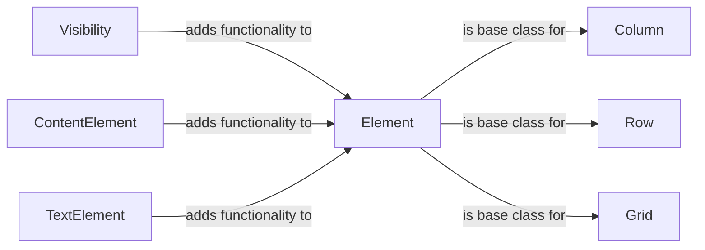

## Component Details

The UI Element Management component in NiceGUI is responsible for defining, managing, and rendering UI elements. It provides a base `Element` class with core functionalities, mixins for extending element behavior, and layout elements for arranging elements on the screen. The component handles element creation, modification, deletion, and their arrangement within the user interface, enabling developers to build complex and interactive UIs.

### Element
The base class for all UI elements in NiceGUI. It provides fundamental functionalities such as adding slots, handling events, clearing content, and managing styling and properties. It serves as the building block for creating complex user interfaces by providing a common interface for all elements.

**Related Classes/Methods**:

- <a href="https://github.com/zauberzeug/nicegui/blob/master/nicegui/element.py#L40-L562" target="_blank" rel="noopener noreferrer">`nicegui.element.Element` (40:562)</a>
- <a href="https://github.com/zauberzeug/nicegui/blob/master/nicegui/element.py#L49-L87" target="_blank" rel="noopener noreferrer">`nicegui.element.Element.__init__` (49:87)</a>
- <a href="https://github.com/zauberzeug/nicegui/blob/master/nicegui/element.py#L89-L147" target="_blank" rel="noopener noreferrer">`nicegui.element.Element.__init_subclass__` (89:147)</a>
- <a href="https://github.com/zauberzeug/nicegui/blob/master/nicegui/element.py#L167-L186" target="_blank" rel="noopener noreferrer">`nicegui.element.Element.add_slot` (167:186)</a>
- <a href="https://github.com/zauberzeug/nicegui/blob/master/nicegui/element.py#L209-L237" target="_blank" rel="noopener noreferrer">`nicegui.element.Element._to_dict` (209:237)</a>
- <a href="https://github.com/zauberzeug/nicegui/blob/master/nicegui/element.py#L199-L207" target="_blank" rel="noopener noreferrer">`nicegui.element.Element._collect_slot_dict` (199:207)</a>
- <a href="https://github.com/zauberzeug/nicegui/blob/master/nicegui/element.py#L344-L401" target="_blank" rel="noopener noreferrer">`nicegui.element.Element.on` (344:401)</a>
- <a href="https://github.com/zauberzeug/nicegui/blob/master/nicegui/element.py#L409-L413" target="_blank" rel="noopener noreferrer">`nicegui.element.Element.update` (409:413)</a>
- <a href="https://github.com/zauberzeug/nicegui/blob/master/nicegui/element.py#L461-L466" target="_blank" rel="noopener noreferrer">`nicegui.element.Element.clear` (461:466)</a>
- <a href="https://github.com/zauberzeug/nicegui/blob/master/nicegui/element.py#L451-L459" target="_blank" rel="noopener noreferrer">`nicegui.element.Element.descendants` (451:459)</a>
- <a href="https://github.com/zauberzeug/nicegui/blob/master/nicegui/element.py#L496-L507" target="_blank" rel="noopener noreferrer">`nicegui.element.Element.remove` (496:507)</a>
- <a href="https://github.com/zauberzeug/nicegui/blob/master/nicegui/element.py#L525-L554" target="_blank" rel="noopener noreferrer">`nicegui.element.Element.__str__` (525:554)</a>

### Visibility
The Visibility mixin provides functionality for controlling the visibility of an element. It allows elements to be shown or hidden based on certain conditions.

**Related Classes/Methods**:

- <a href="https://github.com/zauberzeug/nicegui/blob/master/nicegui/elements/mixins/visibility.py#L13-L109" target="_blank" rel="noopener noreferrer">`nicegui.elements.mixins.visibility.Visibility` (13:109)</a>

### ContentElement
The ContentElement mixin provides functionality for elements that display content. It handles changes to the content and updates the element accordingly. It is designed to be mixed in with other element classes to add content-related behavior.

**Related Classes/Methods**:

- <a href="https://github.com/zauberzeug/nicegui/blob/master/nicegui/elements/mixins/content_element.py#L9-L88" target="_blank" rel="noopener noreferrer">`nicegui.elements.mixins.content_element.ContentElement` (9:88)</a>
- <a href="https://github.com/zauberzeug/nicegui/blob/master/nicegui/elements/mixins/content_element.py#L14-L17" target="_blank" rel="noopener noreferrer">`nicegui.elements.mixins.content_element.ContentElement.__init__` (14:17)</a>
- <a href="https://github.com/zauberzeug/nicegui/blob/master/nicegui/elements/mixins/content_element.py#L80-L88" target="_blank" rel="noopener noreferrer">`nicegui.elements.mixins.content_element.ContentElement._handle_content_change` (80:88)</a>

### TextElement
The TextElement mixin provides functionality for elements that display text. It handles changes to the text and updates the element accordingly. It also includes methods for converting text to a model-compatible format. It is designed to be mixed in with other element classes to add text-related behavior.

**Related Classes/Methods**:

- <a href="https://github.com/zauberzeug/nicegui/blob/master/nicegui/elements/mixins/text_element.py#L9-L88" target="_blank" rel="noopener noreferrer">`nicegui.elements.mixins.text_element.TextElement` (9:88)</a>
- <a href="https://github.com/zauberzeug/nicegui/blob/master/nicegui/elements/mixins/text_element.py#L13-L16" target="_blank" rel="noopener noreferrer">`nicegui.elements.mixins.text_element.TextElement.__init__` (13:16)</a>
- <a href="https://github.com/zauberzeug/nicegui/blob/master/nicegui/elements/mixins/text_element.py#L79-L85" target="_blank" rel="noopener noreferrer">`nicegui.elements.mixins.text_element.TextElement._handle_text_change` (79:85)</a>
- <a href="https://github.com/zauberzeug/nicegui/blob/master/nicegui/elements/mixins/text_element.py#L87-L88" target="_blank" rel="noopener noreferrer">`nicegui.elements.mixins.text_element.TextElement._text_to_model_text` (87:88)</a>

### Column
The Column element arranges its child elements vertically.

**Related Classes/Methods**:

- <a href="https://github.com/zauberzeug/nicegui/blob/master/nicegui/elements/column.py#L6-L24" target="_blank" rel="noopener noreferrer">`nicegui.elements.column.Column` (6:24)</a>

### Row
The Row element arranges its child elements horizontally.

**Related Classes/Methods**:

- <a href="https://github.com/zauberzeug/nicegui/blob/master/nicegui/elements/row.py#L6-L25" target="_blank" rel="noopener noreferrer">`nicegui.elements.row.Row` (6:25)</a>

### Grid
The Grid element arranges its child elements in a grid layout.

**Related Classes/Methods**:

- <a href="https://github.com/zauberzeug/nicegui/blob/master/nicegui/elements/grid.py#L6-L30" target="_blank" rel="noopener noreferrer">`nicegui.elements.grid.Grid` (6:30)</a>