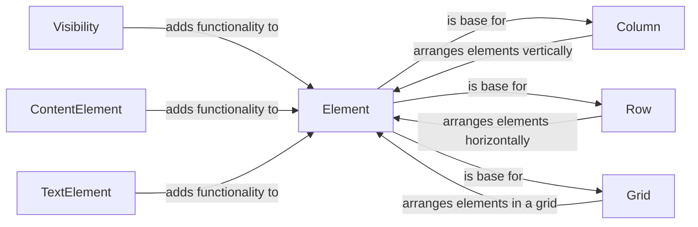

## Component Details

The UI Element Management component in NiceGUI is responsible for defining, managing, and rendering UI elements. It provides a hierarchical structure for organizing elements, handles their lifecycle, and offers functionalities for controlling visibility, content, and layout. The core of this component is the `Element` class, which serves as the base for all UI elements. Mixins like `Visibility`, `ContentElement`, and `TextElement` extend the functionality of elements by adding features for controlling visibility, displaying content, and handling text. Layout elements like `Column`, `Row`, and `Grid` provide containers for arranging elements in different layouts.

### Element
The base class for all UI elements in NiceGUI. It provides fundamental functionalities such as adding slots, handling initialization, managing visibility, and updating the client-side representation. It serves as the building block for creating complex user interfaces by providing a common interface and managing the element's lifecycle.

**Related Classes/Methods**:

- <a href="https://github.com/zauberzeug/nicegui/blob/master/nicegui/element.py#L40-L562" target="_blank" rel="noopener noreferrer">`nicegui.element.Element` (40:562)</a>
- <a href="https://github.com/zauberzeug/nicegui/blob/master/nicegui/element.py#L49-L87" target="_blank" rel="noopener noreferrer">`nicegui.element.Element.__init__` (49:87)</a>
- <a href="https://github.com/zauberzeug/nicegui/blob/master/nicegui/element.py#L89-L147" target="_blank" rel="noopener noreferrer">`nicegui.element.Element.__init_subclass__` (89:147)</a>
- <a href="https://github.com/zauberzeug/nicegui/blob/master/nicegui/element.py#L209-L237" target="_blank" rel="noopener noreferrer">`nicegui.element.Element._to_dict` (209:237)</a>
- <a href="https://github.com/zauberzeug/nicegui/blob/master/nicegui/element.py#L344-L401" target="_blank" rel="noopener noreferrer">`nicegui.element.Element.on` (344:401)</a>
- <a href="https://github.com/zauberzeug/nicegui/blob/master/nicegui/element.py#L461-L466" target="_blank" rel="noopener noreferrer">`nicegui.element.Element.clear` (461:466)</a>
- <a href="https://github.com/zauberzeug/nicegui/blob/master/nicegui/element.py#L496-L507" target="_blank" rel="noopener noreferrer">`nicegui.element.Element.remove` (496:507)</a>
- <a href="https://github.com/zauberzeug/nicegui/blob/master/nicegui/element.py#L525-L554" target="_blank" rel="noopener noreferrer">`nicegui.element.Element.__str__` (525:554)</a>

### Visibility
The Visibility mixin provides methods to control the visibility of an element. It is designed to be inherited by other element classes to add visibility-related functionalities.

**Related Classes/Methods**:

- <a href="https://github.com/zauberzeug/nicegui/blob/master/nicegui/elements/mixins/visibility.py#L13-L109" target="_blank" rel="noopener noreferrer">`nicegui.elements.mixins.visibility.Visibility` (13:109)</a>
- <a href="https://github.com/zauberzeug/nicegui/blob/master/nicegui/elements/mixins/visibility.py#L17-L20" target="_blank" rel="noopener noreferrer">`nicegui.elements.mixins.visibility.Visibility.__init__` (17:20)</a>

### ContentElement
The ContentElement mixin provides functionality for elements that display content, such as text or HTML. It handles content changes and updates the element accordingly.

**Related Classes/Methods**:

- <a href="https://github.com/zauberzeug/nicegui/blob/master/nicegui/elements/mixins/content_element.py#L9-L88" target="_blank" rel="noopener noreferrer">`nicegui.elements.mixins.content_element.ContentElement` (9:88)</a>
- <a href="https://github.com/zauberzeug/nicegui/blob/master/nicegui/elements/mixins/content_element.py#L14-L17" target="_blank" rel="noopener noreferrer">`nicegui.elements.mixins.content_element.ContentElement.__init__` (14:17)</a>
- <a href="https://github.com/zauberzeug/nicegui/blob/master/nicegui/elements/mixins/content_element.py#L80-L88" target="_blank" rel="noopener noreferrer">`nicegui.elements.mixins.content_element.ContentElement._handle_content_change` (80:88)</a>

### TextElement
The TextElement mixin provides functionality for elements that display text. It handles text changes and converts the text to a model-compatible format.

**Related Classes/Methods**:

- <a href="https://github.com/zauberzeug/nicegui/blob/master/nicegui/elements/mixins/text_element.py#L9-L88" target="_blank" rel="noopener noreferrer">`nicegui.elements.mixins.text_element.TextElement` (9:88)</a>
- <a href="https://github.com/zauberzeug/nicegui/blob/master/nicegui/elements/mixins/text_element.py#L13-L16" target="_blank" rel="noopener noreferrer">`nicegui.elements.mixins.text_element.TextElement.__init__` (13:16)</a>
- <a href="https://github.com/zauberzeug/nicegui/blob/master/nicegui/elements/mixins/text_element.py#L79-L85" target="_blank" rel="noopener noreferrer">`nicegui.elements.mixins.text_element.TextElement._handle_text_change` (79:85)</a>

### Column
The Column element arranges its child elements vertically. It inherits from the Element class and provides a container for laying out elements in a column.

**Related Classes/Methods**:

- <a href="https://github.com/zauberzeug/nicegui/blob/master/nicegui/elements/column.py#L6-L24" target="_blank" rel="noopener noreferrer">`nicegui.elements.column.Column` (6:24)</a>
- <a href="https://github.com/zauberzeug/nicegui/blob/master/nicegui/elements/column.py#L8-L24" target="_blank" rel="noopener noreferrer">`nicegui.elements.column.Column.__init__` (8:24)</a>

### Row
The Row element arranges its child elements horizontally. It inherits from the Element class and provides a container for laying out elements in a row.

**Related Classes/Methods**:

- <a href="https://github.com/zauberzeug/nicegui/blob/master/nicegui/elements/row.py#L6-L25" target="_blank" rel="noopener noreferrer">`nicegui.elements.row.Row` (6:25)</a>
- <a href="https://github.com/zauberzeug/nicegui/blob/master/nicegui/elements/row.py#L8-L25" target="_blank" rel="noopener noreferrer">`nicegui.elements.row.Row.__init__` (8:25)</a>

### Grid
The Grid element arranges its child elements in a grid layout. It inherits from the Element class and provides a container for laying out elements in a grid.

**Related Classes/Methods**:

- <a href="https://github.com/zauberzeug/nicegui/blob/master/nicegui/elements/grid.py#L6-L30" target="_blank" rel="noopener noreferrer">`nicegui.elements.grid.Grid` (6:30)</a>
- <a href="https://github.com/zauberzeug/nicegui/blob/master/nicegui/elements/grid.py#L8-L30" target="_blank" rel="noopener noreferrer">`nicegui.elements.grid.Grid.__init__` (8:30)</a>