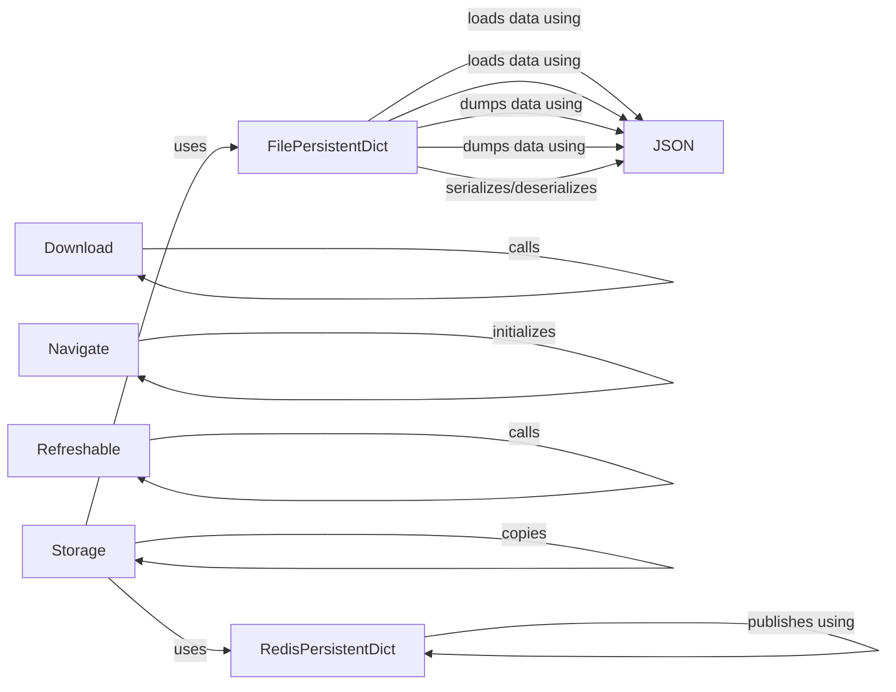

## Component Details

The Utilities and Storage component in NiceGUI provides essential functionalities for enhancing user experience and managing data persistence. It encompasses features like file downloads, in-app navigation, UI refreshing, and versatile storage solutions. The component offers a set of tools for developers to seamlessly integrate these functionalities into their applications, ensuring smooth operation and data preservation across different scopes and sessions.

### Download
The `Download` class facilitates file downloads within a NiceGUI application. It supports initiating downloads from various sources, including local files, URLs, and in-memory content. It interacts with the client to trigger the download process, providing a convenient way for users to save files generated or accessed within the application.

**Related Classes/Methods**:

- <a href="https://github.com/zauberzeug/nicegui/blob/master/nicegui/functions/download.py#L9-L89" target="_blank" rel="noopener noreferrer">`nicegui.functions.download.Download` (9:89)</a>
- <a href="https://github.com/zauberzeug/nicegui/blob/master/nicegui/functions/download.py#L17-L32" target="_blank" rel="noopener noreferrer">`nicegui.functions.download.Download:__call__` (17:32)</a>
- <a href="https://github.com/zauberzeug/nicegui/blob/master/nicegui/functions/download.py#L76-L89" target="_blank" rel="noopener noreferrer">`nicegui.functions.download.Download.content` (76:89)</a>
- <a href="https://github.com/zauberzeug/nicegui/blob/master/nicegui/functions/download.py#L34-L46" target="_blank" rel="noopener noreferrer">`nicegui.functions.download.Download.file` (34:46)</a>
- <a href="https://github.com/zauberzeug/nicegui/blob/master/nicegui/functions/download.py#L48-L74" target="_blank" rel="noopener noreferrer">`nicegui.functions.download.Download.from_url` (48:74)</a>

### Navigate
The `Navigate` class is responsible for managing navigation within the NiceGUI application. It provides a way to programmatically navigate to different parts of the application, potentially interacting with a history mechanism to enable back and forward navigation. It ensures that the client-side view is updated correctly based on navigation events, offering a seamless user experience.

**Related Classes/Methods**:

- <a href="https://github.com/zauberzeug/nicegui/blob/master/nicegui/functions/navigate.py#L9-L69" target="_blank" rel="noopener noreferrer">`nicegui.functions.navigate.Navigate` (9:69)</a>
- <a href="https://github.com/zauberzeug/nicegui/blob/master/nicegui/functions/navigate.py#L17-L18" target="_blank" rel="noopener noreferrer">`nicegui.functions.navigate.Navigate:__init__` (17:18)</a>
- <a href="https://github.com/zauberzeug/nicegui/blob/master/nicegui/functions/navigate.py#L72-L94" target="_blank" rel="noopener noreferrer">`nicegui.functions.navigate.History` (72:94)</a>

### Refreshable
The `refreshable` function and related classes (`RefreshableTarget`, `RefreshableContainer`) offer a mechanism for dynamically updating parts of the UI. The `refreshable` function wraps a UI element or a function that creates UI elements, allowing it to be refreshed. `RefreshableTarget` manages the execution and waiting for results of the refreshable content, while `RefreshableContainer` likely holds the UI elements that are being refreshed, ensuring that the UI remains responsive and up-to-date.

**Related Classes/Methods**:

- <a href="https://github.com/zauberzeug/nicegui/blob/master/nicegui/functions/refreshable.py#L58-L131" target="_blank" rel="noopener noreferrer">`nicegui.functions.refreshable.refreshable` (58:131)</a>
- <a href="https://github.com/zauberzeug/nicegui/blob/master/nicegui/functions/refreshable.py#L86-L91" target="_blank" rel="noopener noreferrer">`nicegui.functions.refreshable.refreshable:__call__` (86:91)</a>
- <a href="https://github.com/zauberzeug/nicegui/blob/master/nicegui/functions/refreshable.py#L93-L120" target="_blank" rel="noopener noreferrer">`nicegui.functions.refreshable.refreshable:refresh` (93:120)</a>
- <a href="https://github.com/zauberzeug/nicegui/blob/master/nicegui/functions/refreshable.py#L136-L142" target="_blank" rel="noopener noreferrer">`nicegui.functions.refreshable.refreshable_method:__init__` (136:142)</a>
- <a href="https://github.com/zauberzeug/nicegui/blob/master/nicegui/functions/refreshable.py#L20-L51" target="_blank" rel="noopener noreferrer">`nicegui.functions.refreshable.RefreshableTarget` (20:51)</a>
- <a href="https://github.com/zauberzeug/nicegui/blob/master/nicegui/functions/refreshable.py#L54-L55" target="_blank" rel="noopener noreferrer">`nicegui.functions.refreshable.RefreshableContainer` (54:55)</a>
- <a href="https://github.com/zauberzeug/nicegui/blob/master/nicegui/functions/refreshable.py#L31-L51" target="_blank" rel="noopener noreferrer">`nicegui.functions.refreshable.RefreshableTarget:run` (31:51)</a>

### Storage
The `Storage` class provides a mechanism to store and retrieve data associated with different scopes: browser, user, client, and tab. It utilizes persistent dictionaries to store the data, ensuring its preservation across sessions or page reloads. It interacts with the persistence layer (e.g., `FilePersistentDict`, `RedisPersistentDict`) to save and load data, offering a flexible and reliable way to manage application state.

**Related Classes/Methods**:

- <a href="https://github.com/zauberzeug/nicegui/blob/master/nicegui/storage.py#L50-L217" target="_blank" rel="noopener noreferrer">`nicegui.storage.Storage` (50:217)</a>
- <a href="https://github.com/zauberzeug/nicegui/blob/master/nicegui/storage.py#L66-L69" target="_blank" rel="noopener noreferrer">`nicegui.storage.Storage:__init__` (66:69)</a>
- <a href="https://github.com/zauberzeug/nicegui/blob/master/nicegui/storage.py#L79-L99" target="_blank" rel="noopener noreferrer">`nicegui.storage.Storage:browser` (79:99)</a>
- <a href="https://github.com/zauberzeug/nicegui/blob/master/nicegui/storage.py#L102-L118" target="_blank" rel="noopener noreferrer">`nicegui.storage.Storage:user` (102:118)</a>
- <a href="https://github.com/zauberzeug/nicegui/blob/master/nicegui/storage.py#L138-L147" target="_blank" rel="noopener noreferrer">`nicegui.storage.Storage:client` (138:147)</a>
- <a href="https://github.com/zauberzeug/nicegui/blob/master/nicegui/storage.py#L150-L161" target="_blank" rel="noopener noreferrer">`nicegui.storage.Storage:tab` (150:161)</a>
- <a href="https://github.com/zauberzeug/nicegui/blob/master/nicegui/storage.py#L120-L123" target="_blank" rel="noopener noreferrer">`nicegui.storage.Storage:_create_user_storage` (120:123)</a>
- <a href="https://github.com/zauberzeug/nicegui/blob/master/nicegui/storage.py#L163-L172" target="_blank" rel="noopener noreferrer">`nicegui.storage.Storage:_create_tab_storage` (163:172)</a>
- <a href="https://github.com/zauberzeug/nicegui/blob/master/nicegui/storage.py#L174-L181" target="_blank" rel="noopener noreferrer">`nicegui.storage.Storage:copy_tab` (174:181)</a>

### FilePersistentDict
The `FilePersistentDict` class implements a persistent dictionary that stores data in a file using JSON serialization. It provides methods to initialize the dictionary from a file, back up the data to a file, and synchronize the data with the file. This class is suitable for persisting small to medium-sized datasets that need to be preserved across application restarts.

**Related Classes/Methods**:

- <a href="https://github.com/zauberzeug/nicegui/blob/master/nicegui/persistence/file_persistent_dict.py#L12-L60" target="_blank" rel="noopener noreferrer">`nicegui.persistence.file_persistent_dict.FilePersistentDict` (12:60)</a>
- <a href="https://github.com/zauberzeug/nicegui/blob/master/nicegui/persistence/file_persistent_dict.py#L20-L29" target="_blank" rel="noopener noreferrer">`nicegui.persistence.file_persistent_dict.FilePersistentDict:initialize` (20:29)</a>
- <a href="https://github.com/zauberzeug/nicegui/blob/master/nicegui/persistence/file_persistent_dict.py#L31-L39" target="_blank" rel="noopener noreferrer">`nicegui.persistence.file_persistent_dict.FilePersistentDict:initialize_sync` (31:39)</a>
- <a href="https://github.com/zauberzeug/nicegui/blob/master/nicegui/persistence/file_persistent_dict.py#L41-L56" target="_blank" rel="noopener noreferrer">`nicegui.persistence.file_persistent_dict.FilePersistentDict:backup` (41:56)</a>

### RedisPersistentDict
The `RedisPersistentDict` class implements a persistent dictionary that stores data in a Redis database. It provides methods to initialize the dictionary from Redis, start listening for updates from Redis, and publish updates to Redis. This class is suitable for persisting data in a distributed environment or when real-time updates are required.

**Related Classes/Methods**:

- <a href="https://github.com/zauberzeug/nicegui/blob/master/nicegui/persistence/redis_persistent_dict.py#L13-L92" target="_blank" rel="noopener noreferrer">`nicegui.persistence.redis_persistent_dict.RedisPersistentDict` (13:92)</a>
- <a href="https://github.com/zauberzeug/nicegui/blob/master/nicegui/persistence/redis_persistent_dict.py#L30-L37" target="_blank" rel="noopener noreferrer">`nicegui.persistence.redis_persistent_dict.RedisPersistentDict:initialize` (30:37)</a>
- <a href="https://github.com/zauberzeug/nicegui/blob/master/nicegui/persistence/redis_persistent_dict.py#L39-L53" target="_blank" rel="noopener noreferrer">`nicegui.persistence.redis_persistent_dict.RedisPersistentDict:initialize_sync` (39:53)</a>
- <a href="https://github.com/zauberzeug/nicegui/blob/master/nicegui/persistence/redis_persistent_dict.py#L55-L67" target="_blank" rel="noopener noreferrer">`nicegui.persistence.redis_persistent_dict.RedisPersistentDict:_start_listening` (55:67)</a>
- <a href="https://github.com/zauberzeug/nicegui/blob/master/nicegui/persistence/redis_persistent_dict.py#L69-L79" target="_blank" rel="noopener noreferrer">`nicegui.persistence.redis_persistent_dict.RedisPersistentDict:publish` (69:79)</a>

### JSON
The `json.orjson_wrapper` module provides functions for JSON serialization and deserialization. It is used by the `FilePersistentDict` class to save and load data to and from files, ensuring data is stored in a human-readable and easily exchangeable format.

**Related Classes/Methods**:

- <a href="https://github.com/zauberzeug/nicegui/blob/master/nicegui/json/orjson_wrapper.py#L43-L48" target="_blank" rel="noopener noreferrer">`nicegui.json.orjson_wrapper.loads` (43:48)</a>
- <a href="https://github.com/zauberzeug/nicegui/blob/master/nicegui/json/orjson_wrapper.py#L14-L40" target="_blank" rel="noopener noreferrer">`nicegui.json.orjson_wrapper.dumps` (14:40)</a>