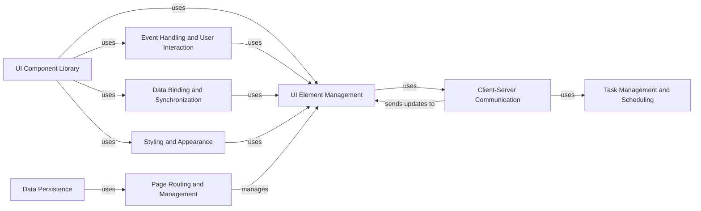

## Component Details

NiceGUI is a Python framework for creating web-based user interfaces. The framework is structured around several core components that handle UI element management, event handling, client-server communication, data binding, task management, and styling. These components work together to provide a reactive and efficient way to build interactive web applications.

### UI Element Management
This component is responsible for defining, managing, and rendering UI elements. It includes the base `Element` class, mixins for adding functionalities, and layout elements like `Column`, `Row`, and `Grid`. It handles the creation, modification, and deletion of UI elements, as well as their arrangement within the user interface.

**Related Classes/Methods**:

- <a href="https://github.com/zauberzeug/nicegui/blob/master/nicegui/element.py#L40-L562" target="_blank" rel="noopener noreferrer">`nicegui.element.Element` (40:562)</a>
- <a href="https://github.com/zauberzeug/nicegui/blob/master/nicegui/elements/mixins/visibility.py#L13-L109" target="_blank" rel="noopener noreferrer">`nicegui.elements.mixins.visibility.Visibility` (13:109)</a>
- <a href="https://github.com/zauberzeug/nicegui/blob/master/nicegui/elements/mixins/content_element.py#L9-L88" target="_blank" rel="noopener noreferrer">`nicegui.elements.mixins.content_element.ContentElement` (9:88)</a>
- <a href="https://github.com/zauberzeug/nicegui/blob/master/nicegui/elements/mixins/text_element.py#L9-L88" target="_blank" rel="noopener noreferrer">`nicegui.elements.mixins.text_element.TextElement` (9:88)</a>
- <a href="https://github.com/zauberzeug/nicegui/blob/master/nicegui/elements/column.py#L6-L24" target="_blank" rel="noopener noreferrer">`nicegui.elements.column.Column` (6:24)</a>
- <a href="https://github.com/zauberzeug/nicegui/blob/master/nicegui/elements/row.py#L6-L25" target="_blank" rel="noopener noreferrer">`nicegui.elements.row.Row` (6:25)</a>
- <a href="https://github.com/zauberzeug/nicegui/blob/master/nicegui/elements/grid.py#L6-L30" target="_blank" rel="noopener noreferrer">`nicegui.elements.grid.Grid` (6:30)</a>

### Event Handling and User Interaction
This component manages user interactions and events within the UI. It defines event argument classes, handles event dispatching, and provides mechanisms for registering event handlers to UI elements. It acts as the bridge between user actions and the application logic.

**Related Classes/Methods**:

- <a href="https://github.com/zauberzeug/nicegui/blob/master/nicegui/events.py#L410-L453" target="_blank" rel="noopener noreferrer">`nicegui.events.handle_event` (410:453)</a>
- <a href="https://github.com/zauberzeug/nicegui/blob/master/nicegui/events.py#L46-L48" target="_blank" rel="noopener noreferrer">`nicegui.events.UiEventArguments` (46:48)</a>
- <a href="https://github.com/zauberzeug/nicegui/blob/master/nicegui/element.py#L344-L401" target="_blank" rel="noopener noreferrer">`nicegui.element.Element.on` (344:401)</a>

### Client-Server Communication
This component handles the communication between the server and the client (browser). It manages the WebSocket connection, sends updates to the client, and queues messages for efficient delivery. It ensures that the UI in the browser reflects the current state of the application on the server.

**Related Classes/Methods**:

- <a href="https://github.com/zauberzeug/nicegui/blob/master/nicegui/client.py#L35-L385" target="_blank" rel="noopener noreferrer">`nicegui.client.Client` (35:385)</a>
- <a href="https://github.com/zauberzeug/nicegui/blob/master/nicegui/outbox.py#L26-L154" target="_blank" rel="noopener noreferrer">`nicegui.outbox.Outbox` (26:154)</a>

### Data Binding and Synchronization
This component provides a mechanism for synchronizing data between UI elements and Python variables. It defines functions for creating bindings and propagating changes, enabling reactive updates to class attributes. It ensures that changes in the UI are reflected in the Python code, and vice versa.

**Related Classes/Methods**:

- <a href="https://github.com/zauberzeug/nicegui/blob/master/nicegui/binding.py#L162-L178" target="_blank" rel="noopener noreferrer">`nicegui.binding.bind` (162:178)</a>
- <a href="https://github.com/zauberzeug/nicegui/blob/master/nicegui/binding.py#L144-L159" target="_blank" rel="noopener noreferrer">`nicegui.binding.bind_from` (144:159)</a>
- <a href="https://github.com/zauberzeug/nicegui/blob/master/nicegui/binding.py#L126-L141" target="_blank" rel="noopener noreferrer">`nicegui.binding.bind_to` (126:141)</a>
- <a href="https://github.com/zauberzeug/nicegui/blob/master/nicegui/binding.py#L181-L204" target="_blank" rel="noopener noreferrer">`nicegui.binding.BindableProperty` (181:204)</a>

### Task Management and Scheduling
This component manages background tasks and asynchronous operations. It provides functions for creating and managing tasks, and allows scheduling functions to be called periodically. It enables the execution of long-running operations without blocking the UI thread.

**Related Classes/Methods**:

- <a href="https://github.com/zauberzeug/nicegui/blob/master/nicegui/background_tasks.py#L17-L30" target="_blank" rel="noopener noreferrer">`nicegui.background_tasks.create` (17:30)</a>
- <a href="https://github.com/zauberzeug/nicegui/blob/master/nicegui/timer.py#L11-L116" target="_blank" rel="noopener noreferrer">`nicegui.timer.Timer` (11:116)</a>

### UI Component Library
This component provides a collection of pre-built UI components, such as buttons, inputs, labels, and charts. These components are built on top of the core UI definition and management component and offer a higher level of abstraction for common UI patterns. It simplifies the creation of complex UIs by providing reusable building blocks.

**Related Classes/Methods**:

- <a href="https://github.com/zauberzeug/nicegui/blob/master/nicegui/elements/button.py#L13-L53" target="_blank" rel="noopener noreferrer">`nicegui.elements.button.Button` (13:53)</a>
- <a href="https://github.com/zauberzeug/nicegui/blob/master/nicegui/elements/input.py#L10-L76" target="_blank" rel="noopener noreferrer">`nicegui.elements.input.Input` (10:76)</a>
- <a href="https://github.com/zauberzeug/nicegui/blob/master/nicegui/elements/label.py#L4-L13" target="_blank" rel="noopener noreferrer">`nicegui.elements.label.Label` (4:13)</a>
- <a href="https://github.com/zauberzeug/nicegui/blob/master/nicegui/elements/aggrid.py#L15-L44" target="_blank" rel="noopener noreferrer">`nicegui.elements.chart.Chart` (15:44)</a>
- <a href="https://github.com/zauberzeug/nicegui/blob/master/nicegui/elements/table.py#L29-L453" target="_blank" rel="noopener noreferrer">`nicegui.elements.table.Table` (29:453)</a>
- <a href="https://github.com/zauberzeug/nicegui/blob/master/nicegui/elements/select.py#L12-L169" target="_blank" rel="noopener noreferrer">`nicegui.elements.select.Select` (12:169)</a>

### Styling and Appearance
This component provides mechanisms for styling the UI. It includes classes for applying CSS styles and using Tailwind CSS classes. It allows developers to customize the look and feel of the application.

**Related Classes/Methods**:

- <a href="https://github.com/zauberzeug/nicegui/blob/master/nicegui/style.py#L9-L47" target="_blank" rel="noopener noreferrer">`nicegui.style.Style` (9:47)</a>
- <a href="https://github.com/zauberzeug/nicegui/blob/master/nicegui/tailwind.py#L182-L1022" target="_blank" rel="noopener noreferrer">`nicegui.tailwind.Tailwind` (182:1022)</a>
- <a href="https://github.com/zauberzeug/nicegui/blob/master/nicegui/classes.py#L9-L56" target="_blank" rel="noopener noreferrer">`nicegui.classes.Classes` (9:56)</a>

### Page Routing and Management
This component handles the creation and management of pages within the application. It defines routes and associates them with UI content, and manages page titles and other metadata. It enables the creation of multi-page applications with well-defined navigation.

**Related Classes/Methods**:

- <a href="https://github.com/zauberzeug/nicegui/blob/master/nicegui/page.py#L21-L158" target="_blank" rel="noopener noreferrer">`nicegui.page.page` (21:158)</a>

### Data Persistence
This component provides mechanisms for storing data, including browser storage, user storage, and session storage. It includes classes for managing access to these different storage types and persisting data using different backends like files or Redis. It allows the application to store and retrieve data across sessions and users.

**Related Classes/Methods**:

- <a href="https://github.com/zauberzeug/nicegui/blob/master/nicegui/storage.py#L50-L217" target="_blank" rel="noopener noreferrer">`nicegui.storage.Storage` (50:217)</a>
- <a href="https://github.com/zauberzeug/nicegui/blob/master/nicegui/persistence/file_persistent_dict.py#L12-L60" target="_blank" rel="noopener noreferrer">`nicegui.persistence.file_persistent_dict.FilePersistentDict` (12:60)</a>
- <a href="https://github.com/zauberzeug/nicegui/blob/master/nicegui/persistence/redis_persistent_dict.py#L13-L92" target="_blank" rel="noopener noreferrer">`nicegui.persistence.redis_persistent_dict.RedisPersistentDict` (13:92)</a>