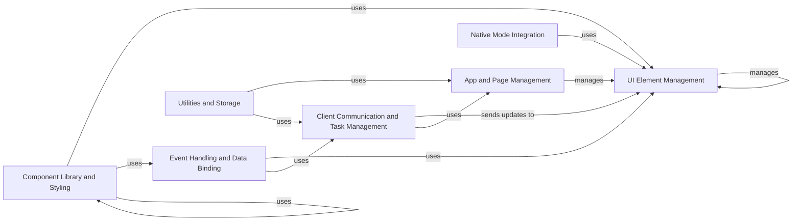

## Component Details

NiceGUI is a Python framework for creating web-based user interfaces. The framework is structured around several core components that handle UI element management, event handling, client-server communication, component libraries, application and page management, utilities, storage, and native mode integration. These components work together to provide a comprehensive and efficient way to build interactive web applications with Python.

### UI Element Management
This component is responsible for defining, managing, and rendering UI elements. It provides the base `Element` class, mixins for common functionalities like visibility and content, and layout elements like `Column`, `Row`, and `Grid`. It handles the creation, modification, and deletion of UI elements, as well as their hierarchical organization within the UI.

**Related Classes/Methods**:

- <a href="https://github.com/zauberzeug/nicegui/blob/master/nicegui/element.py#L40-L562" target="_blank" rel="noopener noreferrer">`nicegui.element.Element` (40:562)</a>
- <a href="https://github.com/zauberzeug/nicegui/blob/master/nicegui/elements/mixins/visibility.py#L13-L109" target="_blank" rel="noopener noreferrer">`nicegui.elements.mixins.visibility.Visibility` (13:109)</a>
- <a href="https://github.com/zauberzeug/nicegui/blob/master/nicegui/elements/mixins/content_element.py#L9-L88" target="_blank" rel="noopener noreferrer">`nicegui.elements.mixins.content_element.ContentElement` (9:88)</a>
- <a href="https://github.com/zauberzeug/nicegui/blob/master/nicegui/elements/mixins/text_element.py#L9-L88" target="_blank" rel="noopener noreferrer">`nicegui.elements.mixins.text_element.TextElement` (9:88)</a>
- <a href="https://github.com/zauberzeug/nicegui/blob/master/nicegui/elements/column.py#L6-L24" target="_blank" rel="noopener noreferrer">`nicegui.elements.column.Column` (6:24)</a>
- <a href="https://github.com/zauberzeug/nicegui/blob/master/nicegui/elements/row.py#L6-L25" target="_blank" rel="noopener noreferrer">`nicegui.elements.row.Row` (6:25)</a>
- <a href="https://github.com/zauberzeug/nicegui/blob/master/nicegui/elements/grid.py#L6-L30" target="_blank" rel="noopener noreferrer">`nicegui.elements.grid.Grid` (6:30)</a>

### Event Handling and Data Binding
This component manages user interactions and data synchronization. It handles events triggered by UI elements, dispatches them to registered handlers, and provides mechanisms for binding UI elements to Python variables, ensuring that changes in one are reflected in the other. It uses `nicegui.events.handle_event` to handle events and `nicegui.binding` for data binding.

**Related Classes/Methods**:

- <a href="https://github.com/zauberzeug/nicegui/blob/master/nicegui/events.py#L410-L453" target="_blank" rel="noopener noreferrer">`nicegui.events.handle_event` (410:453)</a>
- <a href="https://github.com/zauberzeug/nicegui/blob/master/nicegui/events.py#L46-L48" target="_blank" rel="noopener noreferrer">`nicegui.events.UiEventArguments` (46:48)</a>
- <a href="https://github.com/zauberzeug/nicegui/blob/master/nicegui/element.py#L344-L401" target="_blank" rel="noopener noreferrer">`nicegui.element.Element.on` (344:401)</a>
- <a href="https://github.com/zauberzeug/nicegui/blob/master/nicegui/binding.py#L162-L178" target="_blank" rel="noopener noreferrer">`nicegui.binding.bind` (162:178)</a>
- <a href="https://github.com/zauberzeug/nicegui/blob/master/nicegui/binding.py#L144-L159" target="_blank" rel="noopener noreferrer">`nicegui.binding.bind_from` (144:159)</a>
- <a href="https://github.com/zauberzeug/nicegui/blob/master/nicegui/binding.py#L126-L141" target="_blank" rel="noopener noreferrer">`nicegui.binding.bind_to` (126:141)</a>
- <a href="https://github.com/zauberzeug/nicegui/blob/master/nicegui/binding.py#L181-L204" target="_blank" rel="noopener noreferrer">`nicegui.binding.BindableProperty` (181:204)</a>

### Client Communication and Task Management
This component manages communication between the server and the client, as well as background tasks. It uses WebSockets to send updates to the client and manages background tasks using `asyncio`. The `Client` class handles the WebSocket connection, and the `Outbox` class queues messages for efficient delivery. The `background_tasks` module provides functions for creating and managing tasks, and the `Timer` class allows scheduling functions to be called periodically.

**Related Classes/Methods**:

- <a href="https://github.com/zauberzeug/nicegui/blob/master/nicegui/client.py#L35-L385" target="_blank" rel="noopener noreferrer">`nicegui.client.Client` (35:385)</a>
- <a href="https://github.com/zauberzeug/nicegui/blob/master/nicegui/outbox.py#L26-L154" target="_blank" rel="noopener noreferrer">`nicegui.outbox.Outbox` (26:154)</a>
- <a href="https://github.com/zauberzeug/nicegui/blob/master/nicegui/background_tasks.py#L17-L30" target="_blank" rel="noopener noreferrer">`nicegui.background_tasks.create` (17:30)</a>
- <a href="https://github.com/zauberzeug/nicegui/blob/master/nicegui/timer.py#L11-L116" target="_blank" rel="noopener noreferrer">`nicegui.timer.Timer` (11:116)</a>

### Component Library and Styling
This component provides a collection of pre-built UI components and styling mechanisms. It includes components like buttons, inputs, labels, and charts, built on top of the core UI definition and management component. It also provides classes for applying CSS styles (`Style`), using Tailwind CSS classes (`Tailwind`), and managing CSS classes on UI elements (`Classes`).

**Related Classes/Methods**:

- <a href="https://github.com/zauberzeug/nicegui/blob/master/nicegui/elements/button.py#L13-L53" target="_blank" rel="noopener noreferrer">`nicegui.elements.button.Button` (13:53)</a>
- <a href="https://github.com/zauberzeug/nicegui/blob/master/nicegui/elements/input.py#L10-L76" target="_blank" rel="noopener noreferrer">`nicegui.elements.input.Input` (10:76)</a>
- <a href="https://github.com/zauberzeug/nicegui/blob/master/nicegui/elements/label.py#L4-L13" target="_blank" rel="noopener noreferrer">`nicegui.elements.label.Label` (4:13)</a>
- <a href="https://github.com/zauberzeug/nicegui/blob/master/nicegui/elements/aggrid.py#L12-L40" target="_blank" rel="noopener noreferrer">`nicegui.elements.chart.Chart` (12:40)</a>
- <a href="https://github.com/zauberzeug/nicegui/blob/master/nicegui/elements/table.py#L29-L453" target="_blank" rel="noopener noreferrer">`nicegui.elements.table.Table` (29:453)</a>
- <a href="https://github.com/zauberzeug/nicegui/blob/master/nicegui/elements/select.py#L12-L169" target="_blank" rel="noopener noreferrer">`nicegui.elements.select.Select` (12:169)</a>
- <a href="https://github.com/zauberzeug/nicegui/blob/master/nicegui/style.py#L9-L47" target="_blank" rel="noopener noreferrer">`nicegui.style.Style` (9:47)</a>
- <a href="https://github.com/zauberzeug/nicegui/blob/master/nicegui/tailwind.py#L182-L1022" target="_blank" rel="noopener noreferrer">`nicegui.tailwind.Tailwind` (182:1022)</a>
- <a href="https://github.com/zauberzeug/nicegui/blob/master/nicegui/classes.py#L9-L56" target="_blank" rel="noopener noreferrer">`nicegui.classes.Classes` (9:56)</a>

### App and Page Management
This component handles the creation and management of the application and its pages. It includes the `page` decorator, which defines routes and associates them with UI content. It also manages page titles, metadata, static files, and media files. The `App` class is responsible for the overall application lifecycle.

**Related Classes/Methods**:

- <a href="https://github.com/zauberzeug/nicegui/blob/master/nicegui/page.py#L21-L158" target="_blank" rel="noopener noreferrer">`nicegui.page.page` (21:158)</a>
- <a href="https://github.com/zauberzeug/nicegui/blob/master/nicegui/app/app.py#L180-L218" target="_blank" rel="noopener noreferrer">`nicegui.app.app.App.add_static_file` (180:218)</a>
- <a href="https://github.com/zauberzeug/nicegui/blob/master/nicegui/app/app.py#L241-L274" target="_blank" rel="noopener noreferrer">`nicegui.app.app.App.add_media_file` (241:274)</a>
- <a href="https://github.com/zauberzeug/nicegui/blob/master/nicegui/app/range_response.py#L13-L58" target="_blank" rel="noopener noreferrer">`nicegui.app.range_response.get_range_response` (13:58)</a>

### Utilities and Storage
This component provides utility functions and storage mechanisms. It includes functions for navigation, downloading files, refreshing parts of the UI, and accessing different storage types (browser, user, session). The `Storage` class manages access to these storage types, and the `FilePersistentDict` and `RedisPersistentDict` classes provide functionality for persisting data using files or Redis.

**Related Classes/Methods**:

- <a href="https://github.com/zauberzeug/nicegui/blob/master/nicegui/functions/download.py#L9-L89" target="_blank" rel="noopener noreferrer">`nicegui.functions.download.Download` (9:89)</a>
- <a href="https://github.com/zauberzeug/nicegui/blob/master/nicegui/functions/navigate.py#L9-L69" target="_blank" rel="noopener noreferrer">`nicegui.functions.navigate.Navigate` (9:69)</a>
- <a href="https://github.com/zauberzeug/nicegui/blob/master/nicegui/functions/refreshable.py#L58-L131" target="_blank" rel="noopener noreferrer">`nicegui.functions.refreshable.refreshable` (58:131)</a>
- <a href="https://github.com/zauberzeug/nicegui/blob/master/nicegui/storage.py#L50-L217" target="_blank" rel="noopener noreferrer">`nicegui.storage.Storage` (50:217)</a>
- <a href="https://github.com/zauberzeug/nicegui/blob/master/nicegui/persistence/file_persistent_dict.py#L12-L60" target="_blank" rel="noopener noreferrer">`nicegui.persistence.file_persistent_dict.FilePersistentDict` (12:60)</a>
- <a href="https://github.com/zauberzeug/nicegui/blob/master/nicegui/persistence/redis_persistent_dict.py#L13-L92" target="_blank" rel="noopener noreferrer">`nicegui.persistence.redis_persistent_dict.RedisPersistentDict` (13:92)</a>

### Native Mode Integration
This component enables running NiceGUI applications in a native desktop window. It includes the `native_mode` module, which provides functions for creating and managing native windows. It allows users to deploy NiceGUI applications as standalone desktop applications.

**Related Classes/Methods**:

- <a href="https://github.com/zauberzeug/nicegui/blob/master/nicegui/native/native_mode.py#L29-L52" target="_blank" rel="noopener noreferrer">`nicegui.native.native_mode._open_window` (29:52)</a>