```mermaid
graph LR
    Server_Application_Management["Server & Application Management"]
    Client_Server_Communication["Client-Server Communication"]
    UI_Core_Elements["UI Core & Elements"]
    Styling_Layout_Engine["Styling & Layout Engine"]
    Event_System["Event System"]
    Data_Management_Reactivity["Data Management & Reactivity"]
    Core_Utilities["Core Utilities"]
    Documentation_Testing["Documentation & Testing"]
    Server_Application_Management -- "manages" --> Client_Server_Communication
    Server_Application_Management -- "renders" --> UI_Core_Elements
    Client_Server_Communication -- "interacts with" --> UI_Core_Elements
    Client_Server_Communication -- "dispatches events to" --> Event_System
    UI_Core_Elements -- "sends updates to" --> Client_Server_Communication
    UI_Core_Elements -- "is styled by" --> Styling_Layout_Engine
    UI_Core_Elements -- "generates" --> Event_System
    UI_Core_Elements -- "is updated by" --> Data_Management_Reactivity
    Styling_Layout_Engine -- "applies to" --> UI_Core_Elements
    Event_System -- "receives events from" --> Client_Server_Communication
    Event_System -- "triggers updates in" --> UI_Core_Elements
    Data_Management_Reactivity -- "synchronizes with" --> UI_Core_Elements
    Data_Management_Reactivity -- "persists data for" --> Server_Application_Management
    Core_Utilities -- "provides services to" --> Server_Application_Management
    Core_Utilities -- "provides services to" --> UI_Core_Elements
    Documentation_Testing -- "tests" --> Server_Application_Management
    Documentation_Testing -- "demonstrates" --> UI_Core_Elements
    click Server_Application_Management href "https://github.com/CodeBoarding/GeneratedOnBoardings/blob/main/nicegui/Server & Application Management.md" "Details"
    click Client_Server_Communication href "https://github.com/CodeBoarding/GeneratedOnBoardings/blob/main/nicegui/Client-Server Communication.md" "Details"
    click UI_Core_Elements href "https://github.com/CodeBoarding/GeneratedOnBoardings/blob/main/nicegui/UI Core & Elements.md" "Details"
    click Styling_Layout_Engine href "https://github.com/CodeBoarding/GeneratedOnBoardings/blob/main/nicegui/Styling & Layout Engine.md" "Details"
    click Event_System href "https://github.com/CodeBoarding/GeneratedOnBoardings/blob/main/nicegui/Event System.md" "Details"
    click Data_Management_Reactivity href "https://github.com/CodeBoarding/GeneratedOnBoardings/blob/main/nicegui/Data Management & Reactivity.md" "Details"
    click Core_Utilities href "https://github.com/CodeBoarding/GeneratedOnBoardings/blob/main/nicegui/Core Utilities.md" "Details"
    click Documentation_Testing href "https://github.com/CodeBoarding/GeneratedOnBoardings/blob/main/nicegui/Documentation & Testing.md" "Details"
```

## Component Details

The NiceGUI framework provides a Pythonic way to build web-based graphical user interfaces, abstracting away the complexities of frontend development. Its architecture is centered around a Server & Application Management component that orchestrates client-server communication, UI rendering, event handling, and data management, enabling reactive and interactive web applications with optional native desktop integration.

### Server & Application Management
Manages the core application lifecycle, server operations, routing, background tasks, favicon serving, global error handling, and native desktop integration.

**Related Classes/Methods**:

- <a href="https://github.com/zauberzeug/nicegui/blob/master/nicegui/app/app.py#L1-L240" target="_blank" rel="noopener noreferrer">`nicegui.app.app` (1:240)</a>
- <a href="https://github.com/zauberzeug/nicegui/blob/master/nicegui/nicegui.py#L1-L140" target="_blank" rel="noopener noreferrer">`nicegui.nicegui` (1:140)</a>
- <a href="https://github.com/zauberzeug/nicegui/blob/master/nicegui/server.py#L1-L27" target="_blank" rel="noopener noreferrer">`nicegui.server` (1:27)</a>
- <a href="https://github.com/zauberzeug/nicegui/blob/master/nicegui/page.py#L21-L158" target="_blank" rel="noopener noreferrer">`nicegui.page` (21:158)</a>
- <a href="https://github.com/zauberzeug/nicegui/blob/master/nicegui/api_router.py#L1-L30" target="_blank" rel="noopener noreferrer">`nicegui.api_router` (1:30)</a>
- <a href="https://github.com/zauberzeug/nicegui/blob/master/nicegui/background_tasks.py#L1-L80" target="_blank" rel="noopener noreferrer">`nicegui.background_tasks` (1:80)</a>
- <a href="https://github.com/zauberzeug/nicegui/blob/master/nicegui/favicon.py#L1-L90" target="_blank" rel="noopener noreferrer">`nicegui.favicon` (1:90)</a>
- <a href="https://github.com/zauberzeug/nicegui/blob/master/nicegui/error.py#L1-L29" target="_blank" rel="noopener noreferrer">`nicegui.error` (1:29)</a>
- `nicegui.ui_run` (full file reference)
- `nicegui.ui_run_with` (full file reference)
- <a href="https://github.com/zauberzeug/nicegui/blob/master/nicegui/native/native.py#L1-L160" target="_blank" rel="noopener noreferrer">`nicegui.native.native` (1:160)</a>
- `nicegui.native.native_config` (full file reference)
- `nicegui.native.native_mode` (full file reference)

### Client-Server Communication
Handles real-time communication between the server and connected browser clients, managing UI updates and JavaScript execution.

**Related Classes/Methods**:

- <a href="https://github.com/zauberzeug/nicegui/blob/master/nicegui/client.py#L1-L240" target="_blank" rel="noopener noreferrer">`nicegui.client` (1:240)</a>
- <a href="https://github.com/zauberzeug/nicegui/blob/master/nicegui/outbox.py#L1-L110" target="_blank" rel="noopener noreferrer">`nicegui.outbox` (1:110)</a>
- <a href="https://github.com/zauberzeug/nicegui/blob/master/nicegui/awaitable_response.py#L1-L20" target="_blank" rel="noopener noreferrer">`nicegui.awaitable_response` (1:20)</a>
- <a href="https://github.com/zauberzeug/nicegui/blob/master/nicegui/javascript_request.py#L1-L30" target="_blank" rel="noopener noreferrer">`nicegui.javascript_request` (1:30)</a>

### UI Core & Elements
Provides the foundational structure and a rich set of pre-built interactive user interface elements for building the application's visual interface.

**Related Classes/Methods**:

- <a href="https://github.com/zauberzeug/nicegui/blob/master/nicegui/element.py#L1-L340" target="_blank" rel="noopener noreferrer">`nicegui.element` (1:340)</a>
- <a href="https://github.com/zauberzeug/nicegui/blob/master/nicegui/elements/button.py#L1-L30" target="_blank" rel="noopener noreferrer">`nicegui.elements.button` (1:30)</a>
- `nicegui.elements.input` (full file reference)
- `nicegui.elements.table` (full file reference)
- `nicegui.elements.image` (full file reference)
- <a href="https://github.com/zauberzeug/nicegui/blob/master/nicegui/slot.py#L1-L50" target="_blank" rel="noopener noreferrer">`nicegui.slot` (1:50)</a>
- <a href="https://github.com/zauberzeug/nicegui/blob/master/nicegui/dependencies.py#L1-L120" target="_blank" rel="noopener noreferrer">`nicegui.dependencies` (1:120)</a>

### Styling & Layout Engine
Manages the visual appearance and arrangement of UI elements, including CSS classes, inline styles, Tailwind CSS integration, and page layouts.

**Related Classes/Methods**:

- <a href="https://github.com/zauberzeug/nicegui/blob/master/nicegui/classes.py#L1-L45" target="_blank" rel="noopener noreferrer">`nicegui.classes` (1:45)</a>
- <a href="https://github.com/zauberzeug/nicegui/blob/master/nicegui/style.py#L1-L45" target="_blank" rel="noopener noreferrer">`nicegui.style` (1:45)</a>
- <a href="https://github.com/zauberzeug/nicegui/blob/master/nicegui/tailwind.py#L1-L600" target="_blank" rel="noopener noreferrer">`nicegui.tailwind` (1:600)</a>
- <a href="https://github.com/zauberzeug/nicegui/blob/master/nicegui/page_layout.py#L1-L240" target="_blank" rel="noopener noreferrer">`nicegui.page_layout` (1:240)</a>

### Event System
Manages user interactions and internal application events, providing mechanisms for event handling and dispatching.

**Related Classes/Methods**:

- <a href="https://github.com/zauberzeug/nicegui/blob/master/nicegui/events.py#L1-L380" target="_blank" rel="noopener noreferrer">`nicegui.events` (1:380)</a>
- <a href="https://github.com/zauberzeug/nicegui/blob/master/nicegui/event_listener.py#L1-L30" target="_blank" rel="noopener noreferrer">`nicegui.event_listener` (1:30)</a>

### Data Management & Reactivity
Facilitates automatic synchronization between Python data and UI elements, and provides mechanisms for persistent data storage across different scopes.

**Related Classes/Methods**:

- <a href="https://github.com/zauberzeug/nicegui/blob/master/nicegui/binding.py#L1-L200" target="_blank" rel="noopener noreferrer">`nicegui.binding` (1:200)</a>
- <a href="https://github.com/zauberzeug/nicegui/blob/master/nicegui/observables.py#L1-L200" target="_blank" rel="noopener noreferrer">`nicegui.observables` (1:200)</a>
- <a href="https://github.com/zauberzeug/nicegui/blob/master/nicegui/storage.py#L1-L170" target="_blank" rel="noopener noreferrer">`nicegui.storage` (1:170)</a>
- <a href="https://github.com/zauberzeug/nicegui/blob/master/nicegui/persistence/file_persistent_dict.py#L1-L200" target="_blank" rel="noopener noreferrer">`nicegui.persistence.file_persistent_dict` (1:200)</a>
- `nicegui.persistence.persistent_dict` (full file reference)
- `nicegui.persistence.read_only_dict` (full file reference)
- `nicegui.persistence.redis_persistent_dict` (full file reference)
- <a href="https://github.com/zauberzeug/nicegui/blob/master/nicegui/functions/refreshable.py#L58-L131" target="_blank" rel="noopener noreferrer">`nicegui.functions.refreshable` (58:131)</a>

### Core Utilities
Offers a collection of general-purpose helper functions for common tasks like clipboard operations, file downloads, JavaScript execution, and notifications.

**Related Classes/Methods**:

- <a href="https://github.com/zauberzeug/nicegui/blob/master/nicegui/functions/clipboard.py#L1-L20" target="_blank" rel="noopener noreferrer">`nicegui.functions.clipboard` (1:20)</a>
- `nicegui.functions.download` (full file reference)
- `nicegui.functions.javascript` (full file reference)
- `nicegui.functions.navigate` (full file reference)
- <a href="https://github.com/zauberzeug/nicegui/blob/master/nicegui/functions/notify.py#L12-L53" target="_blank" rel="noopener noreferrer">`nicegui.functions.notify` (12:53)</a>
- <a href="https://github.com/zauberzeug/nicegui/blob/master/nicegui/functions/update.py#L4-L7" target="_blank" rel="noopener noreferrer">`nicegui.functions.update` (4:7)</a>
- <a href="https://github.com/zauberzeug/nicegui/blob/master/nicegui/helpers.py#L1-L100" target="_blank" rel="noopener noreferrer">`nicegui.helpers` (1:100)</a>

### Documentation & Testing
Contains the code for generating the NiceGUI documentation website and provides utilities for testing NiceGUI applications.

**Related Classes/Methods**:

- <a href="https://github.com/zauberzeug/nicegui/blob/master/website/main_page.py#L1-L50" target="_blank" rel="noopener noreferrer">`nicegui.website.main_page` (1:50)</a>
- <a href="https://github.com/zauberzeug/nicegui/blob/master/website/documentation/content/button_documentation.py#L1-L100" target="_blank" rel="noopener noreferrer">`nicegui.website.documentation.content.button_documentation` (1:100)</a>
- `nicegui.website.documentation.code_extraction` (full file reference)
- `nicegui.website.example_card` (full file reference)
- <a href="https://github.com/zauberzeug/nicegui/blob/master/nicegui/testing/screen.py#L1-L200" target="_blank" rel="noopener noreferrer">`nicegui.testing.screen` (1:200)</a>
- <a href="https://github.com/zauberzeug/nicegui/blob/master/nicegui/testing/user_interaction.py#L1-L100" target="_blank" rel="noopener noreferrer">`nicegui.testing.user_interaction` (1:100)</a>
- `nicegui.testing.conftest` (full file reference)
- `nicegui.testing.plugin` (full file reference)

### [FAQ](https://github.com/CodeBoarding/GeneratedOnBoardings/tree/main?tab=readme-ov-file#faq)