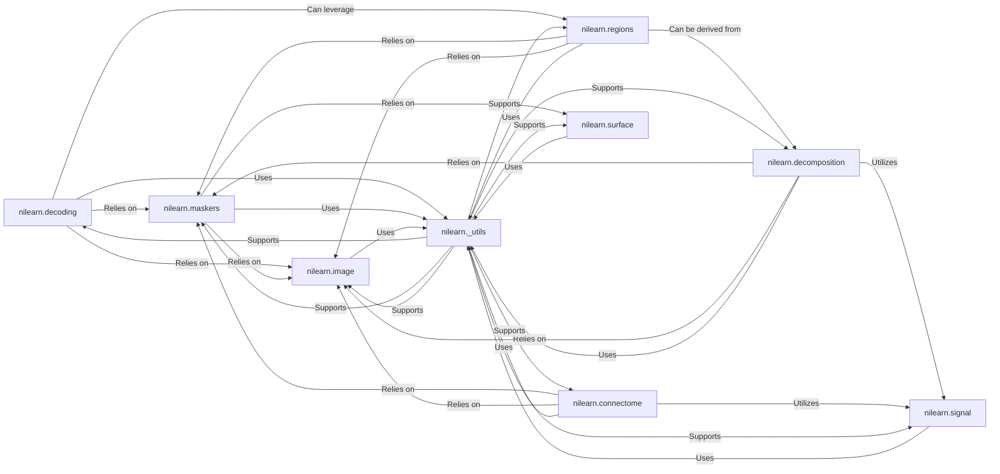

## Details

The `Advanced Analysis & Machine Learning` component in Nilearn is a sophisticated subsystem designed for in-depth neuroimaging data analysis. It is built upon a modular architecture, leveraging core functionalities from other Nilearn components to provide a comprehensive suite of advanced algorithms.

### nilearn.decoding
This component implements a suite of machine learning algorithms specifically tailored for brain decoding. Its primary purpose is to predict cognitive or behavioral states directly from brain activity patterns. This includes multi-voxel pattern analysis (MVPA) techniques like searchlight analysis and various sparse linear models (e.g., SpaceNet), which are crucial for identifying distributed neural representations.

**Related Classes/Methods**:

- <a href="https://github.com/nilearn/nilearn/blob/main/nilearn/decoding/decoder.py" target="_blank" rel="noopener noreferrer">`nilearn/decoding/decoder.py`</a>
- <a href="https://github.com/nilearn/nilearn/blob/main/nilearn/decoding/searchlight.py" target="_blank" rel="noopener noreferrer">`nilearn/decoding/searchlight.py`</a>
- <a href="https://github.com/nilearn/nilearn/blob/main/nilearn/decoding/space_net.py" target="_blank" rel="noopener noreferrer">`nilearn/decoding/space_net.py`</a>
- <a href="https://github.com/nilearn/nilearn/blob/main/nilearn/decoding/fista.py" target="_blank" rel="noopener noreferrer">`nilearn/decoding/fista.py`</a>
- <a href="https://github.com/nilearn/nilearn/blob/main/nilearn/decoding/space_net_solvers.py" target="_blank" rel="noopener noreferrer">`nilearn/decoding/space_net_solvers.py`</a>
- <a href="https://github.com/nilearn/nilearn/blob/main/nilearn/decoding/_objective_functions.py" target="_blank" rel="noopener noreferrer">`nilearn/decoding/_objective_functions.py`</a>
- <a href="https://github.com/nilearn/nilearn/blob/main/nilearn/decoding/_proximal_operators.py" target="_blank" rel="noopener noreferrer">`nilearn/decoding/_proximal_operators.py`</a>

### nilearn.decomposition
This component offers methods for decomposing complex neuroimaging data into underlying, simpler components or sources. Techniques such as Independent Component Analysis (ICA) and Dictionary Learning are provided for dimensionality reduction, noise separation, and the identification of intrinsic functional networks within the brain.

**Related Classes/Methods**:

- <a href="https://github.com/nilearn/nilearn/blob/main/nilearn/decomposition/canica.py" target="_blank" rel="noopener noreferrer">`nilearn/decomposition/canica.py`</a>
- <a href="https://github.com/nilearn/nilearn/blob/main/nilearn/decomposition/dict_learning.py" target="_blank" rel="noopener noreferrer">`nilearn/decomposition/dict_learning.py`</a>
- <a href="https://github.com/nilearn/nilearn/blob/main/nilearn/decomposition/_base.py" target="_blank" rel="noopener noreferrer">`nilearn/decomposition/_base.py`</a>
- <a href="https://github.com/nilearn/nilearn/blob/main/nilearn/decomposition/_multi_pca.py" target="_blank" rel="noopener noreferrer">`nilearn/decomposition/_multi_pca.py`</a>

### nilearn.regions
This component is dedicated to defining, extracting, and analyzing signals from specific brain regions or parcellations. It includes tools for data-driven parcellation (e.g., hierarchical clustering, RENA clustering), as well as functionalities for extracting signals from predefined anatomical or functional regions of interest (ROIs).

**Related Classes/Methods**:

- <a href="https://github.com/nilearn/nilearn/blob/main/nilearn/regions/hierarchical_kmeans_clustering.py" target="_blank" rel="noopener noreferrer">`nilearn/regions/hierarchical_kmeans_clustering.py`</a>
- <a href="https://github.com/nilearn/nilearn/blob/main/nilearn/regions/parcellations.py" target="_blank" rel="noopener noreferrer">`nilearn/regions/parcellations.py`</a>
- <a href="https://github.com/nilearn/nilearn/blob/main/nilearn/regions/region_extractor.py" target="_blank" rel="noopener noreferrer">`nilearn/regions/region_extractor.py`</a>
- <a href="https://github.com/nilearn/nilearn/blob/main/nilearn/regions/rena_clustering.py" target="_blank" rel="noopener noreferrer">`nilearn/regions/rena_clustering.py`</a>
- <a href="https://github.com/nilearn/nilearn/blob/main/nilearn/regions/signal_extraction.py" target="_blank" rel="noopener noreferrer">`nilearn/regions/signal_extraction.py`</a>

### nilearn.connectome
This component provides comprehensive tools for computing and analyzing functional and structural connectivity matrices. It supports various connectivity measures (e.g., correlation, partial correlation, precision matrices) and advanced techniques like group sparse covariance, allowing for the investigation of how different brain regions interact and form networks.

**Related Classes/Methods**:

- <a href="https://github.com/nilearn/nilearn/blob/main/nilearn/connectome/connectivity_matrices.py" target="_blank" rel="noopener noreferrer">`nilearn/connectome/connectivity_matrices.py`</a>
- <a href="https://github.com/nilearn/nilearn/blob/main/nilearn/connectome/group_sparse_cov.py" target="_blank" rel="noopener noreferrer">`nilearn/connectome/group_sparse_cov.py`</a>

### nilearn.maskers
This component provides essential functionalities for preparing and transforming neuroimaging data, primarily by extracting signals from specified masks (e.g., brain regions, anatomical structures). It acts as a crucial preprocessing layer for many advanced analyses.

**Related Classes/Methods**:

- <a href="https://github.com/nilearn/nilearn/blob/main/nilearn/maskers/base_masker.py" target="_blank" rel="noopener noreferrer">`nilearn/maskers/base_masker.py`</a>
- <a href="https://github.com/nilearn/nilearn/blob/main/nilearn/maskers/nifti_masker.py" target="_blank" rel="noopener noreferrer">`nilearn/maskers/nifti_masker.py`</a>
- <a href="https://github.com/nilearn/nilearn/blob/main/nilearn/maskers/nifti_labels_masker.py" target="_blank" rel="noopener noreferrer">`nilearn/maskers/nifti_labels_masker.py`</a>
- <a href="https://github.com/nilearn/nilearn/blob/main/nilearn/maskers/nifti_maps_masker.py" target="_blank" rel="noopener noreferrer">`nilearn/maskers/nifti_maps_masker.py`</a>
- <a href="https://github.com/nilearn/nilearn/blob/main/nilearn/maskers/surface_masker.py" target="_blank" rel="noopener noreferrer">`nilearn/maskers/surface_masker.py`</a>

### nilearn.image
This component offers core image manipulation capabilities for neuroimaging data, including operations like resampling, smoothing, and basic image processing. It provides the foundational tools for handling the raw image data.

**Related Classes/Methods**:

- <a href="https://github.com/nilearn/nilearn/blob/main/nilearn/image/__init__.py" target="_blank" rel="noopener noreferrer">`nilearn/image/__init__.py`</a>
- <a href="https://github.com/nilearn/nilearn/blob/main/nilearn/image/image.py" target="_blank" rel="noopener noreferrer">`nilearn/image/image.py`</a>
- <a href="https://github.com/nilearn/nilearn/blob/main/nilearn/image/resampling.py" target="_blank" rel="noopener noreferrer">`nilearn/image/resampling.py`</a>
- `nilearn/image/smooth_img.py`

### nilearn.surface
This component supports surface-based analyses for neuroimaging data, providing utilities to work with brain surface meshes and map data onto them. It extends the analytical capabilities to different data representations beyond volumetric images.

**Related Classes/Methods**:

- <a href="https://github.com/nilearn/nilearn/blob/main/nilearn/surface/__init__.py" target="_blank" rel="noopener noreferrer">`nilearn/surface/__init__.py`</a>
- <a href="https://github.com/nilearn/nilearn/blob/main/nilearn/surface/surface.py" target="_blank" rel="noopener noreferrer">`nilearn/surface/surface.py`</a>
- `nilearn/surface/resampling.py`

### nilearn.signal
This component provides tools for pre-processing time-series data, such as standardization, detrending, and confound removal. These operations are vital for cleaning and preparing functional MRI time-series before advanced analyses like connectivity or decoding.

**Related Classes/Methods**:

- `nilearn/signal/__init__.py`
- <a href="https://github.com/nilearn/nilearn/blob/main/nilearn/signal.py" target="_blank" rel="noopener noreferrer">`nilearn/signal.py`</a>

### nilearn._utils
This component contains common utility functionalities such as parameter validation, caching mechanisms, and logging. It provides foundational support and helper functions that are leveraged across various Nilearn modules, ensuring consistency, efficiency, and robustness.

**Related Classes/Methods**:

- <a href="https://github.com/nilearn/nilearn/blob/main/nilearn/_utils/__init__.py" target="_blank" rel="noopener noreferrer">`nilearn/_utils/__init__.py`</a>
- <a href="https://github.com/nilearn/nilearn/blob/main/nilearn/_utils/cache_mixin.py" target="_blank" rel="noopener noreferrer">`nilearn/_utils/cache_mixin.py`</a>
- <a href="https://github.com/nilearn/nilearn/blob/main/nilearn/_utils/niimg_conversions.py" target="_blank" rel="noopener noreferrer">`nilearn/_utils/niimg_conversions.py`</a>
- <a href="https://github.com/nilearn/nilearn/blob/main/nilearn/_utils/param_validation.py" target="_blank" rel="noopener noreferrer">`nilearn/_utils/param_validation.py`</a>

### [FAQ](https://github.com/CodeBoarding/GeneratedOnBoardings/tree/main?tab=readme-ov-file#faq)