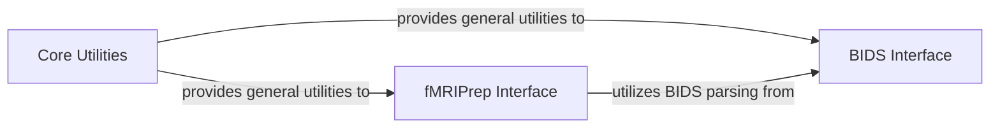

## Details

The `Core Utilities & External Interfaces` component in Nilearn is a critical foundational layer, embodying the "Modular Architecture" and "Extensibility" patterns. It provides essential, cross-cutting functionalities and acts as a bridge to external neuroimaging data standards and preprocessing pipelines.

### Core Utilities
This component serves as the central utility hub for the entire Nilearn library. It provides essential, cross-cutting functionalities such as robust caching mechanisms (via `CacheMixin`), data validation, image and NumPy array handling, general mathematical operations, logging, and helper functions. Its widespread use across other Nilearn modules underscores its foundational role.

**Related Classes/Methods**:

- <a href="https://github.com/nilearn/nilearn/blob/main/nilearn/_utils/cache_mixin.py" target="_blank" rel="noopener noreferrer">`nilearn._utils.cache_mixin`</a>
- <a href="https://github.com/nilearn/nilearn/blob/main/nilearn/_utils/helpers.py" target="_blank" rel="noopener noreferrer">`nilearn._utils.helpers`</a>
- <a href="https://github.com/nilearn/nilearn/blob/main/nilearn/_utils/logger.py" target="_blank" rel="noopener noreferrer">`nilearn._utils.logger`</a>
- <a href="https://github.com/nilearn/nilearn/blob/main/nilearn/_utils/niimg_conversions.py" target="_blank" rel="noopener noreferrer">`nilearn._utils.niimg_conversions`</a>
- <a href="https://github.com/nilearn/nilearn/blob/main/nilearn/_utils/param_validation.py" target="_blank" rel="noopener noreferrer">`nilearn._utils.param_validation`</a>
- <a href="https://github.com/nilearn/nilearn/blob/main/nilearn/_utils/extmath.py" target="_blank" rel="noopener noreferrer">`nilearn._utils.extmath`</a>
- <a href="https://github.com/nilearn/nilearn/blob/main/nilearn/_utils/bids.py" target="_blank" rel="noopener noreferrer">`nilearn._utils.bids`</a>
- <a href="https://github.com/nilearn/nilearn/blob/main/nilearn/_utils/fmriprep_confounds.py" target="_blank" rel="noopener noreferrer">`nilearn._utils.fmriprep_confounds`</a>
- <a href="https://github.com/nilearn/nilearn/blob/main/nilearn/_utils/html_document.py" target="_blank" rel="noopener noreferrer">`nilearn._utils.html_document`</a>

### BIDS Interface
This component provides a dedicated interface for interacting with neuroimaging data organized according to the Brain Imaging Data Structure (BIDS) standard. It facilitates tasks such as querying BIDS datasets for specific files and metadata, and saving analysis results in a BIDS-compliant manner. It leverages the general utilities provided by the `Core Utilities` component.

**Related Classes/Methods**:

- <a href="https://github.com/nilearn/nilearn/blob/main/nilearn/interfaces/bids/glm.py" target="_blank" rel="noopener noreferrer">`nilearn.interfaces.bids.glm`</a>
- <a href="https://github.com/nilearn/nilearn/blob/main/nilearn/interfaces/bids/query.py" target="_blank" rel="noopener noreferrer">`nilearn.interfaces.bids.query`</a>
- <a href="https://github.com/nilearn/nilearn/blob/main/nilearn/interfaces/bids/utils.py" target="_blank" rel="noopener noreferrer">`nilearn.interfaces.bids.utils`</a>

### fMRIPrep Interface
This component specializes in handling outputs from fMRIPrep, a widely used fMRI preprocessing pipeline. It offers functionalities to load and process confound variables generated by fMRIPrep, providing various strategies for selecting and cleaning noise components from the data. It relies on `Core Utilities` for general operations and `BIDS Interface` for locating fMRIPrep outputs within BIDS datasets.

**Related Classes/Methods**:

- <a href="https://github.com/nilearn/nilearn/blob/main/nilearn/interfaces/fmriprep/load_confounds.py#L99-L368" target="_blank" rel="noopener noreferrer">`nilearn.interfaces.fmriprep.load_confounds` (99:368)</a>
- <a href="https://github.com/nilearn/nilearn/blob/main/nilearn/interfaces/fmriprep/load_confounds_utils.py" target="_blank" rel="noopener noreferrer">`nilearn.interfaces.fmriprep.load_confounds_utils`</a>
- <a href="https://github.com/nilearn/nilearn/blob/main/nilearn/interfaces/fmriprep/load_confounds_strategy.py#L51-L238" target="_blank" rel="noopener noreferrer">`nilearn.interfaces.fmriprep.load_confounds_strategy` (51:238)</a>
- <a href="https://github.com/nilearn/nilearn/blob/main/nilearn/interfaces/fmriprep/load_confounds_components.py" target="_blank" rel="noopener noreferrer">`nilearn.interfaces.fmriprep.load_confounds_components`</a>

### [FAQ](https://github.com/CodeBoarding/GeneratedOnBoardings/tree/main?tab=readme-ov-file#faq)