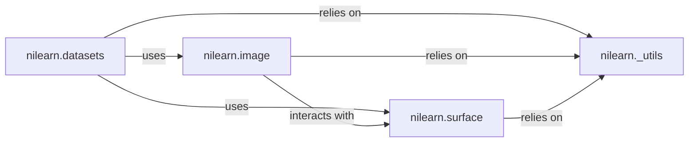

## Details

This subsystem serves as the foundational layer for handling neuroimaging data within Nilearn, encompassing the essential functionalities for data acquisition, loading, saving, and fundamental manipulations of both volumetric (NIfTI) and surface-based brain images. It is designed to provide robust and efficient tools for the initial stages of neuroimaging data processing.

### nilearn.datasets
This component is the primary entry point for acquiring and loading standardized neuroimaging datasets and atlases. It abstracts away the complexities of data download, caching, and local storage, providing convenient access to common resources for analysis, examples, and benchmarking.

**Related Classes/Methods**:

- `fetch_atlas_harvard_oxford` (1:1)
- `load_mni152_brain_mask` (1:1)
- `_SpecialValue` (1:1)
- `_OrderComp` (1:1)
- `nilearn.datasets` (1:1)

### nilearn.image
This component provides the core functionalities for manipulating volumetric neuroimaging images, typically in NIfTI format. It includes essential low-level operations such as loading, saving, smoothing, thresholding, resampling, and basic mathematical operations on 3D/4D image data. It forms the bedrock for all volumetric data processing in Nilearn.

**Related Classes/Methods**:

- `load_img` (1:1)
- `smooth_img` (1:1)
- `resample_img` (1:1)
- `math_img` (1:1)
- `nilearn.image` (1:1)

### nilearn.surface
This component offers core functionalities for handling and manipulating surface-based brain images, which represent the cortical surface as a mesh. It includes operations for loading, saving, and performing basic transformations on mesh data, crucial for analyses that operate directly on the brain's surface.

**Related Classes/Methods**:

- `SurfaceMesh` (1:1)
- `FileMesh` (1:1)
- `InMemoryMesh` (1:1)
- `PolyData` (1:1)
- `PolyMesh` (1:1)
- `load_surf_mesh` (1:1)
- `load_surf_data` (1:1)
- `nilearn.surface` (1:1)

### nilearn._utils
Shared utility functions for tasks such as caching, data validation, error handling, and common data transformations, ensuring consistency and efficiency across the library.

**Related Classes/Methods**: _None_

### [FAQ](https://github.com/CodeBoarding/GeneratedOnBoardings/tree/main?tab=readme-ov-file#faq)