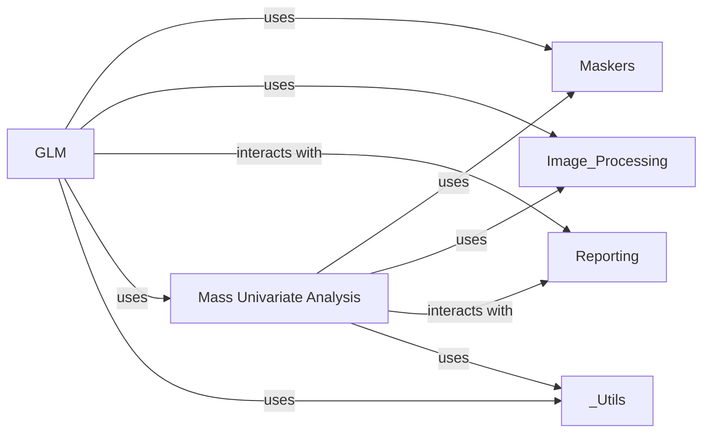

## Details

The Statistical Modeling component in Nilearn is a cornerstone for neuroimaging data analysis, providing robust tools for statistical inference, primarily through the General Linear Model (GLM) and mass univariate analysis. Its design adheres to the "Scientific Computing Library" architectural pattern by offering modular, functionally grouped, and extensible statistical functionalities.

### GLM
This component implements the core General Linear Model framework for analyzing fMRI data. It encompasses functionalities for constructing design matrices, fitting first-level (individual subject) and second-level (group) GLMs, defining and computing statistical contrasts, and applying appropriate statistical thresholding to results.

**Related Classes/Methods**:

- <a href="https://github.com/nilearn/nilearn/blob/main/nilearn/glm/first_level/first_level.py" target="_blank" rel="noopener noreferrer">`nilearn/glm/first_level/first_level.py`</a>
- <a href="https://github.com/nilearn/nilearn/blob/main/nilearn/glm/second_level/second_level.py" target="_blank" rel="noopener noreferrer">`nilearn/glm/second_level/second_level.py`</a>
- <a href="https://github.com/nilearn/nilearn/blob/main/nilearn/glm/first_level/design_matrix.py" target="_blank" rel="noopener noreferrer">`nilearn/glm/first_level/design_matrix.py`</a>
- <a href="https://github.com/nilearn/nilearn/blob/main/nilearn/glm/contrasts.py" target="_blank" rel="noopener noreferrer">`nilearn/glm/contrasts.py`</a>
- <a href="https://github.com/nilearn/nilearn/blob/main/nilearn/glm/thresholding.py" target="_blank" rel="noopener noreferrer">`nilearn/glm/thresholding.py`</a>

### Mass Univariate Analysis
This component provides tools for performing voxel-wise statistical inference across the entire brain, addressing the multiple comparisons problem inherent in neuroimaging data. It primarily focuses on permutation-based methods, such as Permuted Ordinary Least Squares (OLS), to derive statistically significant results without strong parametric assumptions.

**Related Classes/Methods**:

- <a href="https://github.com/nilearn/nilearn/blob/main/nilearn/mass_univariate/permuted_least_squares.py" target="_blank" rel="noopener noreferrer">`nilearn/mass_univariate/permuted_least_squares.py`</a>

### [FAQ](https://github.com/CodeBoarding/GeneratedOnBoardings/tree/main?tab=readme-ov-file#faq)