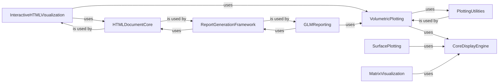

## Details

The `Visualization & Reporting` component in Nilearn is designed to provide comprehensive tools for generating high-quality visualizations and detailed reports of neuroimaging data and analysis results. It is structured to offer both static and interactive plotting functionalities, alongside robust reporting capabilities for various analysis pipelines.

### VolumetricPlotting
This component provides high-level functions for visualizing 2D and 3D neuroimaging volumetric data. It handles various types of images, including anatomical images, statistical maps, regions of interest (ROIs), EPIs, glass brains, connectomes, and carpet plots, serving as the primary user interface for image-based visualizations.

**Related Classes/Methods**:

- `nilearn.plotting` (1:1)
- <a href="https://github.com/nilearn/nilearn/blob/main/nilearn/plotting/img_plotting.py#L1-L1" target="_blank" rel="noopener noreferrer">`nilearn.plotting.img_plotting` (1:1)</a>

### SurfacePlotting
This component specializes in plotting neuroimaging data directly onto brain surfaces. It offers functions to visualize statistical maps, ROIs, and general surface meshes, leveraging 3D rendering capabilities for surface-based data.

**Related Classes/Methods**:

- `nilearn.plotting.surface` (1:1)

### CoreDisplayEngine
A foundational, internal component that provides the core display logic for various plotting types. It defines abstract classes and functionalities for managing plot axes, figures, projectors (mapping 3D data to 2D views), and slicers (displaying slices of volumetric data). It acts as a low-level rendering engine for higher-level plotting functions.

**Related Classes/Methods**:

- <a href="https://github.com/nilearn/nilearn/blob/main/nilearn/plotting/displays/_axes.py#L1-L1" target="_blank" rel="noopener noreferrer">`nilearn.plotting.displays._axes` (1:1)</a>
- <a href="https://github.com/nilearn/nilearn/blob/main/nilearn/plotting/displays/_figures.py#L1-L1" target="_blank" rel="noopener noreferrer">`nilearn.plotting.displays._figures` (1:1)</a>
- <a href="https://github.com/nilearn/nilearn/blob/main/nilearn/plotting/displays/_projectors.py#L1-L1" target="_blank" rel="noopener noreferrer">`nilearn.plotting.displays._projectors` (1:1)</a>
- <a href="https://github.com/nilearn/nilearn/blob/main/nilearn/plotting/displays/_slicers.py#L1-L1" target="_blank" rel="noopener noreferrer">`nilearn.plotting.displays._slicers` (1:1)</a>
- <a href="https://github.com/nilearn/nilearn/blob/main/nilearn/plotting/displays/_utils.py#L1-L1" target="_blank" rel="noopener noreferrer">`nilearn.plotting.displays._utils` (1:1)</a>

### InteractiveHTMLVisualization
This component generates interactive HTML visualizations for neuroimaging data, including statistical maps, connectomes, and surface-based data. It enables dynamic exploration of results directly in a web browser, enhancing data interpretation.

**Related Classes/Methods**:

- <a href="https://github.com/nilearn/nilearn/blob/main/nilearn/plotting/html_stat_map.py#L1-L1" target="_blank" rel="noopener noreferrer">`nilearn.plotting.html_stat_map` (1:1)</a>
- <a href="https://github.com/nilearn/nilearn/blob/main/nilearn/plotting/html_connectome.py#L1-L1" target="_blank" rel="noopener noreferrer">`nilearn.plotting.html_connectome` (1:1)</a>
- <a href="https://github.com/nilearn/nilearn/blob/main/nilearn/plotting/surface/html_surface.py#L1-L1" target="_blank" rel="noopener noreferrer">`nilearn.plotting.surface.html_surface` (1:1)</a>
- <a href="https://github.com/nilearn/nilearn/blob/main/nilearn/plotting/js_plotting_utils.py#L1-L1" target="_blank" rel="noopener noreferrer">`nilearn.plotting.js_plotting_utils` (1:1)</a>

### GLMReporting
This is a core component for generating comprehensive HTML reports specifically for General Linear Model (GLM) analyses. These reports typically include detailed information such as design matrices, contrast matrices, statistical maps with cluster tables, and other relevant GLM results, providing a complete summary of the analysis.

**Related Classes/Methods**:

- `nilearn.reporting.glm_reporting` (1:1)

### ReportGenerationFramework
This component provides a general framework and utilities for generating structured HTML reports. It serves as a base for more specific reports (like the GLM report), offering common functionalities for HTML document creation and content organization, including cluster table generation.

**Related Classes/Methods**:

- <a href="https://github.com/nilearn/nilearn/blob/main/nilearn/reporting/html_report.py#L1-L1" target="_blank" rel="noopener noreferrer">`nilearn.reporting.html_report` (1:1)</a>
- `nilearn.reporting.cluster_report` (1:1)

### HTMLDocumentCore
A fundamental utility component responsible for generating and managing the underlying HTML document structures. This is a cross-cutting concern, providing common HTML building blocks for both interactive plotting and reporting components.

**Related Classes/Methods**:

- <a href="https://github.com/nilearn/nilearn/blob/main/nilearn/_utils/html_document.py#L1-L1" target="_blank" rel="noopener noreferrer">`nilearn._utils.html_document` (1:1)</a>

### PlottingUtilities
This component contains general utility functions that support various plotting operations. This includes algorithms for automatically determining optimal cut coordinates (slice positions) when displaying 3D neuroimaging volumes and managing a collection of perceptually uniform color maps.

**Related Classes/Methods**:

- <a href="https://github.com/nilearn/nilearn/blob/main/nilearn/plotting/img_plotting.py#L1-L1" target="_blank" rel="noopener noreferrer">`nilearn.plotting.img_plotting:find_cut_coords` (1:1)</a>
- <a href="https://github.com/nilearn/nilearn/blob/main/nilearn/plotting/cm.py#L1-L1" target="_blank" rel="noopener noreferrer">`nilearn.plotting.cm` (1:1)</a>

### MatrixVisualization
This component offers specific functionalities for plotting matrices, which is particularly useful for visualizing design matrices in GLM analyses or displaying connectivity matrices derived from brain data.

**Related Classes/Methods**:

- `nilearn.plotting.matrix_plotting` (1:1)

### [FAQ](https://github.com/CodeBoarding/GeneratedOnBoardings/tree/main?tab=readme-ov-file#faq)