```mermaid
graph LR
    Neuroimage_I_O_Core_Operations["Neuroimage I/O & Core Operations"]
    Data_Preprocessing_Feature_Extraction["Data Preprocessing & Feature Extraction"]
    Statistical_Modeling["Statistical Modeling"]
    Advanced_Analysis_Machine_Learning["Advanced Analysis & Machine Learning"]
    Visualization_Reporting["Visualization & Reporting"]
    Core_Utilities_External_Interfaces["Core Utilities & External Interfaces"]
    Neuroimage_I_O_Core_Operations -- "Provides raw data to" --> Data_Preprocessing_Feature_Extraction
    Neuroimage_I_O_Core_Operations -- "Provides raw data/images to" --> Visualization_Reporting
    Neuroimage_I_O_Core_Operations -- "Utilizes" --> Core_Utilities_External_Interfaces
    Data_Preprocessing_Feature_Extraction -- "Receives raw data from" --> Neuroimage_I_O_Core_Operations
    Data_Preprocessing_Feature_Extraction -- "Provides processed data to" --> Statistical_Modeling
    Data_Preprocessing_Feature_Extraction -- "Provides processed data to" --> Advanced_Analysis_Machine_Learning
    Data_Preprocessing_Feature_Extraction -- "Utilizes" --> Core_Utilities_External_Interfaces
    Statistical_Modeling -- "Receives processed data from" --> Data_Preprocessing_Feature_Extraction
    Statistical_Modeling -- "Provides analysis results to" --> Visualization_Reporting
    Statistical_Modeling -- "Utilizes" --> Core_Utilities_External_Interfaces
    Advanced_Analysis_Machine_Learning -- "Receives processed data from" --> Data_Preprocessing_Feature_Extraction
    Advanced_Analysis_Machine_Learning -- "Provides analysis results to" --> Visualization_Reporting
    Advanced_Analysis_Machine_Learning -- "Utilizes" --> Core_Utilities_External_Interfaces
    Visualization_Reporting -- "Receives data/results from" --> Neuroimage_I_O_Core_Operations
    Visualization_Reporting -- "Receives analysis results from" --> Statistical_Modeling
    Visualization_Reporting -- "Receives analysis results from" --> Advanced_Analysis_Machine_Learning
    Visualization_Reporting -- "Utilizes" --> Core_Utilities_External_Interfaces
    Core_Utilities_External_Interfaces -- "Supports" --> Neuroimage_I_O_Core_Operations
    Core_Utilities_External_Interfaces -- "Supports" --> Data_Preprocessing_Feature_Extraction
    Core_Utilities_External_Interfaces -- "Supports" --> Statistical_Modeling
    Core_Utilities_External_Interfaces -- "Supports" --> Advanced_Analysis_Machine_Learning
    Core_Utilities_External_Interfaces -- "Supports" --> Visualization_Reporting
    click Neuroimage_I_O_Core_Operations href "https://github.com/CodeBoarding/GeneratedOnBoardings/blob/main/nilearn/Neuroimage_I_O_Core_Operations.md" "Details"
    click Statistical_Modeling href "https://github.com/CodeBoarding/GeneratedOnBoardings/blob/main/nilearn/Statistical_Modeling.md" "Details"
    click Advanced_Analysis_Machine_Learning href "https://github.com/CodeBoarding/GeneratedOnBoardings/blob/main/nilearn/Advanced_Analysis_Machine_Learning.md" "Details"
    click Visualization_Reporting href "https://github.com/CodeBoarding/GeneratedOnBoardings/blob/main/nilearn/Visualization_Reporting.md" "Details"
    click Core_Utilities_External_Interfaces href "https://github.com/CodeBoarding/GeneratedOnBoardings/blob/main/nilearn/Core_Utilities_External_Interfaces.md" "Details"
```

## Details

Nilearn's architecture is designed as a modular, layered scientific computing library, emphasizing data-centric design and pipeline components. It facilitates a clear flow from data acquisition and preprocessing to advanced statistical analysis, machine learning, and comprehensive visualization. A foundational utility layer supports all core functionalities.

### Neuroimage I/O & Core Operations [[Expand]](./Neuroimage_I_O_Core_Operations.md)
This component is the entry point for neuroimaging data, responsible for loading, saving, and performing fundamental manipulations on both volumetric (NIfTI) and surface-based brain images. It includes functionalities for acquiring standardized datasets and atlases, as well as basic image transformations like resampling and smoothing.

**Related Classes/Methods**:

- `nilearn.datasets`
- `nilearn.image`
- `nilearn.surface`

### Data Preprocessing & Feature Extraction
This component prepares raw neuroimaging data for subsequent statistical analysis or machine learning. It encompasses various "maskers" to extract time series or other relevant data from images based on regions of interest (ROIs), anatomical masks, or functional maps. It also provides signal processing tools for cleaning and standardizing extracted time series, including detrending, filtering, and confound regression.

**Related Classes/Methods**:

- `nilearn.maskers`
- <a href="https://github.com/nilearn/nilearn/blob/main/nilearn/masking.py" target="_blank" rel="noopener noreferrer">`nilearn.masking`</a>
- <a href="https://github.com/nilearn/nilearn/blob/main/nilearn/signal.py" target="_blank" rel="noopener noreferrer">`nilearn.signal`</a>

### Statistical Modeling [[Expand]](./Statistical_Modeling.md)
This component implements core statistical analysis methods for neuroimaging data, primarily focusing on the General Linear Model (GLM) for fMRI. It handles the creation of design matrices, fitting first-level and second-level GLMs, computing contrasts, and applying statistical thresholding. It also includes mass univariate analysis techniques for voxel-wise statistical inference.

**Related Classes/Methods**:

- `nilearn.glm`
- `nilearn.mass_univariate`

### Advanced Analysis & Machine Learning [[Expand]](./Advanced_Analysis_Machine_Learning.md)
This component offers a range of sophisticated analytical tools beyond basic statistical modeling. It includes algorithms for multi-voxel pattern analysis (MVPA) and sparse learning for decoding brain states, methods for decomposing fMRI data into independent components (e.g., ICA, Dictionary Learning), techniques for brain parcellation into functionally homogeneous regions, and tools for computing and analyzing functional and structural connectivity matrices.

**Related Classes/Methods**:

- `nilearn.decoding`
- `nilearn.decomposition`
- `nilearn.regions`
- `nilearn.connectome`

### Visualization & Reporting [[Expand]](./Visualization_Reporting.md)
This component is dedicated to generating high-quality visualizations and comprehensive reports of neuroimaging data and analysis results. It offers extensive plotting functionalities for volumetric images, surface meshes, statistical maps, and connectivity matrices. It also provides tools to create interactive HTML reports that summarize analysis pipelines and their outcomes.

**Related Classes/Methods**:

- `nilearn.plotting`
- `nilearn.reporting`

### Core Utilities & External Interfaces [[Expand]](./Core_Utilities_External_Interfaces.md)
This foundational component provides essential, cross-cutting functionalities that support all other parts of the Nilearn library. It includes common utility functions for logging, caching, data validation, robust file handling, and general mathematical operations. Additionally, it offers interfaces for seamless integration with external neuroimaging data standards (like BIDS) and preprocessing pipelines (like fMRIPrep), facilitating data loading and confound handling.

**Related Classes/Methods**:

- `nilearn._utils`
- `nilearn.interfaces`

### [FAQ](https://github.com/CodeBoarding/GeneratedOnBoardings/tree/main?tab=readme-ov-file#faq)