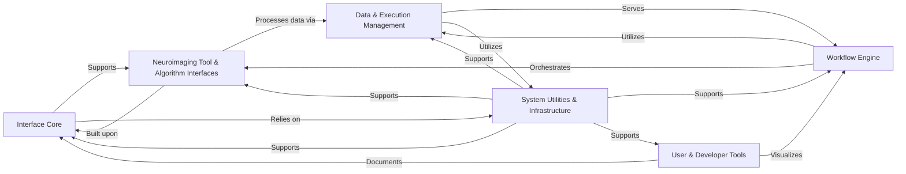

## Details

Final Architecture Analysis for `nipype`

### Interface Core
This is the foundational layer of Nipype, providing abstract classes and utilities for defining how external neuroimaging tools and custom Python functions are wrapped and exposed as standardized "interfaces." It manages input/output specifications and argument formatting, acting as the common language for all processing units.

**Related Classes/Methods**:

- <a href="https://github.com/nipy/nipype/nipype/interfaces/base/core.py#L0-L9999" target="_blank" rel="noopener noreferrer">`nipype.interfaces.base.core` (0:9999)</a>
- <a href="https://github.com/nipy/nipype/nipype/interfaces/base/specs.py#L0-L9999" target="_blank" rel="noopener noreferrer">`nipype.interfaces.base.specs` (0:9999)</a>
- <a href="https://github.com/nipy/nipype/nipype/interfaces/base/support.py#L0-L9999" target="_blank" rel="noopener noreferrer">`nipype.interfaces.base.support` (0:9999)</a>
- <a href="https://github.com/nipy/nipype/nipype/interfaces/base/traits_extension.py#L0-L9999" target="_blank" rel="noopener noreferrer">`nipype.interfaces.base.traits_extension` (0:9999)</a>

### Workflow Engine
The central orchestration component of Nipype. It allows users to define complex neuroimaging pipelines as directed acyclic graphs (DAGs) of interconnected processing units called "nodes." It manages the execution order, data dependencies, and overall flow of the analysis.

**Related Classes/Methods**:

- <a href="https://github.com/nipy/nipype/nipype/pipeline/engine/workflows.py#L0-L9999" target="_blank" rel="noopener noreferrer">`nipype.pipeline.engine.workflows` (0:9999)</a>
- <a href="https://github.com/nipy/nipype/nipype/pipeline/engine/nodes.py#L0-L9999" target="_blank" rel="noopener noreferrer">`nipype.pipeline.engine.nodes` (0:9999)</a>
- <a href="https://github.com/nipy/nipype/nipype/pipeline/engine/utils.py#L0-L9999" target="_blank" rel="noopener noreferrer">`nipype.pipeline.engine.utils` (0:9999)</a>

### Neuroimaging Tool & Algorithm Interfaces
A comprehensive collection of Nipype interfaces that provide Pythonic wrappers for various external neuroimaging software packages (e.g., FSL, FreeSurfer, SPM, ANTS, AFNI, Dipy, MRtrix, NiftyReg/Seg). This component also includes algorithms implemented directly within Nipype for tasks like confound correction, statistical analysis, and model generation.

**Related Classes/Methods**:

- `nipype.interfaces.afni` (0:9999)
- `nipype.interfaces.ants` (0:9999)
- `nipype.interfaces.freesurfer` (0:9999)
- `nipype.interfaces.fsl` (0:9999)
- `nipype.interfaces.spm` (0:9999)
- `nipype.interfaces.dipy` (0:9999)
- `nipype.interfaces.mrtrix` (0:9999)
- `nipype.interfaces.mrtrix3` (0:9999)
- `nipype.interfaces.niftyreg` (0:9999)
- `nipype.interfaces.niftyseg` (0:9999)
- <a href="https://github.com/nipy/nipype/nipype/interfaces/matlab.py#L0-L9999" target="_blank" rel="noopener noreferrer">`nipype.interfaces.matlab` (0:9999)</a>
- <a href="https://github.com/nipy/nipype/nipype/interfaces/r.py#L0-L9999" target="_blank" rel="noopener noreferrer">`nipype.interfaces.r` (0:9999)</a>
- `nipype.algorithms` (0:9999)

### Data & Execution Management
This component handles the seamless input and output of data within Nipype workflows, providing interfaces to grab data from various sources (local files, cloud storage, BIDS datasets) and sink processed results to specified destinations. It also includes various plugins that determine how the defined workflows are executed across different environments (e.g., local multiprocessing, SGE, SLURM).

**Related Classes/Methods**:

- <a href="https://github.com/nipy/nipype/nipype/interfaces/io.py#L0-L9999" target="_blank" rel="noopener noreferrer">`nipype.interfaces.io` (0:9999)</a>
- `nipype.interfaces.utility` (0:9999)
- `nipype.pipeline.plugins` (0:9999)

### System Utilities & Infrastructure
A foundational layer providing low-level utilities for interacting with the operating system, such as file manipulation (copying, renaming), executing external commands, and managing temporary directories. Crucially, it also manages Nipype's global configuration settings and ensures reproducibility and efficiency through data provenance tracking and result caching.

**Related Classes/Methods**:

- <a href="https://github.com/nipy/nipype/nipype/utils/filemanip.py#L0-L9999" target="_blank" rel="noopener noreferrer">`nipype.utils.filemanip` (0:9999)</a>
- <a href="https://github.com/nipy/nipype/nipype/utils/subprocess.py#L0-L9999" target="_blank" rel="noopener noreferrer">`nipype.utils.subprocess` (0:9999)</a>
- <a href="https://github.com/nipy/nipype/nipype/utils/tmpdirs.py#L0-L9999" target="_blank" rel="noopener noreferrer">`nipype.utils.tmpdirs` (0:9999)</a>
- <a href="https://github.com/nipy/nipype/nipype/utils/provenance.py#L0-L9999" target="_blank" rel="noopener noreferrer">`nipype.utils.provenance` (0:9999)</a>
- <a href="https://github.com/nipy/nipype/nipype/caching/memory.py#L0-L9999" target="_blank" rel="noopener noreferrer">`nipype.caching.memory` (0:9999)</a>
- <a href="https://github.com/nipy/nipype/nipype/utils/config.py#L0-L9999" target="_blank" rel="noopener noreferrer">`nipype.utils.config` (0:9999)</a>
- <a href="https://github.com/nipy/nipype/nipype/utils/logger.py#L0-L9999" target="_blank" rel="noopener noreferrer">`nipype.utils.logger` (0:9999)</a>
- <a href="https://github.com/nipy/nipype/nipype/external/cloghandler.py#L0-L9999" target="_blank" rel="noopener noreferrer">`nipype.external.cloghandler` (0:9999)</a>
- <a href="https://github.com/nipy/nipype/nipype/external/fsl_imglob.py#L0-L9999" target="_blank" rel="noopener noreferrer">`nipype.external.fsl_imglob` (0:9999)</a>

### User & Developer Tools
This component provides functionalities primarily aimed at enhancing user experience and aiding developers. This includes tools for generating documentation (e.g., Sphinx extensions for plotting workflows and API documentation) and command-line interfaces (CLI) for direct interaction with Nipype's features.

**Related Classes/Methods**:

- `nipype.sphinxext` (0:9999)
- <a href="https://github.com/nipy/nipype/nipype/scripts/cli.py#L22-L23" target="_blank" rel="noopener noreferrer">`nipype.scripts.cli` (22:23)</a>
- <a href="https://github.com/nipy/nipype/nipype/utils/docparse.py#L0-L9999" target="_blank" rel="noopener noreferrer">`nipype.utils.docparse` (0:9999)</a>
- <a href="https://github.com/nipy/nipype/nipype/utils/nipype2boutiques.py#L0-L9999" target="_blank" rel="noopener noreferrer">`nipype.utils.nipype2boutiques` (0:9999)</a>

### [FAQ](https://github.com/CodeBoarding/GeneratedOnBoardings/tree/main?tab=readme-ov-file#faq)