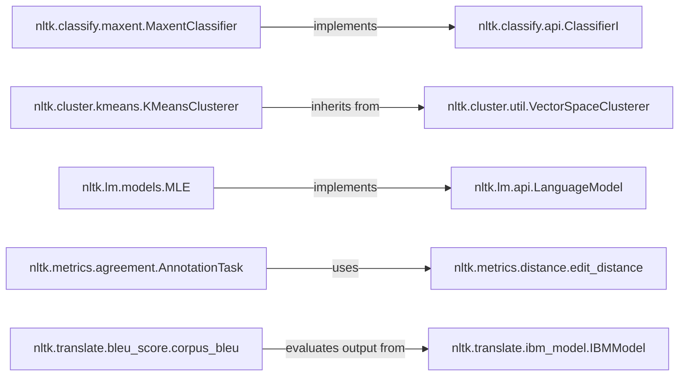

## Component Details

Component Overview: Advanced NLP Models & Evaluation

### nltk.classify.api.ClassifierI
This is an abstract base class that defines the fundamental interface for all classifiers within NLTK. It mandates essential methods such as `labels()`, `classify()`, and `prob_classify()`, ensuring a consistent API across diverse classification algorithms.

**Related Classes/Methods**:

- <a href="https://github.com/nltk/nltk/blob/master/nltk/classify/api.py#L42-L47" target="_blank" rel="noopener noreferrer">`nltk.classify.api.ClassifierI:labels` (42:47)</a>
- <a href="https://github.com/nltk/nltk/blob/master/nltk/classify/api.py#L49-L57" target="_blank" rel="noopener noreferrer">`nltk.classify.api.ClassifierI:classify` (49:57)</a>
- <a href="https://github.com/nltk/nltk/blob/master/nltk/classify/api.py#L59-L68" target="_blank" rel="noopener noreferrer">`nltk.classify.api.ClassifierI:prob_classify` (59:68)</a>

### nltk.classify.maxent.MaxentClassifier
Implements the Maximum Entropy Classifier, a widely used probabilistic classifier in NLP. It learns a set of weights for features based on training data to make predictions.

**Related Classes/Methods**: _None_

### nltk.cluster.util.VectorSpaceClusterer
An abstract base class for clustering algorithms that operate on data represented in vector spaces. It provides common functionalities like vector normalization and defines the interface for vector-based clustering and classification.

**Related Classes/Methods**: _None_

### nltk.cluster.kmeans.KMeansClusterer
Implements the K-Means clustering algorithm, an iterative method that partitions data points into a specified number of clusters, aiming to minimize the variance within each cluster.

**Related Classes/Methods**: _None_

### nltk.lm.api.LanguageModel
An abstract base class that defines the core interface for all language models in NLTK. It provides methods for common language modeling tasks such as fitting a model to data, scoring sequences, calculating entropy, and generating text.

**Related Classes/Methods**:

- <a href="https://github.com/nltk/nltk/blob/master/nltk/lm/api.py#L103-L115" target="_blank" rel="noopener noreferrer">`nltk.lm.api.LanguageModel:fit` (103:115)</a>
- <a href="https://github.com/nltk/nltk/blob/master/nltk/lm/api.py#L117-L125" target="_blank" rel="noopener noreferrer">`nltk.lm.api.LanguageModel:score` (117:125)</a>
- <a href="https://github.com/nltk/nltk/blob/master/nltk/lm/api.py#L162-L174" target="_blank" rel="noopener noreferrer">`nltk.lm.api.LanguageModel:entropy` (162:174)</a>
- <a href="https://github.com/nltk/nltk/blob/master/nltk/lm/api.py#L184-L237" target="_blank" rel="noopener noreferrer">`nltk.lm.api.LanguageModel:generate` (184:237)</a>

### nltk.lm.models.MLE
Implements a Maximum Likelihood Estimation (MLE) language model, which estimates the probabilities of word sequences directly from their observed frequencies in the training data without any smoothing.

**Related Classes/Methods**: _None_

### nltk.metrics.agreement.AnnotationTask
A class designed for calculating various inter-annotator agreement metrics, such as observed agreement, Cohen's Kappa, and Krippendorff's Alpha, which are crucial for evaluating the reliability of human annotations in NLP tasks.

**Related Classes/Methods**: _None_

### nltk.metrics.distance.edit_distance
A function that calculates the Levenshtein edit distance between two sequences. This fundamental metric quantifies the minimum number of single-character edits (insertions, deletions, or substitutions) required to transform one sequence into the other, widely used for string similarity.

**Related Classes/Methods**: _None_

### nltk.translate.ibm_model.IBMModel
An abstract base class that serves as the foundation for the IBM statistical machine translation models (Model 1 through Model 5). It defines common functionalities and attributes shared across these foundational models for word alignment and translation probability estimation.

**Related Classes/Methods**: _None_

### nltk.translate.bleu_score.corpus_bleu
A function to compute the Bilingual Evaluation Understudy (BLEU) score for a corpus of translated sentences. BLEU is a widely adopted metric for automatically evaluating the quality of machine translation output by comparing n-gram overlaps with reference translations.

**Related Classes/Methods**: _None_

### [FAQ](https://github.com/CodeBoarding/GeneratedOnBoardings/tree/main?tab=readme-ov-file#faq)