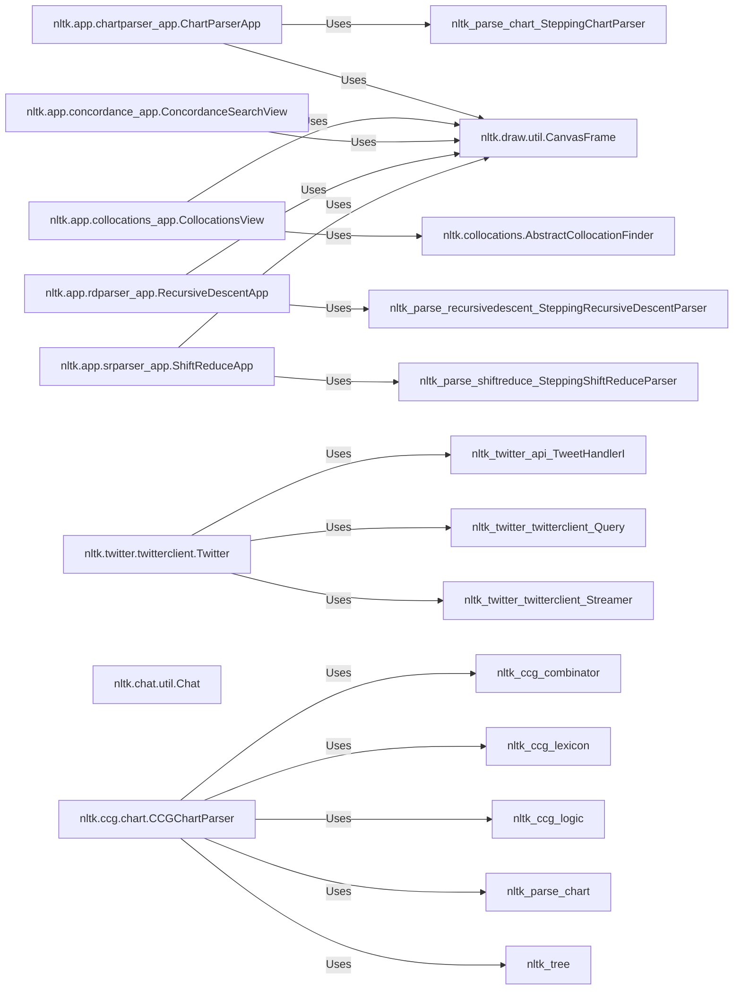

## Component Details

The `Applications & Interfaces` component of NLTK serves as the user-facing layer, providing interactive tools and integrations that demonstrate and utilize NLTK's core NLP functionalities. This component is crucial for making NLTK accessible and for showcasing its capabilities through practical applications.

### nltk.app.chartparser_app.ChartParserApp
A GUI application that visually demonstrates the chart parsing process. It allows users to load grammars and sentences, step through the parsing process, and view the chart, matrix, and results.

**Related Classes/Methods**:

- <a href="https://github.com/nltk/nltk/blob/master/nltk/parse/chart.py#L1528-L1687" target="_blank" rel="noopener noreferrer">`nltk.parse.chart.SteppingChartParser` (1528:1687)</a>
- <a href="https://github.com/nltk/nltk/blob/master/nltk/draw/util.py#L1765-L1998" target="_blank" rel="noopener noreferrer">`nltk.draw.util.CanvasFrame` (1765:1998)</a>

### nltk.app.collocations_app.CollocationsView
A GUI application for exploring collocations in a text corpus. It allows users to select a corpus, specify n-gram size, and view the most significant collocations.

**Related Classes/Methods**:

- <a href="https://github.com/nltk/nltk/blob/master/nltk/collocations.py#L46-L146" target="_blank" rel="noopener noreferrer">`nltk.collocations.AbstractCollocationFinder` (46:146)</a>
- <a href="https://github.com/nltk/nltk/blob/master/nltk/draw/util.py#L1765-L1998" target="_blank" rel="noopener noreferrer">`nltk.draw.util.CanvasFrame` (1765:1998)</a>

### nltk.app.concordance_app.ConcordanceSearchView
A GUI application for performing and displaying concordances (keyword-in-context). Users can select a corpus and search for specific words or patterns.

**Related Classes/Methods**:

- <a href="https://github.com/nltk/nltk/blob/master/nltk/draw/util.py#L1765-L1998" target="_blank" rel="noopener noreferrer">`nltk.draw.util.CanvasFrame` (1765:1998)</a>

### nltk.app.rdparser_app.RecursiveDescentApp
A GUI application that visually demonstrates the recursive descent parsing algorithm, allowing users to step through the parsing process and observe the parse tree and frontier.

**Related Classes/Methods**:

- <a href="https://github.com/nltk/nltk/blob/master/nltk/parse/recursivedescent.py#L344-L644" target="_blank" rel="noopener noreferrer">`nltk.parse.recursivedescent.SteppingRecursiveDescentParser` (344:644)</a>
- <a href="https://github.com/nltk/nltk/blob/master/nltk/draw/util.py#L1765-L1998" target="_blank" rel="noopener noreferrer">`nltk.draw.util.CanvasFrame` (1765:1998)</a>

### nltk.app.srparser_app.ShiftReduceApp
A GUI application that visualizes the shift-reduce parsing algorithm, showing the stack, input, and reducible productions.

**Related Classes/Methods**:

- <a href="https://github.com/nltk/nltk/blob/master/nltk/parse/shiftreduce.py#L284-L440" target="_blank" rel="noopener noreferrer">`nltk.parse.shiftreduce.SteppingShiftReduceParser` (284:440)</a>
- <a href="https://github.com/nltk/nltk/blob/master/nltk/draw/util.py#L1765-L1998" target="_blank" rel="noopener noreferrer">`nltk.draw.util.CanvasFrame` (1765:1998)</a>

### nltk.draw.util.CanvasFrame
A Tkinter-based frame that contains a canvas widget, providing a drawing surface for other widgets and managing scrolling. It's a fundamental building block for many NLTK GUI applications.

**Related Classes/Methods**: _None_

### nltk.twitter.twitterclient.Twitter
The primary class for interacting with the Twitter API, handling authentication, queries, and streaming of tweets.

**Related Classes/Methods**:

- <a href="https://github.com/nltk/nltk/blob/master/nltk/twitter/api.py#L78-L144" target="_blank" rel="noopener noreferrer">`nltk.twitter.api.TweetHandlerI` (78:144)</a>
- <a href="https://github.com/nltk/nltk/blob/master/nltk/twitter/twitterclient.py#L120-L306" target="_blank" rel="noopener noreferrer">`nltk.twitter.twitterclient.Query` (120:306)</a>
- <a href="https://github.com/nltk/nltk/blob/master/nltk/twitter/twitterclient.py#L39-L117" target="_blank" rel="noopener noreferrer">`nltk.twitter.twitterclient.Streamer` (39:117)</a>

### nltk.collocations.AbstractCollocationFinder
An abstract base class that defines the common interface and provides core functionalities for finding collocations (e.g., n-gram frequency distribution, filtering, scoring).

**Related Classes/Methods**: _None_

### nltk.chat.util.Chat
Provides the foundational utilities and a base class for creating simple rule-based chatbots. Specific chatbots (like Eliza) inherit from or utilize components within this module.

**Related Classes/Methods**: _None_

### nltk.ccg.chart.CCGChartParser
Implements a chart parser specifically designed for Combinatory Categorial Grammar (CCG), enabling the parsing of sentences based on CCG rules.

**Related Classes/Methods**:

- <a href="https://github.com/nltk/nltk/blob/master/nltk/ccg/combinator.py#L0-L0" target="_blank" rel="noopener noreferrer">`nltk.ccg.combinator` (0:0)</a>
- <a href="https://github.com/nltk/nltk/blob/master/nltk/ccg/lexicon.py#L0-L0" target="_blank" rel="noopener noreferrer">`nltk.ccg.lexicon` (0:0)</a>
- <a href="https://github.com/nltk/nltk/blob/master/nltk/ccg/logic.py#L0-L0" target="_blank" rel="noopener noreferrer">`nltk.ccg.logic` (0:0)</a>
- <a href="https://github.com/nltk/nltk/blob/master/nltk/parse/chart.py#L0-L0" target="_blank" rel="noopener noreferrer">`nltk.parse.chart` (0:0)</a>
- `nltk.tree` (0:0)

### [FAQ](https://github.com/CodeBoarding/GeneratedOnBoardings/tree/main?tab=readme-ov-file#faq)