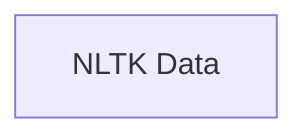

## Component Details

Analysis of NLTK modules, focusing on the 'data' module and its interactions with other parts of NLTK for managing linguistic resources. The analysis aims to understand how data is loaded, accessed, and utilized across the library, identifying key functions and classes involved in data handling and their relationships with components responsible for tokenization, stemming, and tagging. This will help in understanding the overall architecture and data flow within NLTK, especially concerning its extensibility and performance with large linguistic datasets. The analysis will also cover error handling and efficiency in data operations, providing insights into potential optimizations and common pitfalls in NLTK data usage. The 'data' module is central to NLTK's functionality, enabling access to corpora, pre-trained models, and other linguistic resources essential for natural language processing tasks. Understanding its internal mechanisms and interactions is crucial for effective NLTK development and application. The analysis will also consider the module's role in supporting various data formats and its adaptability to new linguistic resources, highlighting its importance in the broader NLP ecosystem. The 'data' module's design principles, such as lazy loading and resource management, will be examined to understand their impact on performance and memory usage. Furthermore, the analysis will explore how the 'data' module integrates with other NLTK components, such as tokenizers, taggers, and parsers, to provide a seamless workflow for NLP tasks. This comprehensive analysis will contribute to a deeper understanding of NLTK's architecture and its capabilities in handling diverse linguistic data.

### NLTK Data
The NLTK data module.

**Related Classes/Methods**:

- <a href="https://github.com/nltk/nltk/blob/master/nltk/data.py#L0-L0" target="_blank" rel="noopener noreferrer">`nltk.data` (0:0)</a>

### [FAQ](https://github.com/CodeBoarding/GeneratedOnBoardings/tree/main?tab=readme-ov-file#faq)