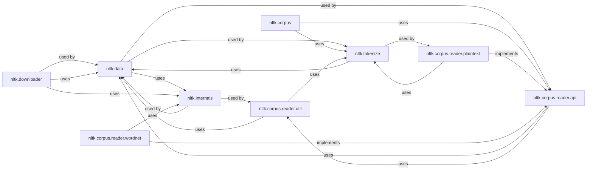

## Component Details

This component is central to NLTK's ability to handle and provide access to its vast collection of linguistic data, including corpora, pre-trained models, and grammars. It ensures that users can easily locate, load, and process various data formats, abstracting away the underlying storage mechanisms.

### nltk.data
This module is the primary interface for locating and loading NLTK's linguistic data. It abstracts away the underlying file system details and provides functions to find data files and directories, supporting various URL protocols (e.g., `nltk:`, `file:`, `https:`). It also manages the NLTK data search path.

**Related Classes/Methods**:

- <a href="https://github.com/nltk/nltk/blob/master/nltk/data.py#L0-L0" target="_blank" rel="noopener noreferrer">`nltk.data` (0:0)</a>

### nltk.downloader
This module provides functionality for downloading and installing NLTK data packages from the official NLTK data server. It manages the process of fetching, verifying, and extracting data, making it easy for users to acquire necessary linguistic resources.

**Related Classes/Methods**:

- <a href="https://github.com/nltk/nltk/blob/master/nltk/downloader.py#L0-L0" target="_blank" rel="noopener noreferrer">`nltk.downloader` (0:0)</a>

### nltk.corpus
This package serves as the central access point for all NLTK corpora. It provides a unified API to load and interact with various linguistic datasets, abstracting the specific reader implementations for different data formats. It acts as a registry for available corpora.

**Related Classes/Methods**:

- `nltk.corpus` (0:0)

### nltk.corpus.reader.api
This module defines the abstract base classes and common interfaces (e.g., `CorpusReader`) for all NLTK corpus readers. It establishes a contract for how different types of linguistic data can be accessed and processed, promoting consistency and extensibility across various data formats.

**Related Classes/Methods**:

- <a href="https://github.com/nltk/nltk/blob/master/nltk/corpus/reader/api.py#L0-L0" target="_blank" rel="noopener noreferrer">`nltk.corpus.reader.api` (0:0)</a>

### nltk.corpus.reader.util
This module provides a collection of utility functions and helper classes (e.g., `StreamBackedCorpusView`) specifically designed to support the implementation of various corpus readers. This includes functionalities for handling file paths, character encodings, and efficient stream processing of large data files.

**Related Classes/Methods**:

- <a href="https://github.com/nltk/nltk/blob/master/nltk/corpus/reader/util.py#L0-L0" target="_blank" rel="noopener noreferrer">`nltk.corpus.reader.util` (0:0)</a>

### nltk.corpus.reader.plaintext
A concrete implementation of a corpus reader designed to process and provide access to plain text corpora. It handles the basic reading and tokenization of raw text files, making it a fundamental reader for many common datasets.

**Related Classes/Methods**:

- <a href="https://github.com/nltk/nltk/blob/master/nltk/corpus/reader/plaintext.py#L0-L0" target="_blank" rel="noopener noreferrer">`nltk.corpus.reader.plaintext` (0:0)</a>

### nltk.corpus.reader.wordnet
A specialized corpus reader for the WordNet lexical database. It provides methods to access WordNet's synsets, lemmas, definitions, and relationships, enabling semantic processing. This demonstrates the extensibility of the `corpus.reader.api`.

**Related Classes/Methods**:

- <a href="https://github.com/nltk/nltk/blob/master/nltk/corpus/reader/wordnet.py#L0-L0" target="_blank" rel="noopener noreferrer">`nltk.corpus.reader.wordnet` (0:0)</a>

### nltk.internals
This module provides internal utility functions and configurations for NLTK, including mechanisms for locating external programs (like Java for Stanford tools) and managing internal data paths. It's a foundational dependency for data loading and external tool integration.

**Related Classes/Methods**:

- <a href="https://github.com/nltk/nltk/blob/master/nltk/internals.py#L0-L0" target="_blank" rel="noopener noreferrer">`nltk.internals` (0:0)</a>

### nltk.tokenize
This package provides various tokenization algorithms, which are essential for breaking down raw text from corpora into meaningful units (words, sentences). Many corpus readers rely on tokenizers to provide structured data for further NLP tasks.

**Related Classes/Methods**:

- `nltk.tokenize` (0:0)

### [FAQ](https://github.com/CodeBoarding/GeneratedOnBoardings/tree/main?tab=readme-ov-file#faq)