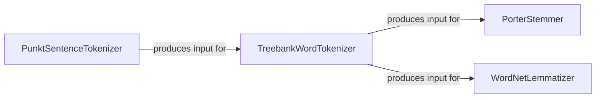

## Component Details

The Text Preprocessing component is designed to transform raw textual data into a structured format suitable for various Natural Language Processing (NLP) tasks. It primarily handles the initial stages of text normalization, specifically tokenization and morphological normalization (stemming and lemmatization).

### PunktSentenceTokenizer
This component is responsible for segmenting raw text into individual sentences. It employs an unsupervised algorithm to learn patterns of abbreviations, collocations, and sentence-starting words, enabling it to accurately identify sentence boundaries.

**Related Classes/Methods**:

- <a href="https://github.com/nltk/nltk/blob/master/nltk/tokenize/punkt.py#L1238-L1733" target="_blank" rel="noopener noreferrer">`nltk.tokenize.punkt.PunktSentenceTokenizer` (1238:1733)</a>

### TreebankWordTokenizer
This component performs word tokenization, splitting sentences into individual words and punctuation marks. It adheres to the conventions of the Penn Treebank, handling common English contractions and various punctuation rules to produce a consistent stream of tokens.

**Related Classes/Methods**:

- <a href="https://github.com/nltk/nltk/blob/master/nltk/tokenize/treebank.py#L28-L212" target="_blank" rel="noopener noreferrer">`nltk.tokenize.treebank.TreebankWordTokenizer` (28:212)</a>

### PorterStemmer
This component implements the Porter stemming algorithm, a rule-based method for reducing words to their morphological root or stem. It removes common suffixes to conflate different inflected forms of a word into a single base form (e.g., "running," "runs," "ran" all become "run").

**Related Classes/Methods**:

- <a href="https://github.com/nltk/nltk/blob/master/nltk/stem/porter.py#L1-L1" target="_blank" rel="noopener noreferrer">`nltk.stem.porter.PorterStemmer` (1:1)</a>

### WordNetLemmatizer
This component performs lemmatization, a more linguistically sophisticated process than stemming. It uses the WordNet lexical database to reduce words to their canonical base form (lemma), considering their part of speech (e.g., "better" becomes "good," "am" becomes "be").

**Related Classes/Methods**:

- <a href="https://github.com/nltk/nltk/blob/master/nltk/stem/wordnet.py#L10-L88" target="_blank" rel="noopener noreferrer">`nltk.stem.wordnet.WordNetLemmatizer` (10:88)</a>

### [FAQ](https://github.com/CodeBoarding/GeneratedOnBoardings/tree/main?tab=readme-ov-file#faq)