```mermaid
graph LR
    Core_Utilities_Foundations["Core Utilities & Foundations"]
    Data_Corpus_Management["Data & Corpus Management"]
    Text_Preprocessing["Text Preprocessing"]
    Syntactic_Structural_Analysis["Syntactic & Structural Analysis"]
    Advanced_NLP_Models_Evaluation["Advanced NLP Models & Evaluation"]
    Applications_Interfaces["Applications & Interfaces"]
    Core_Utilities_Foundations -- "provides foundational services to" --> Data_Corpus_Management
    Core_Utilities_Foundations -- "provides foundational services to" --> Text_Preprocessing
    Core_Utilities_Foundations -- "provides foundational services to" --> Syntactic_Structural_Analysis
    Core_Utilities_Foundations -- "provides foundational services to" --> Advanced_NLP_Models_Evaluation
    Core_Utilities_Foundations -- "provides foundational services to" --> Applications_Interfaces
    Core_Utilities_Foundations -- "supports statistical computations for" --> Advanced_NLP_Models_Evaluation
    Data_Corpus_Management -- "provides raw linguistic data to" --> Text_Preprocessing
    Data_Corpus_Management -- "supplies pre-trained models and grammars to" --> Syntactic_Structural_Analysis
    Text_Preprocessing -- "provides tokenized and normalized text to" --> Syntactic_Structural_Analysis
    Text_Preprocessing -- "provides tokenized and normalized text to" --> Advanced_NLP_Models_Evaluation
    Syntactic_Structural_Analysis -- "provides structured linguistic data to" --> Advanced_NLP_Models_Evaluation
    Applications_Interfaces -- "utilizes functionalities from" --> Core_Utilities_Foundations
    Applications_Interfaces -- "utilizes functionalities from" --> Data_Corpus_Management
    Applications_Interfaces -- "utilizes functionalities from" --> Text_Preprocessing
    Applications_Interfaces -- "utilizes functionalities from" --> Syntactic_Structural_Analysis
    Applications_Interfaces -- "utilizes functionalities from" --> Advanced_NLP_Models_Evaluation
    click Core_Utilities_Foundations href "https://github.com/CodeBoarding/GeneratedOnBoardings/blob/main//nltk/Core_Utilities_Foundations.md" "Details"
    click Data_Corpus_Management href "https://github.com/CodeBoarding/GeneratedOnBoardings/blob/main//nltk/Data_Corpus_Management.md" "Details"
    click Text_Preprocessing href "https://github.com/CodeBoarding/GeneratedOnBoardings/blob/main//nltk/Text_Preprocessing.md" "Details"
    click Syntactic_Structural_Analysis href "https://github.com/CodeBoarding/GeneratedOnBoardings/blob/main//nltk/Syntactic_Structural_Analysis.md" "Details"
    click Advanced_NLP_Models_Evaluation href "https://github.com/CodeBoarding/GeneratedOnBoardings/blob/main//nltk/Advanced_NLP_Models_Evaluation.md" "Details"
    click Applications_Interfaces href "https://github.com/CodeBoarding/GeneratedOnBoardings/blob/main//nltk/Applications_Interfaces.md" "Details"
```

## Component Details

Final architecture analysis for `nltk`, consolidating insights from both CFG and Source analysis into a high-level data flow overview. The `nltk` library is designed with a modular architecture, allowing for a clear separation of concerns across various Natural Language Processing (NLP) tasks. The core components are structured to facilitate a pipeline approach, where processed data flows from foundational layers to more complex analytical and application-oriented modules. The six components are chosen because they represent the fundamental, distinct, and logically grouped functionalities that constitute the core of the NLTK library. They illustrate a typical NLP pipeline, from raw data to advanced analysis and application: Core Utilities & Foundations (bedrock), Data & Corpus Management (fundamental for resources), Text Preprocessing (initial and crucial step), Syntactic & Structural Analysis (core linguistic intelligence), Advanced NLP Models & Evaluation (sophisticated algorithms and machine learning capabilities), and Applications & Interfaces (fundamental for user accessibility and practical utility). Together, these components form a comprehensive, modular, and highly interconnected architecture that enables NLTK to address a vast array of Natural Language Processing challenges, from basic text manipulation to complex semantic and statistical modeling.

### Core Utilities & Foundations
This component provides the fundamental building blocks for the entire NLTK library. It includes general-purpose data structures (e.g., `OrderedDict`, `Trie`), essential utility functions, internal helper functions, compatibility layers, and core statistical tools like frequency distributions and various probability models. It underpins almost all other NLTK functionalities.

**Related Classes/Methods**:

- <a href="https://github.com/nltk/nltk/blob/master/nltk/util.py#L1-L1" target="_blank" rel="noopener noreferrer">`nltk.util` (1:1)</a>
- <a href="https://github.com/nltk/nltk/blob/master/nltk/collections.py#L1-L1" target="_blank" rel="noopener noreferrer">`nltk.collections` (1:1)</a>
- <a href="https://github.com/nltk/nltk/blob/master/nltk/internals.py#L1-L1" target="_blank" rel="noopener noreferrer">`nltk.internals` (1:1)</a>
- <a href="https://github.com/nltk/nltk/blob/master/nltk/decorators.py#L1-L1" target="_blank" rel="noopener noreferrer">`nltk.decorators` (1:1)</a>
- <a href="https://github.com/nltk/nltk/blob/master/nltk/jsontags.py#L1-L1" target="_blank" rel="noopener noreferrer">`nltk.jsontags` (1:1)</a>
- <a href="https://github.com/nltk/nltk/blob/master/nltk/compat.py#L1-L1" target="_blank" rel="noopener noreferrer">`nltk.compat` (1:1)</a>
- <a href="https://github.com/nltk/nltk/blob/master/nltk/lazyimport.py#L1-L1" target="_blank" rel="noopener noreferrer">`nltk.lazyimport` (1:1)</a>
- <a href="https://github.com/nltk/nltk/blob/master/nltk/langnames.py#L1-L1" target="_blank" rel="noopener noreferrer">`nltk.langnames` (1:1)</a>
- <a href="https://github.com/nltk/nltk/blob/master/nltk/probability.py#L1-L1" target="_blank" rel="noopener noreferrer">`nltk.probability` (1:1)</a>

### Data & Corpus Management
This component is responsible for managing NLTK's extensive collection of linguistic data. It handles the loading, locating, and downloading of corpora, pre-trained models, and grammars. It also provides standardized interfaces and reader classes for accessing and processing various types of linguistic data, abstracting away underlying file formats.

**Related Classes/Methods**:

- <a href="https://github.com/nltk/nltk/blob/master/nltk/data.py#L1-L1" target="_blank" rel="noopener noreferrer">`nltk.data` (1:1)</a>
- <a href="https://github.com/nltk/nltk/blob/master/nltk/downloader.py#L1-L1" target="_blank" rel="noopener noreferrer">`nltk.downloader` (1:1)</a>
- <a href="https://github.com/nltk/nltk/blob/master/nltk/corpus/reader/api.py#L1-L1" target="_blank" rel="noopener noreferrer">`nltk.corpus.reader.api` (1:1)</a>
- `nltk.corpus.reader` (1:1)

### Text Preprocessing
This component focuses on transforming raw text into structured linguistic units suitable for further analysis. Its primary functions include tokenization (breaking down text into words, sentences, or multi-word expressions) and morphological normalization (reducing words to their base or root forms through stemming and lemmatization).

**Related Classes/Methods**:

- `nltk.tokenize` (1:1)
- `nltk.stem` (1:1)

### Syntactic & Structural Analysis
This component analyzes the grammatical and structural properties of text. It includes functionalities for Part-of-Speech (POS) tagging (assigning grammatical categories to words), chunking (identifying multi-word phrases), Named Entity Recognition (categorizing entities like persons or locations), and parsing (generating syntactic parse trees or dependency graphs). It also defines formal grammars and handles feature structures and tree representations.

**Related Classes/Methods**:

- `nltk.tag` (1:1)
- `nltk.chunk` (1:1)
- `nltk.parse` (1:1)
- <a href="https://github.com/nltk/nltk/blob/master/nltk/grammar.py#L1-L1" target="_blank" rel="noopener noreferrer">`nltk.grammar` (1:1)</a>
- <a href="https://github.com/nltk/nltk/blob/master/nltk/featstruct.py#L1-L1" target="_blank" rel="noopener noreferrer">`nltk.featstruct` (1:1)</a>
- `nltk.tree` (1:1)

### Advanced NLP Models & Evaluation
This component encompasses higher-level NLP tasks that often involve statistical or machine learning models. It includes tools for building and evaluating statistical language models (e.g., N-gram models), machine translation (e.g., IBM models, BLEU scores), text classification, and clustering. Crucially, it also provides a comprehensive suite of metrics for evaluating the performance and quality of various NLP models and tasks.

**Related Classes/Methods**:

- `nltk.lm` (1:1)
- `nltk.translate` (1:1)
- `nltk.classify` (1:1)
- `nltk.cluster` (1:1)
- `nltk.metrics` (1:1)

### Applications & Interfaces
This component provides interactive applications, graphical user interfaces (GUIs), and specific integrations (e.g., Twitter API) to demonstrate NLTK's capabilities and allow users to interact with NLP concepts. It also includes utilities for tasks like collocation discovery and simple chat-bots, serving as a user-facing layer for the library's functionalities.

**Related Classes/Methods**:

- `nltk.app` (1:1)
- `nltk.draw` (1:1)
- `nltk.twitter` (1:1)
- <a href="https://github.com/nltk/nltk/blob/master/nltk/collocations.py#L1-L1" target="_blank" rel="noopener noreferrer">`nltk.collocations` (1:1)</a>
- `nltk.chat` (1:1)
- `nltk.ccg` (1:1)

### [FAQ](https://github.com/CodeBoarding/GeneratedOnBoardings/tree/main?tab=readme-ov-file#faq)