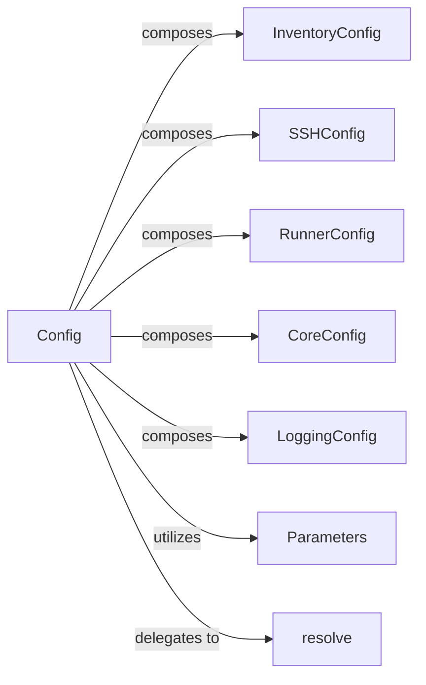

## Details

The Configuration Management subsystem within the Nornir automation framework is responsible for defining, loading, parsing, and validating all operational settings. It is structured around the central `Config` component, which acts as an aggregate root for all other specific configuration types, providing a single, comprehensive entry point for managing Nornir's operational settings.

### Config
Serves as the main aggregator and manager for all Nornir operational settings. It provides methods to initialize, load configuration from various sources (e.g., dictionary, file), and represent the complete configuration state. It orchestrates the creation and population of other specific configuration objects.

**Related Classes/Methods**:

- <a href="https://github.com/nornir-automation/nornir/blob/main/nornir/core/configuration.py#L234-L316" target="_blank" rel="noopener noreferrer">`nornir.core.configuration.Config`:234-316</a>

### InventoryConfig
Manages configuration settings specifically related to how Nornir's inventory is loaded and processed (e.g., inventory plugins, options).

**Related Classes/Methods**:

- <a href="https://github.com/nornir-automation/nornir/blob/main/nornir/core/configuration.py#L70-L103" target="_blank" rel="noopener noreferrer">`nornir.core.configuration.InventoryConfig`:70-103</a>

### SSHConfig
Manages SSH connection parameters and settings used by Nornir tasks (e.g., connection options, authentication details).

**Related Classes/Methods**:

- <a href="https://github.com/nornir-automation/nornir/blob/main/nornir/core/configuration.py#L57-L67" target="_blank" rel="noopener noreferrer">`nornir.core.configuration.SSHConfig`:57-67</a>

### RunnerConfig
Defines and manages settings for how Nornir tasks are executed, such as the number of workers, task-specific options, and overall execution behavior.

**Related Classes/Methods**:

- <a href="https://github.com/nornir-automation/nornir/blob/main/nornir/core/configuration.py#L199-L216" target="_blank" rel="noopener noreferrer">`nornir.core.configuration.RunnerConfig`:199-216</a>

### CoreConfig
Manages fundamental Nornir settings that affect its core behavior, such as global defaults or framework-level parameters.

**Related Classes/Methods**:

- <a href="https://github.com/nornir-automation/nornir/blob/main/nornir/core/configuration.py#L219-L231" target="_blank" rel="noopener noreferrer">`nornir.core.configuration.CoreConfig`:219-231</a>

### LoggingConfig
Manages settings related to Nornir's logging behavior, including log levels, handlers, and formats.

**Related Classes/Methods**:

- <a href="https://github.com/nornir-automation/nornir/blob/main/nornir/core/configuration.py#L106-L196" target="_blank" rel="noopener noreferrer">`nornir.core.configuration.LoggingConfig`:106-196</a>

### Parameters
A general-purpose base class or utility for handling various configuration parameters. It likely provides common methods for validation or default value assignment that other specific configuration classes inherit from or utilize.

**Related Classes/Methods**:

- <a href="https://github.com/nornir-automation/nornir/blob/main/nornir/core/configuration.py#L222-L223" target="_blank" rel="noopener noreferrer">`nornir.core.configuration.Parameters`:222-223</a>

### resolve
A utility function likely responsible for resolving paths, variables, or other dynamic aspects within the configuration, ensuring that all settings are correctly interpreted before use.

**Related Classes/Methods**:

- <a href="https://github.com/nornir-automation/nornir/blob/main/nornir/core/configuration.py#L37-L54" target="_blank" rel="noopener noreferrer">`nornir.core.configuration.resolve`:37-54</a>

### [FAQ](https://github.com/CodeBoarding/GeneratedOnBoardings/tree/main?tab=readme-ov-file#faq)