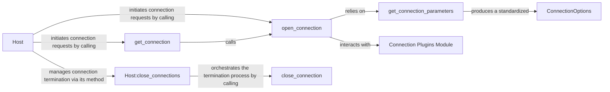

## Details

The `nornir.core.inventory` subsystem is responsible for managing the lifecycle of network device connections. At its core, the `Host` component acts as the primary interface, initiating connection requests through `open_connection` or `get_connection`. These functions rely on `get_connection_parameters` to consolidate connection details into `ConnectionOptions` and interact with the `Connection Plugins Module` to establish the actual network sessions. For connection termination, the `Host` component leverages its `close_connections` method, which orchestrates the release of resources by calling `close_connection` for individual connections. This design ensures a clear separation of concerns, with `Host` managing the overall connection state and dedicated functions handling the specifics of connection establishment and termination, supported by a pluggable architecture for diverse connection types.

### Host
Represents a network device and acts as the primary interface for managing its connection lifecycle (opening, retrieving, closing). It serves as the central entity through which all connection operations for a specific device are initiated.

**Related Classes/Methods**:

- <a href="https://github.com/nornir-automation/nornir/blob/main/nornir/core/inventory.py" target="_blank" rel="noopener noreferrer">`nornir.core.inventory.Host`</a>

### open_connection
Responsible for establishing new connections to a host. This component orchestrates the process of gathering connection parameters and invoking the appropriate connection plugin.

**Related Classes/Methods**:

- <a href="https://github.com/nornir-automation/nornir/blob/main/nornir/core/inventory.py#L488-L538" target="_blank" rel="noopener noreferrer">`nornir.core.inventory.open_connection`:488-538</a>

### get_connection
Provides an existing connection to a host or initiates a new one if no active connection is found. It acts as a gateway to ensure a connection is available for tasks.

**Related Classes/Methods**:

- <a href="https://github.com/nornir-automation/nornir/blob/main/nornir/core/inventory.py#L457-L486" target="_blank" rel="noopener noreferrer">`nornir.core.inventory.get_connection`:457-486</a>

### Host:close_connections
Manages the termination of all active connections for a specific Host instance. This method ensures that all resources associated with the host's connections are properly released.

**Related Classes/Methods**:

- <a href="https://github.com/nornir-automation/nornir/blob/main/nornir/core/inventory.py" target="_blank" rel="noopener noreferrer">`nornir.core.inventory.Host:close_connections`</a>

### close_connection
Performs the low-level action of closing a single, specific connection instance. This is the atomic operation for connection termination.

**Related Classes/Methods**:

- <a href="https://github.com/nornir-automation/nornir/blob/main/nornir/core/inventory.py#L540-L548" target="_blank" rel="noopener noreferrer">`nornir.core.inventory.close_connection`:540-548</a>

### get_connection_parameters
Gathers, consolidates, and resolves all necessary connection parameters for a given host, including merging options from groups and host-specific data.

**Related Classes/Methods**:

- <a href="https://github.com/nornir-automation/nornir/blob/main/nornir/core/inventory.py#L400-L430" target="_blank" rel="noopener noreferrer">`nornir.core.inventory.get_connection_parameters`:400-430</a>

### ConnectionOptions
A data structure that encapsulates and standardizes resolved connection parameters. It provides a consistent format for connection details across the system.

**Related Classes/Methods**:

- <a href="https://github.com/nornir-automation/nornir/blob/main/nornir/core/inventory.py#L60-L92" target="_blank" rel="noopener noreferrer">`nornir.core.inventory.ConnectionOptions`:60-92</a>

### Connection Plugins Module
This module serves as the registry and provider for actual connection implementations (e.g., Netmiko, Paramiko). It allows Nornir to extend its connectivity capabilities through a plugin-based architecture.

**Related Classes/Methods**:

- <a href="https://github.com/nornir-automation/nornir/blob/main/nornir/core/plugins/connections.py" target="_blank" rel="noopener noreferrer">`nornir.core.plugins.connections`</a>

### [FAQ](https://github.com/CodeBoarding/GeneratedOnBoardings/tree/main?tab=readme-ov-file#faq)