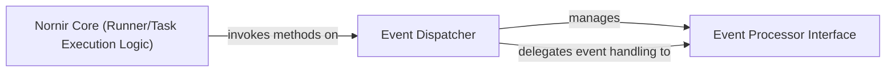

## Details

The Nornir core task execution subsystem is designed around an extensible event-driven architecture. The `Nornir Core (Runner/Task Execution Logic)` component, represented by the `RunnerPlugin` interface, orchestrates the execution of tasks across various hosts. During its operation, it interacts with the `Event Dispatcher` to signal key lifecycle events. The `Event Dispatcher` acts as a central hub, managing a collection of `Event Processor Interface` implementations. These `Processor` instances, which define the contract for event callbacks, are then invoked by the `Event Dispatcher`, allowing for custom logic to be executed at different stages of task and subtask processing. This design promotes modularity and extensibility, enabling users to inject custom behaviors without modifying the core execution engine.

### Event Processor Interface
This component defines the core interface (a Python `Protocol`) for event callbacks. It acts as an Event Hook or Callback Interface, establishing a contract for custom logic to be executed at different stages of task and subtask lifecycle events (e.g., `task_started`, `task_completed`). This is crucial for the framework's extensibility, allowing users to inject custom behavior.

**Related Classes/Methods**:

- <a href="https://github.com/nornir-automation/nornir/blob/main/nornir/core/processor.py#L7-L49" target="_blank" rel="noopener noreferrer">`nornir.core.processor.Processor`:7-49</a>

### Event Dispatcher
This component functions as an Event Dispatcher or Plugin Manager for `Processor` instances. It aggregates a list of `Processor` objects and iterates through them, invoking the appropriate event method when triggered by the core execution engine. This enables multiple custom processors to react to the same lifecycle events, centralizing event management.

**Related Classes/Methods**:

- <a href="https://github.com/nornir-automation/nornir/blob/main/nornir/core/processor.py#L52-L85" target="_blank" rel="noopener noreferrer">`nornir.core.processor.Processors`:52-85</a>

### Nornir Core (Runner/Task Execution Logic)
This component defines the interface for how tasks are executed across hosts. It is responsible for running tasks and subtasks, and at predefined points during execution, it invokes the appropriate event dispatch methods on the `Event Dispatcher`. This allows for custom logic to be injected at various stages of the task lifecycle.

**Related Classes/Methods**:

- <a href="https://github.com/nornir-automation/nornir/blob/main/nornir/core/plugins/runners.py#L10-L21" target="_blank" rel="noopener noreferrer">`nornir.core.plugins.runners.RunnerPlugin`:10-21</a>

### [FAQ](https://github.com/CodeBoarding/GeneratedOnBoardings/tree/main?tab=readme-ov-file#faq)