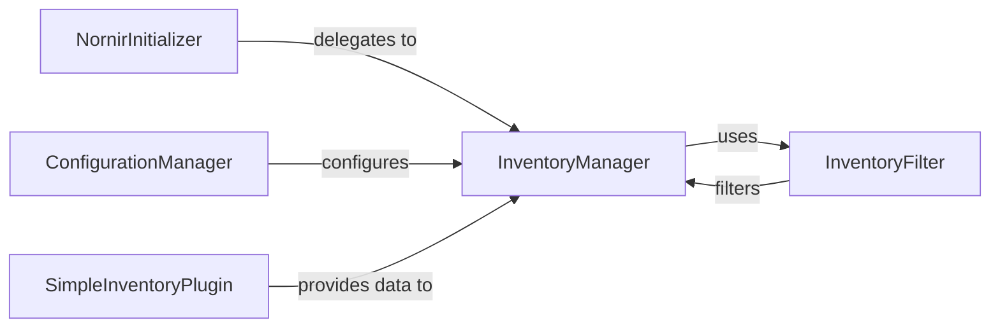

## Details

The Nornir core subsystem orchestrates network automation tasks by managing device inventory and configuration. At its heart, the `NornirInitializer` sets up the Nornir environment, delegating the crucial task of inventory management to the `InventoryManager`. The `ConfigurationManager` plays a vital role by providing essential configuration details to the `InventoryManager`, guiding how inventory data should be processed. Inventory data itself is supplied by specialized plugins, such as the `SimpleInventoryPlugin`, which feeds host and group information into the `InventoryManager`. Once the inventory is loaded, the `InventoryFilter` allows for dynamic selection of specific network devices, enabling targeted automation tasks. This structured interaction ensures a robust and flexible framework for managing and interacting with network infrastructure.

### NornirInitializer
This component is responsible for the initial setup and bootstrapping of the Nornir automation framework. It acts as the entry point for starting Nornir operations, including the crucial step of preparing and loading the network inventory by delegating this responsibility to the `InventoryManager`.

**Related Classes/Methods**: _None_

### ConfigurationManager
This component handles the loading and management of Nornir's configuration settings. It provides essential parameters and directives to other components, particularly configuring the `InventoryManager` on how to locate, parse, and manage inventory data, such as specifying inventory file paths or plugin types.

**Related Classes/Methods**: _None_

### SimpleInventoryPlugin
As a specific implementation of an inventory plugin, this component is responsible for reading and parsing inventory data from a source (e.g., a YAML or JSON file). It then transforms this raw data into a structured format suitable for Nornir's internal representation and provides it to the `InventoryManager` for integration into the overall inventory.

**Related Classes/Methods**: _None_

### InventoryManager
This component serves as the central repository and orchestrator for all network inventory data within Nornir. It is responsible for the storage, retrieval, and manipulation of hosts, groups, and their associated data (e.g., connection details, custom facts). It receives initial inventory data from `SimpleInventoryPlugin` and configuration from `ConfigurationManager`, and its setup is delegated by `NornirInitializer`. It also manages the lifecycle of connections to devices, ensuring that tasks can interact with the correct network elements.

**Related Classes/Methods**:

- <a href="https://github.com/nornir-automation/nornir/blob/main/nornir/core/inventory.py#L577-L644" target="_blank" rel="noopener noreferrer">`nornir.core.inventory.Inventory`:577-644</a>

### InventoryFilter
This component provides a flexible and programmatic mechanism to dynamically select subsets of the inventory managed by `InventoryManager`. It allows users to define complex filtering rules based on host or group attributes, supporting advanced logical operations (AND, OR, NOT) to precisely target specific network devices or groups for automation tasks.

**Related Classes/Methods**:

- <a href="https://github.com/nornir-automation/nornir/blob/main/nornir/core/filter.py#L45-L110" target="_blank" rel="noopener noreferrer">`nornir.core.filter.F`:45-110</a>

### [FAQ](https://github.com/CodeBoarding/GeneratedOnBoardings/tree/main?tab=readme-ov-file#faq)