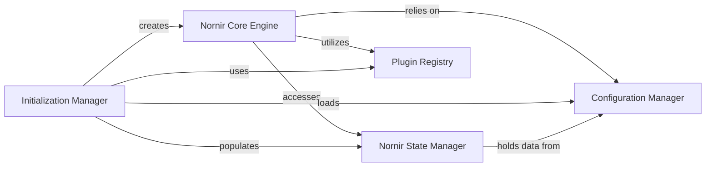

## Details

The Nornir system's core functionality revolves around the Nornir Core Engine, which serves as the central orchestrator for automation tasks. The lifecycle of the Nornir Core Engine is initiated and managed by the Initialization Manager. This manager is responsible for the initial setup, including loading configuration settings through the Configuration Manager and discovering available extensions via the Plugin Registry. During this setup, the Initialization Manager also populates the Nornir State Manager with the initial inventory and configuration data. Once initialized, the Nornir Core Engine accesses the Nornir State Manager for its operational data, relies on the Configuration Manager for various settings, and utilizes the Plugin Registry to leverage its extensible plugin architecture. The Nornir State Manager acts as a central repository for the application's mutable state, holding data influenced by the Configuration Manager and providing it to other components.

### Nornir Core Engine
The central orchestrator and primary API for users. It manages the overall workflow, task execution, and provides the interface for interacting with inventory, tasks, and runners.

**Related Classes/Methods**:

- <a href="https://github.com/nornir-automation/nornir/blob/main/nornir/core/__init__.py" target="_blank" rel="noopener noreferrer">`nornir.core.Nornir`</a>
- <a href="https://github.com/nornir-automation/nornir/blob/main/nornir/core/__init__.py" target="_blank" rel="noopener noreferrer">`nornir.core.Nornir:run`</a>

### Initialization Manager
Responsible for the initial setup and instantiation of the `Nornir` object. This includes parsing configuration, loading inventory, and preparing the environment for automation tasks. It acts as the entry point for creating a Nornir instance.

**Related Classes/Methods**:

- <a href="https://github.com/nornir-automation/nornir/blob/main/nornir/init_nornir.py#L41-L75" target="_blank" rel="noopener noreferrer">`nornir.init_nornir.InitNornir`:41-75</a>
- <a href="https://github.com/nornir-automation/nornir/blob/main/nornir/init_nornir.py" target="_blank" rel="noopener noreferrer">`nornir.init_nornir`</a>

### Nornir State Manager
Manages the global, mutable state of the Nornir application, including the active inventory and configuration. It ensures consistent access to core application data across different operations and tasks.

**Related Classes/Methods**:

- <a href="https://github.com/nornir-automation/nornir/blob/main/nornir/core/state.py" target="_blank" rel="noopener noreferrer">`nornir.core.state.NornirState`</a>

### Configuration Manager
Handles the loading, parsing, and management of Nornir's configuration settings. It provides a centralized mechanism for accessing and applying various settings related to the core, runners, inventory, and logging.

**Related Classes/Methods**:

- <a href="https://github.com/nornir-automation/nornir/blob/main/nornir/core/configuration.py#L234-L316" target="_blank" rel="noopener noreferrer">`nornir.core.configuration.Config`:234-316</a>

### Plugin Registry
Manages the registration, discovery, and loading of Nornir plugins (e.g., inventory loaders, runners, custom tasks, connection plugins). This component is crucial for the framework's extensibility and modularity, allowing users to extend functionality.

**Related Classes/Methods**:

- <a href="https://github.com/nornir-automation/nornir/blob/main/nornir/core/plugins/__init__.py" target="_blank" rel="noopener noreferrer">`nornir.core.plugins.register`</a>

### [FAQ](https://github.com/CodeBoarding/GeneratedOnBoardings/tree/main?tab=readme-ov-file#faq)