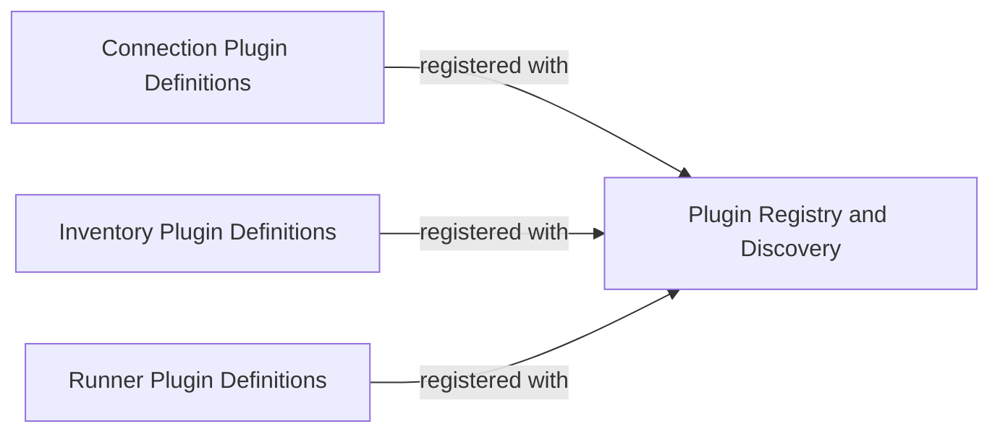

## Details

The `Plugin System` in Nornir is a crucial subsystem that embodies the framework's extensibility, allowing users to integrate custom logic for inventory management, task execution, and device connections. It adheres to the "Plugin/Extension" architectural pattern, centralizing the management and discovery of various plugin types.

### Plugin Registry and Discovery
This component is the central hub for Nornir's extensibility. It manages the registration and automatic discovery of all plugin types (inventory, runner, task, connection), ensuring they are accessible throughout the framework. It provides the mechanisms (`register`, `auto_register`) for plugins to make themselves known to the Nornir core.

**Related Classes/Methods**:

- <a href="https://github.com/nornir-automation/nornir/blob/main/nornir/core/plugins/register.py#L1-L1000" target="_blank" rel="noopener noreferrer">`nornir.core.plugins.register`:1-1000</a>

### Connection Plugin Definitions
This component defines the standardized interfaces, base classes, and potentially default implementations that all Nornir connection plugins must adhere to. These plugins are responsible for establishing, managing, and tearing down connections to network devices or other targets, abstracting the underlying communication protocols.

**Related Classes/Methods**:

- <a href="https://github.com/nornir-automation/nornir/blob/main/nornir/core/plugins/connections.py#L1-L1000" target="_blank" rel="noopener noreferrer">`nornir.core.plugins.connections`:1-1000</a>

### Inventory Plugin Definitions
This component provides the necessary interfaces and base classes for Nornir inventory plugins. These plugins are tasked with loading and managing the inventory of network devices, including host details, group memberships, and associated variables, from various data sources (e.g., files, APIs, databases).

**Related Classes/Methods**:

- <a href="https://github.com/nornir-automation/nornir/blob/main/nornir/core/plugins/inventory.py#L1-L1000" target="_blank" rel="noopener noreferrer">`nornir.core.plugins.inventory`:1-1000</a>

### Runner Plugin Definitions
This component defines the interfaces and base classes for Nornir runner plugins. These plugins dictate how tasks are executed across the inventory, controlling aspects such as concurrency, parallelism, error handling, and overall execution flow. They abstract the "how" of task execution from the "what" of the task itself.

**Related Classes/Methods**:

- <a href="https://github.com/nornir-automation/nornir/blob/main/nornir/core/plugins/runners.py#L1-L1000" target="_blank" rel="noopener noreferrer">`nornir.core.plugins.runners`:1-1000</a>

### [FAQ](https://github.com/CodeBoarding/GeneratedOnBoardings/tree/main?tab=readme-ov-file#faq)