```mermaid
graph LR
    Nornir_Core_Framework["Nornir Core Framework"]
    Configuration_Management["Configuration Management"]
    Inventory_Management["Inventory Management"]
    Task_Execution_Engine["Task Execution Engine"]
    Plugin_System["Plugin System"]
    Connection_Handlers["Connection Handlers"]
    Event_Processing["Event Processing"]
    Nornir_Core_Framework -- "Loads and applies system-wide settings" --> Configuration_Management
    Nornir_Core_Framework -- "Initializes and manages the network inventory" --> Inventory_Management
    Nornir_Core_Framework -- "Orchestrates the execution of automation tasks" --> Task_Execution_Engine
    Nornir_Core_Framework -- "Discovers and registers various Nornir plugins" --> Plugin_System
    Nornir_Core_Framework -- "Notifies registered processors about task lifecycle events" --> Event_Processing
    Configuration_Management -- "Provides configuration details for inventory loading and behavior" --> Inventory_Management
    Configuration_Management -- "Supplies connection-specific parameters (e.g., SSH settings)" --> Connection_Handlers
    Inventory_Management -- "Provides filtered host and group data for task execution" --> Task_Execution_Engine
    Inventory_Management -- "Requests the establishment and termination of connections to devices" --> Connection_Handlers
    Task_Execution_Engine -- "Executes automation logic over established connections" --> Connection_Handlers
    Task_Execution_Engine -- "Triggers callbacks at various stages of task and subtask execution" --> Event_Processing
    Task_Execution_Engine -- "Utilizes runner and task plugins to define execution behavior" --> Plugin_System
    Plugin_System -- "Provides custom inventory loading mechanisms" --> Inventory_Management
    Plugin_System -- "Supplies different connection types (e.g., SSH, Telnet)" --> Connection_Handlers
    click Nornir_Core_Framework href "https://github.com/CodeBoarding/GeneratedOnBoardings/blob/main/nornir/Nornir_Core_Framework.md" "Details"
    click Configuration_Management href "https://github.com/CodeBoarding/GeneratedOnBoardings/blob/main/nornir/Configuration_Management.md" "Details"
    click Inventory_Management href "https://github.com/CodeBoarding/GeneratedOnBoardings/blob/main/nornir/Inventory_Management.md" "Details"
    click Plugin_System href "https://github.com/CodeBoarding/GeneratedOnBoardings/blob/main/nornir/Plugin_System.md" "Details"
    click Connection_Handlers href "https://github.com/CodeBoarding/GeneratedOnBoardings/blob/main/nornir/Connection_Handlers.md" "Details"
    click Event_Processing href "https://github.com/CodeBoarding/GeneratedOnBoardings/blob/main/nornir/Event_Processing.md" "Details"
```

## Details

Nornir operates as a highly modular automation framework centered around the Nornir Core Framework. This core component initializes the system, loads operational settings from Configuration Management, and builds the network topology via Inventory Management. Once the inventory is prepared, the Nornir Core Framework orchestrates automation workflows by passing tasks to the Task Execution Engine. The Task Execution Engine leverages Connection Handlers to establish and manage connections to network devices, often utilizing various Plugin System components (e.g., inventory, runner, connection plugins) to extend its capabilities. Throughout the execution, Event Processing provides a callback mechanism for monitoring and custom logic, ensuring a flexible and extensible automation pipeline.

### Nornir Core Framework [[Expand]](./Nornir_Core_Framework.md)
The central orchestrator, responsible for initialization, state management, and coordinating workflow execution.

**Related Classes/Methods**:

- <a href="https://github.com/nornir-automation/nornir/blob/main/nornir/core/__init__.py" target="_blank" rel="noopener noreferrer">`nornir.core`</a>
- <a href="https://github.com/nornir-automation/nornir/blob/main/nornir/init_nornir.py" target="_blank" rel="noopener noreferrer">`nornir.init_nornir`</a>
- <a href="https://github.com/nornir-automation/nornir/blob/main/nornir/core/state.py" target="_blank" rel="noopener noreferrer">`nornir.core.state`</a>
- <a href="https://github.com/nornir-automation/nornir/blob/main/nornir/init_nornir.py#L41-L75" target="_blank" rel="noopener noreferrer">`nornir.init_nornir.InitNornir`:41-75</a>
- <a href="https://github.com/nornir-automation/nornir/blob/main/nornir/core/__init__.py" target="_blank" rel="noopener noreferrer">`nornir.core.Nornir`</a>
- <a href="https://github.com/nornir-automation/nornir/blob/main/nornir/core/__init__.py" target="_blank" rel="noopener noreferrer">`nornir.core.Nornir:run`</a>

### Configuration Management [[Expand]](./Configuration_Management.md)
Handles loading, parsing, and validating Nornir's operational settings.

**Related Classes/Methods**:

- <a href="https://github.com/nornir-automation/nornir/blob/main/nornir/core/configuration.py" target="_blank" rel="noopener noreferrer">`nornir.core.configuration`</a>
- <a href="https://github.com/nornir-automation/nornir/blob/main/nornir/core/configuration.py#L234-L316" target="_blank" rel="noopener noreferrer">`nornir.core.configuration.Config`:234-316</a>
- <a href="https://github.com/nornir-automation/nornir/blob/main/nornir/core/configuration.py#L70-L103" target="_blank" rel="noopener noreferrer">`nornir.core.configuration.InventoryConfig`:70-103</a>
- <a href="https://github.com/nornir-automation/nornir/blob/main/nornir/core/configuration.py#L57-L67" target="_blank" rel="noopener noreferrer">`nornir.core.configuration.SSHConfig`:57-67</a>

### Inventory Management [[Expand]](./Inventory_Management.md)
Stores, manages, and provides access to network inventory data, including filtering capabilities.

**Related Classes/Methods**:

- <a href="https://github.com/nornir-automation/nornir/blob/main/nornir/core/inventory.py" target="_blank" rel="noopener noreferrer">`nornir.core.inventory`</a>
- <a href="https://github.com/nornir-automation/nornir/blob/main/nornir/core/filter.py" target="_blank" rel="noopener noreferrer">`nornir.core.filter`</a>
- <a href="https://github.com/nornir-automation/nornir/blob/main/nornir/core/inventory.py#L577-L644" target="_blank" rel="noopener noreferrer">`nornir.core.inventory.Inventory`:577-644</a>
- <a href="https://github.com/nornir-automation/nornir/blob/main/nornir/core/inventory.py" target="_blank" rel="noopener noreferrer">`nornir.core.inventory.Inventory:filter`</a>
- <a href="https://github.com/nornir-automation/nornir/blob/main/nornir/core/inventory.py" target="_blank" rel="noopener noreferrer">`nornir.core.inventory.Host:open_connection`</a>
- <a href="https://github.com/nornir-automation/nornir/blob/main/nornir/core/inventory.py" target="_blank" rel="noopener noreferrer">`nornir.core.inventory.Host:close_connections`</a>

### Task Execution Engine
Defines the structure and execution flow for automation tasks, managing their lifecycle and results.

**Related Classes/Methods**:

- <a href="https://github.com/nornir-automation/nornir/blob/main/nornir/core/task.py" target="_blank" rel="noopener noreferrer">`nornir.core.task`</a>
- <a href="https://github.com/nornir-automation/nornir/blob/main/nornir/core/task.py" target="_blank" rel="noopener noreferrer">`nornir.core.task.Task`</a>

### Plugin System [[Expand]](./Plugin_System.md)
Manages the discovery, registration, and availability of various Nornir plugins (inventory, runner, task, connection).

**Related Classes/Methods**:

- <a href="https://github.com/nornir-automation/nornir/blob/main/nornir/core/plugins/register.py" target="_blank" rel="noopener noreferrer">`nornir.core.plugins.register`</a>
- <a href="https://github.com/nornir-automation/nornir/blob/main/nornir/core/plugins/connections.py" target="_blank" rel="noopener noreferrer">`nornir.core.plugins.connections`</a>
- <a href="https://github.com/nornir-automation/nornir/blob/main/nornir/core/plugins/inventory.py" target="_blank" rel="noopener noreferrer">`nornir.core.plugins.inventory`</a>
- <a href="https://github.com/nornir-automation/nornir/blob/main/nornir/core/plugins/runners.py" target="_blank" rel="noopener noreferrer">`nornir.core.plugins.runners`</a>

### Connection Handlers [[Expand]](./Connection_Handlers.md)
Manages the establishment, maintenance, and termination of connections to network devices.

**Related Classes/Methods**:

- <a href="https://github.com/nornir-automation/nornir/blob/main/nornir/core/inventory.py" target="_blank" rel="noopener noreferrer">`nornir.core.inventory`</a>
- <a href="https://github.com/nornir-automation/nornir/blob/main/nornir/core/plugins/connections.py" target="_blank" rel="noopener noreferrer">`nornir.core.plugins.connections`</a>
- <a href="https://github.com/nornir-automation/nornir/blob/main/nornir/core/inventory.py" target="_blank" rel="noopener noreferrer">`nornir.core.inventory.Host:open_connection`</a>
- <a href="https://github.com/nornir-automation/nornir/blob/main/nornir/core/inventory.py" target="_blank" rel="noopener noreferrer">`nornir.core.inventory.Host:close_connections`</a>

### Event Processing [[Expand]](./Event_Processing.md)
Provides a callback mechanism for custom logic to be executed at different stages of task and subtask lifecycle events.

**Related Classes/Methods**:

- <a href="https://github.com/nornir-automation/nornir/blob/main/nornir/core/processor.py" target="_blank" rel="noopener noreferrer">`nornir.core.processor`</a>
- <a href="https://github.com/nornir-automation/nornir/blob/main/nornir/core/processor.py#L7-L49" target="_blank" rel="noopener noreferrer">`nornir.core.processor.Processor`:7-49</a>

### [FAQ](https://github.com/CodeBoarding/GeneratedOnBoardings/tree/main?tab=readme-ov-file#faq)