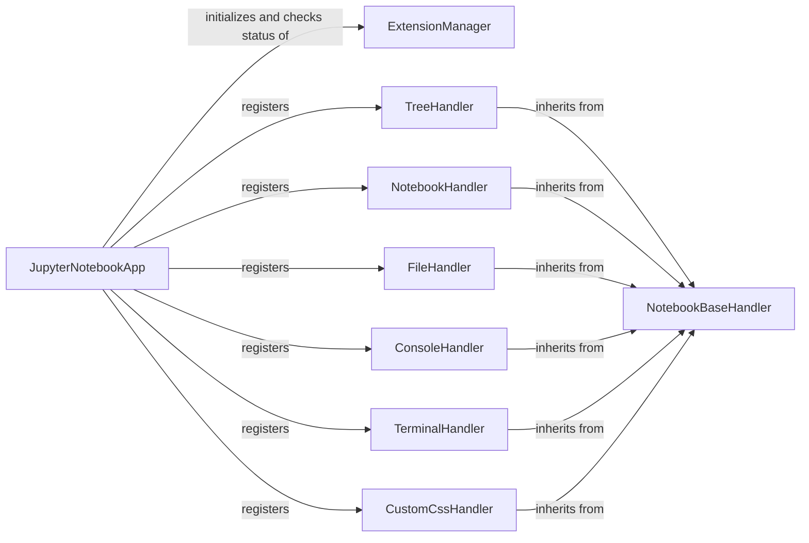

## Component Details

The Application Core subsystem, centered around `JupyterNotebookApp`, orchestrates the entire Jupyter Notebook application lifecycle. It initializes and registers various handlers for different functionalities like displaying directories (`TreeHandler`), notebooks (`NotebookHandler`), files (`FileHandler`), consoles (`ConsoleHandler`), and terminals (`TerminalHandler`), all of which inherit from `NotebookBaseHandler` for common functionalities. The `JupyterNotebookApp` also interacts with an `ExtensionManager` to check the status of server extensions and manages application-wide settings and configurations, including custom CSS through `CustomCssHandler`.

### JupyterNotebookApp
The core application class for Jupyter Notebook, responsible for initializing handlers, managing server extensions, and configuring various application settings like static directories, template directories, and user settings. It extends LabServerApp and NotebookConfigShimMixin, providing the main entry point for the notebook server.

**Related Classes/Methods**:

- <a href="https://github.com/jupyter/notebook/blob/master/notebook/app.py#L245-L363" target="_blank" rel="noopener noreferrer">`notebook.app.JupyterNotebookApp` (245:363)</a>
- <a href="https://github.com/jupyter/notebook/blob/master/notebook/app.py#L329-L359" target="_blank" rel="noopener noreferrer">`notebook.app.JupyterNotebookApp:initialize_handlers` (329:359)</a>
- <a href="https://github.com/jupyter/notebook/blob/master/notebook/app.py#L317-L327" target="_blank" rel="noopener noreferrer">`notebook.app.JupyterNotebookApp.server_extension_is_enabled` (317:327)</a>

### ExtensionManager
Manages the server extensions within the Jupyter Notebook environment. It is responsible for tracking and providing information about enabled or disabled extensions.

**Related Classes/Methods**:

- <a href="https://github.com/jupyter/notebook/blob/master/notebook/app.py#L317-L327" target="_blank" rel="noopener noreferrer">`notebook.app.JupyterNotebookApp.server_extension_is_enabled` (317:327)</a>

### NotebookBaseHandler
The base handler for all notebook API requests, providing common functionalities like retrieving page configuration and handling custom CSS settings. Other specific handlers inherit from this class.

**Related Classes/Methods**:

- <a href="https://github.com/jupyter/notebook/blob/master/notebook/app.py#L50-L130" target="_blank" rel="noopener noreferrer">`notebook.app.NotebookBaseHandler` (50:130)</a>

### TreeHandler
Handles requests for displaying directory listings and redirecting to appropriate pages for notebooks or raw files.

**Related Classes/Methods**:

- <a href="https://github.com/jupyter/notebook/blob/master/notebook/app.py#L133-L170" target="_blank" rel="noopener noreferrer">`notebook.app.TreeHandler` (133:170)</a>

### NotebookHandler
Handles requests for displaying notebook files and redirects to the tree view if the path is a directory.

**Related Classes/Methods**:

- <a href="https://github.com/jupyter/notebook/blob/master/notebook/app.py#L203-L218" target="_blank" rel="noopener noreferrer">`notebook.app.NotebookHandler` (203:218)</a>

### FileHandler
Handles requests for displaying and editing files.

**Related Classes/Methods**:

- <a href="https://github.com/jupyter/notebook/blob/master/notebook/app.py#L193-L200" target="_blank" rel="noopener noreferrer">`notebook.app.FileHandler` (193:200)</a>

### ConsoleHandler
Handles requests for displaying the console page.

**Related Classes/Methods**:

- <a href="https://github.com/jupyter/notebook/blob/master/notebook/app.py#L173-L180" target="_blank" rel="noopener noreferrer">`notebook.app.ConsoleHandler` (173:180)</a>

### TerminalHandler
Handles requests for displaying the terminal page.

**Related Classes/Methods**:

- <a href="https://github.com/jupyter/notebook/blob/master/notebook/app.py#L183-L190" target="_blank" rel="noopener noreferrer">`notebook.app.TerminalHandler` (183:190)</a>

### CustomCssHandler
Handles requests for serving custom CSS files.

**Related Classes/Methods**:

- <a href="https://github.com/jupyter/notebook/blob/master/notebook/app.py#L221-L239" target="_blank" rel="noopener noreferrer">`notebook.app.CustomCssHandler` (221:239)</a>

### [FAQ](https://github.com/CodeBoarding/GeneratedOnBoardings/tree/main?tab=readme-ov-file#faq)