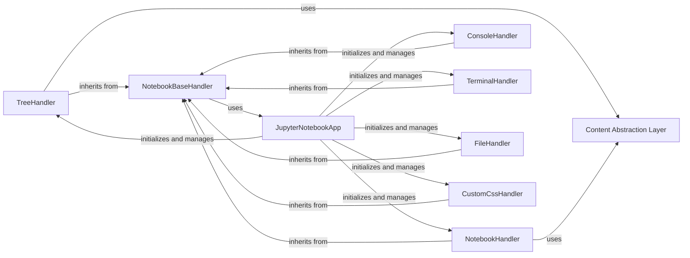

## Component Details

This subsystem provides the core web handlers for the Jupyter Notebook application, managing requests for different views such as the file tree, individual notebooks, consoles, terminals, and file editing. It leverages an abstract content layer to interact with the file system and centralizes page configuration through a base handler. The main application class initializes and orchestrates these handlers.

### Content Abstraction Layer
Offers an abstract interface for interacting with the file system and content storage, enabling handlers to check for file existence, determine types, and retrieve content without direct file system access. This is represented by the 'contents_manager' attribute used by various handlers.

**Related Classes/Methods**:

- <a href="https://github.com/jupyter/notebook/blob/master/notebook/app.py#L137-L170" target="_blank" rel="noopener noreferrer">`notebook.notebook.app.TreeHandler:get` (137:170)</a>
- <a href="https://github.com/jupyter/notebook/blob/master/notebook/app.py#L207-L218" target="_blank" rel="noopener noreferrer">`notebook.notebook.app.NotebookHandler:get` (207:218)</a>

### TreeHandler
This component is responsible for displaying the file tree, handling directory listings, and redirecting to notebook or file views based on the path.

**Related Classes/Methods**:

- <a href="https://github.com/jupyter/notebook/blob/master/notebook/app.py#L133-L170" target="_blank" rel="noopener noreferrer">`notebook.notebook.app.TreeHandler` (133:170)</a>
- <a href="https://github.com/jupyter/notebook/blob/master/notebook/app.py#L137-L170" target="_blank" rel="noopener noreferrer">`notebook.notebook.app.TreeHandler:get` (137:170)</a>

### NotebookHandler
This component is responsible for rendering the notebook page and redirecting to the tree view if the path is a directory.

**Related Classes/Methods**:

- <a href="https://github.com/jupyter/notebook/blob/master/notebook/app.py#L203-L218" target="_blank" rel="noopener noreferrer">`notebook.notebook.app.NotebookHandler` (203:218)</a>
- <a href="https://github.com/jupyter/notebook/blob/master/notebook/app.py#L207-L218" target="_blank" rel="noopener noreferrer">`notebook.notebook.app.NotebookHandler:get` (207:218)</a>

### NotebookBaseHandler
This base class provides shared methods and properties for various notebook handlers, including the get_page_config method which retrieves and constructs the page configuration data.

**Related Classes/Methods**:

- <a href="https://github.com/jupyter/notebook/blob/master/notebook/app.py#L50-L130" target="_blank" rel="noopener noreferrer">`notebook.notebook.app.NotebookBaseHandler` (50:130)</a>
- <a href="https://github.com/jupyter/notebook/blob/master/notebook/app.py#L57-L130" target="_blank" rel="noopener noreferrer">`notebook.notebook.app.NotebookBaseHandler.get_page_config` (57:130)</a>

### ConsoleHandler
Handles requests for the console page.

**Related Classes/Methods**:

- <a href="https://github.com/jupyter/notebook/blob/master/notebook/app.py#L173-L180" target="_blank" rel="noopener noreferrer">`notebook.notebook.app.ConsoleHandler` (173:180)</a>

### TerminalHandler
Handles requests for the terminal page.

**Related Classes/Methods**:

- <a href="https://github.com/jupyter/notebook/blob/master/notebook/app.py#L183-L190" target="_blank" rel="noopener noreferrer">`notebook.notebook.app.TerminalHandler` (183:190)</a>

### FileHandler
Handles requests for the file editing page.

**Related Classes/Methods**:

- <a href="https://github.com/jupyter/notebook/blob/master/notebook/app.py#L193-L200" target="_blank" rel="noopener noreferrer">`notebook.notebook.app.FileHandler` (193:200)</a>

### CustomCssHandler
Handles requests for custom CSS files.

**Related Classes/Methods**:

- <a href="https://github.com/jupyter/notebook/blob/master/notebook/app.py#L221-L239" target="_blank" rel="noopener noreferrer">`notebook.notebook.app.CustomCssHandler` (221:239)</a>

### JupyterNotebookApp
The main application class for Jupyter Notebook, responsible for initializing handlers, managing server extensions, and configuring the application.

**Related Classes/Methods**:

- <a href="https://github.com/jupyter/notebook/blob/master/notebook/app.py#L245-L363" target="_blank" rel="noopener noreferrer">`notebook.notebook.app.JupyterNotebookApp` (245:363)</a>

### [FAQ](https://github.com/CodeBoarding/GeneratedOnBoardings/tree/main?tab=readme-ov-file#faq)