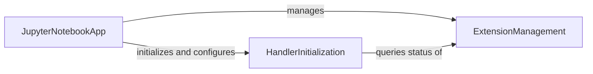

## Component Details

This graph illustrates the core components and their interactions within the Jupyter Notebook application, focusing on how the `JupyterNotebookApp` manages various aspects of the server, including handler initialization and extension management. The `JupyterNotebookApp` acts as the central orchestrator, initializing request handlers through `HandlerInitialization` and querying the status of server extensions via `ExtensionManagement`. The `HandlerInitialization` component, in turn, relies on `ExtensionManagement` to determine which functionalities are enabled, particularly for features like 'nbclassic'. The overall flow ensures that the application correctly routes requests and activates the appropriate server extensions based on their enabled status.

### JupyterNotebookApp
The main application class for the Jupyter Notebook server, providing core functionalities including managing the notebook environment, handling requests, serving static files, and managing extensions.

**Related Classes/Methods**:

- <a href="https://github.com/jupyter/notebook/blob/master/notebook/app.py#L245-L363" target="_blank" rel="noopener noreferrer">`notebook.app.JupyterNotebookApp` (245:363)</a>

### HandlerInitialization
Manages the initialization and setup of various request handlers within the Jupyter Notebook application, routing different functionalities like file tree, notebooks, and terminals.

**Related Classes/Methods**:

- <a href="https://github.com/jupyter/notebook/blob/master/notebook/app.py#L329-L359" target="_blank" rel="noopener noreferrer">`notebook.app.JupyterNotebookApp:initialize_handlers` (329:359)</a>

### ExtensionManagement
Handles the querying and management of server extension statuses, enabling the core application to determine and activate integrated functionalities.

**Related Classes/Methods**:

- <a href="https://github.com/jupyter/notebook/blob/master/notebook/app.py#L317-L327" target="_blank" rel="noopener noreferrer">`notebook.app.JupyterNotebookApp:server_extension_is_enabled` (317:327)</a>

### [FAQ](https://github.com/CodeBoarding/GeneratedOnBoardings/tree/main?tab=readme-ov-file#faq)