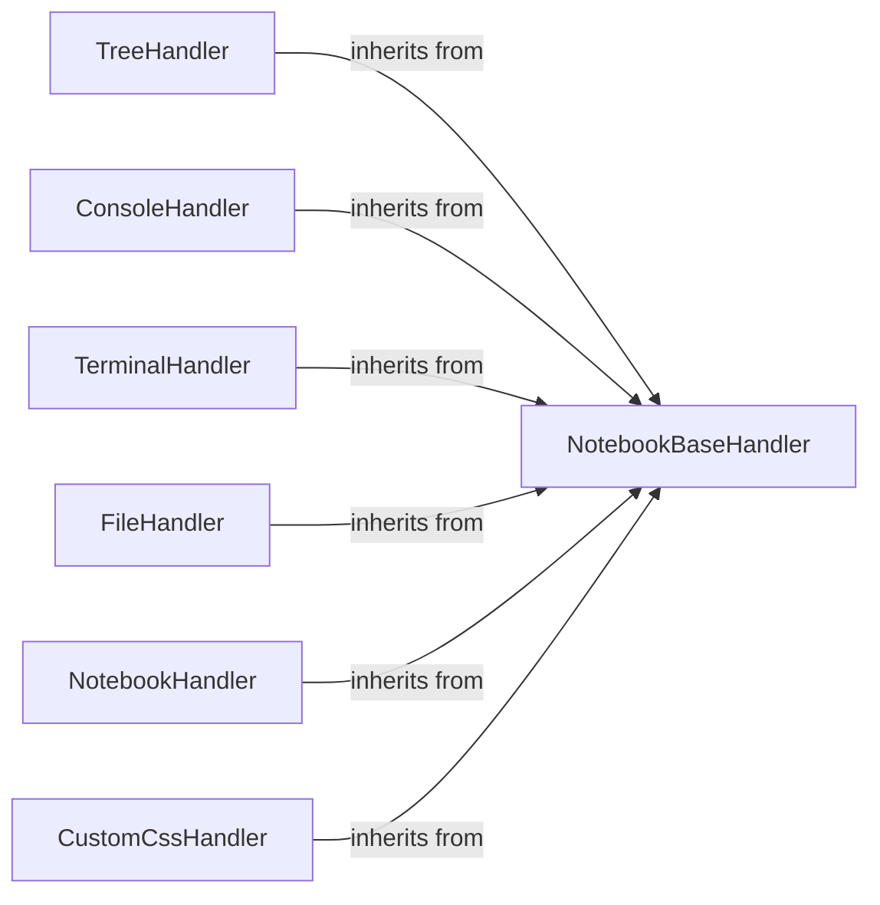

## Component Details

This graph illustrates the core web handlers within the Jupyter Notebook application, all of which inherit from the `NotebookBaseHandler`. The `NotebookBaseHandler` provides essential page configuration data, ensuring consistency across different views. Specialized handlers like `TreeHandler`, `ConsoleHandler`, `TerminalHandler`, `FileHandler`, `NotebookHandler`, and `CustomCssHandler` extend this base functionality to serve specific pages such as file listings, interactive consoles, terminals, file editors, notebook interfaces, and custom CSS, respectively. The main flow involves client requests being routed to the appropriate handler, which then utilizes the base configuration to render the relevant HTML template.

### NotebookBaseHandler
The NotebookBaseHandler serves as the foundational component for all page handlers within the Jupyter Notebook application. It provides common functionalities such as retrieving page configuration data, which includes application version, base URL, terminal availability, and various other settings crucial for rendering the web interface. This handler ensures a consistent and centralized approach to managing page-specific configurations across different parts of the application.

**Related Classes/Methods**:

- <a href="https://github.com/jupyter/notebook/blob/master/notebook/app.py#L50-L130" target="_blank" rel="noopener noreferrer">`notebook.notebook.app.NotebookBaseHandler` (50:130)</a>
- <a href="https://github.com/jupyter/notebook/blob/master/notebook/app.py#L57-L130" target="_blank" rel="noopener noreferrer">`notebook.notebook.app.NotebookBaseHandler:get_page_config` (57:130)</a>

### TreeHandler
The TreeHandler is responsible for displaying the file and directory listing within the Jupyter Notebook application. It handles requests for the root directory or any subdirectories, presenting a navigable view of the user's files. If the requested path is a directory, it renders the 'tree.html' template; otherwise, it redirects to the appropriate handler for notebooks or raw files.

**Related Classes/Methods**:

- <a href="https://github.com/jupyter/notebook/blob/master/notebook/app.py#L133-L170" target="_blank" rel="noopener noreferrer">`notebook.notebook.app.TreeHandler` (133:170)</a>
- <a href="https://github.com/jupyter/notebook/blob/master/notebook/app.py#L137-L170" target="_blank" rel="noopener noreferrer">`notebook.notebook.app.TreeHandler:get` (137:170)</a>

### ConsoleHandler
The ConsoleHandler manages the display of the console page in the Jupyter Notebook application. It is responsible for rendering the 'consoles.html' template, providing an interactive console environment for users.

**Related Classes/Methods**:

- <a href="https://github.com/jupyter/notebook/blob/master/notebook/app.py#L173-L180" target="_blank" rel="noopener noreferrer">`notebook.notebook.app.ConsoleHandler` (173:180)</a>
- <a href="https://github.com/jupyter/notebook/blob/master/notebook/app.py#L177-L180" target="_blank" rel="noopener noreferrer">`notebook.notebook.app.ConsoleHandler:get` (177:180)</a>

### TerminalHandler
The TerminalHandler is dedicated to serving the terminal page within the Jupyter Notebook application. It renders the 'terminals.html' template, allowing users to access and interact with a terminal environment directly from their web browser.

**Related Classes/Methods**:

- <a href="https://github.com/jupyter/notebook/blob/master/notebook/app.py#L183-L190" target="_blank" rel="noopener noreferrer">`notebook.notebook.app.TerminalHandler` (183:190)</a>
- <a href="https://github.com/jupyter/notebook/blob/master/notebook/app.py#L187-L190" target="_blank" rel="noopener noreferrer">`notebook.notebook.app.TerminalHandler:get` (187:190)</a>

### FileHandler
The FileHandler is responsible for displaying and editing individual files within the Jupyter Notebook application. It renders the 'edit.html' template, providing an interface for users to view and modify file content.

**Related Classes/Methods**:

- <a href="https://github.com/jupyter/notebook/blob/master/notebook/app.py#L193-L200" target="_blank" rel="noopener noreferrer">`notebook.notebook.app.FileHandler` (193:200)</a>
- <a href="https://github.com/jupyter/notebook/blob/master/notebook/app.py#L197-L200" target="_blank" rel="noopener noreferrer">`notebook.notebook.app.FileHandler:get` (197:200)</a>

### NotebookHandler
The NotebookHandler specifically manages the display of Jupyter notebooks. It handles requests for notebook files, rendering the 'notebooks.html' template to provide the interactive notebook interface. If the requested path is a directory, it redirects to the TreeHandler.

**Related Classes/Methods**:

- <a href="https://github.com/jupyter/notebook/blob/master/notebook/app.py#L203-L218" target="_blank" rel="noopener noreferrer">`notebook.notebook.app.NotebookHandler` (203:218)</a>
- <a href="https://github.com/jupyter/notebook/blob/master/notebook/app.py#L207-L218" target="_blank" rel="noopener noreferrer">`notebook.notebook.app.NotebookHandler:get` (207:218)</a>

### CustomCssHandler
The CustomCssHandler is responsible for serving custom CSS files to the Jupyter Notebook application. It retrieves the custom CSS file based on the application's configuration and delivers it to the client, allowing for personalized styling of the user interface.

**Related Classes/Methods**:

- <a href="https://github.com/jupyter/notebook/blob/master/notebook/app.py#L221-L239" target="_blank" rel="noopener noreferrer">`notebook.notebook.app.CustomCssHandler` (221:239)</a>
- <a href="https://github.com/jupyter/notebook/blob/master/notebook/app.py#L225-L239" target="_blank" rel="noopener noreferrer">`notebook.notebook.app.CustomCssHandler:get` (225:239)</a>

### [FAQ](https://github.com/CodeBoarding/GeneratedOnBoardings/tree/main?tab=readme-ov-file#faq)