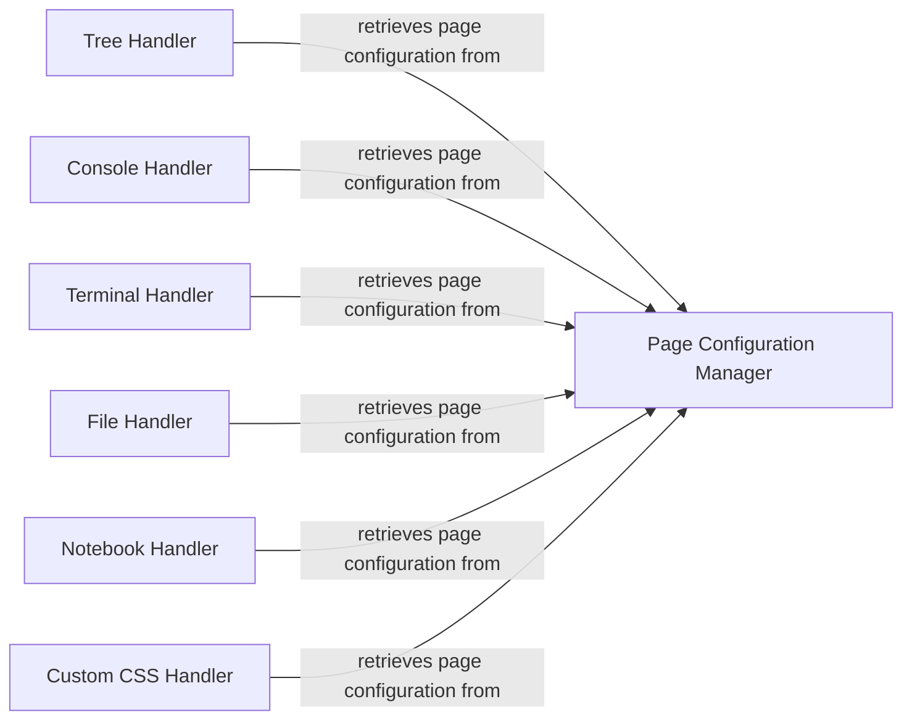

## Component Details

The Web Request Handling subsystem is responsible for managing all incoming HTTP requests and serving various types of content within the Jupyter Notebook application. It dispatches requests to specific handlers based on the URL path, which then process the request, retrieve necessary configuration data, and render the appropriate HTML templates or serve files. The core flow involves a handler receiving a request, consulting the Page Configuration Manager for page-specific settings, and then rendering the view.

### Page Configuration Manager
This component is responsible for generating and providing the page configuration data that is utilized by various handlers within the notebook application. It gathers settings, application details, and environment-specific information to construct a comprehensive configuration object for the frontend.

**Related Classes/Methods**:

- <a href="https://github.com/jupyter/notebook/blob/master/notebook/app.py#L57-L130" target="_blank" rel="noopener noreferrer">`notebook.notebook.app.NotebookBaseHandler:get_page_config` (57:130)</a>
- <a href="https://github.com/jupyter/notebook/blob/master/notebook/app.py#L50-L130" target="_blank" rel="noopener noreferrer">`notebook.notebook.app.NotebookBaseHandler` (50:130)</a>

### Tree Handler
This component manages requests for the file tree view, displaying directory listings, and redirecting to appropriate pages for notebooks or raw files based on the requested path.

**Related Classes/Methods**:

- <a href="https://github.com/jupyter/notebook/blob/master/notebook/app.py#L137-L170" target="_blank" rel="noopener noreferrer">`notebook.notebook.app.TreeHandler:get` (137:170)</a>
- <a href="https://github.com/jupyter/notebook/blob/master/notebook/app.py#L133-L170" target="_blank" rel="noopener noreferrer">`notebook.notebook.app.TreeHandler` (133:170)</a>

### Console Handler
This component is responsible for serving the console page, allowing users to interact with a console environment.

**Related Classes/Methods**:

- <a href="https://github.com/jupyter/notebook/blob/master/notebook/app.py#L177-L180" target="_blank" rel="noopener noreferrer">`notebook.notebook.app.ConsoleHandler:get` (177:180)</a>
- <a href="https://github.com/jupyter/notebook/blob/master/notebook/app.py#L173-L180" target="_blank" rel="noopener noreferrer">`notebook.notebook.app.ConsoleHandler` (173:180)</a>

### Terminal Handler
This component handles requests for the terminal page, providing access to a terminal environment within the notebook application.

**Related Classes/Methods**:

- <a href="https://github.com/jupyter/notebook/blob/master/notebook/app.py#L187-L190" target="_blank" rel="noopener noreferrer">`notebook.notebook.app.TerminalHandler:get` (187:190)</a>
- <a href="https://github.com/jupyter/notebook/blob/master/notebook/app.py#L183-L190" target="_blank" rel="noopener noreferrer">`notebook.notebook.app.TerminalHandler` (183:190)</a>

### File Handler
This component manages requests for editing files, serving the appropriate page for file content manipulation.

**Related Classes/Methods**:

- <a href="https://github.com/jupyter/notebook/blob/master/notebook/app.py#L197-L200" target="_blank" rel="noopener noreferrer">`notebook.notebook.app.FileHandler:get` (197:200)</a>
- <a href="https://github.com/jupyter/notebook/blob/master/notebook/app.py#L193-L200" target="_blank" rel="noopener noreferrer">`notebook.notebook.app.FileHandler` (193:200)</a>

### Notebook Handler
This component is responsible for serving notebook documents, handling requests for notebook pages and redirecting if the path refers to a directory.

**Related Classes/Methods**:

- <a href="https://github.com/jupyter/notebook/blob/master/notebook/app.py#L207-L218" target="_blank" rel="noopener noreferrer">`notebook.notebook.app.NotebookHandler:get` (207:218)</a>
- <a href="https://github.com/jupyter/notebook/blob/master/notebook/app.py#L203-L218" target="_blank" rel="noopener noreferrer">`notebook.notebook.app.NotebookHandler` (203:218)</a>

### Custom CSS Handler
This component handles requests for custom CSS files, allowing the application to load user-defined styles.

**Related Classes/Methods**:

- <a href="https://github.com/jupyter/notebook/blob/master/notebook/app.py#L225-L239" target="_blank" rel="noopener noreferrer">`notebook.notebook.app.CustomCssHandler:get` (225:239)</a>
- <a href="https://github.com/jupyter/notebook/blob/master/notebook/app.py#L221-L239" target="_blank" rel="noopener noreferrer">`notebook.notebook.app.CustomCssHandler` (221:239)</a>

### [FAQ](https://github.com/CodeBoarding/GeneratedOnBoardings/tree/main?tab=readme-ov-file#faq)