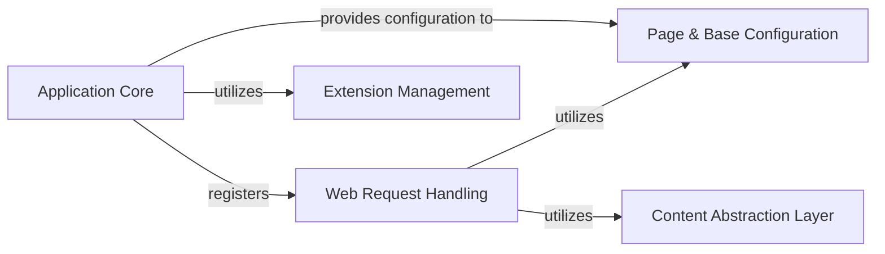

## Component Details

The Jupyter Notebook application's architecture is centered around serving dynamic web content and managing user interactions. The Application Core initializes the server and registers various Web Request Handlers, which process specific HTTP requests for files, notebooks, terminals, and consoles. These handlers rely on a Page & Base Configuration service for common settings and a Content Abstraction Layer for file system interactions. The Application Core also integrates with an Extension Management component to handle server extensions, ensuring a modular and extensible system.

### Application Core
The central orchestrator of the Jupyter Notebook application, responsible for its overall lifecycle, including server initialization, handler registration, and managing application-wide settings and extensions.

**Related Classes/Methods**:

- <a href="https://github.com/jupyter/notebook/blob/master/notebook/app.py#L245-L363" target="_blank" rel="noopener noreferrer">`notebook.notebook.app.JupyterNotebookApp` (245:363)</a>
- <a href="https://github.com/jupyter/notebook/blob/master/notebook/app.py#L329-L359" target="_blank" rel="noopener noreferrer">`notebook.notebook.app.JupyterNotebookApp:initialize_handlers` (329:359)</a>
- <a href="https://github.com/jupyter/notebook/blob/master/notebook/app.py#L317-L327" target="_blank" rel="noopener noreferrer">`notebook.notebook.app.JupyterNotebookApp.server_extension_is_enabled` (317:327)</a>

### Web Request Handling
Manages all incoming HTTP requests, processing them to serve various types of content such as file listings, console interfaces, terminal sessions, individual files, notebooks, and custom CSS.

**Related Classes/Methods**:

- <a href="https://github.com/jupyter/notebook/blob/master/notebook/app.py#L137-L170" target="_blank" rel="noopener noreferrer">`notebook.notebook.app.TreeHandler:get` (137:170)</a>
- <a href="https://github.com/jupyter/notebook/blob/master/notebook/app.py#L177-L180" target="_blank" rel="noopener noreferrer">`notebook.notebook.app.ConsoleHandler:get` (177:180)</a>
- <a href="https://github.com/jupyter/notebook/blob/master/notebook/app.py#L187-L190" target="_blank" rel="noopener noreferrer">`notebook.notebook.app.TerminalHandler:get` (187:190)</a>
- <a href="https://github.com/jupyter/notebook/blob/master/notebook/app.py#L197-L200" target="_blank" rel="noopener noreferrer">`notebook.notebook.app.FileHandler:get` (197:200)</a>
- <a href="https://github.com/jupyter/notebook/blob/master/notebook/app.py#L207-L218" target="_blank" rel="noopener noreferrer">`notebook.notebook.app.NotebookHandler:get` (207:218)</a>
- <a href="https://github.com/jupyter/notebook/blob/master/notebook/app.py#L225-L239" target="_blank" rel="noopener noreferrer">`notebook.notebook.app.CustomCssHandler:get` (225:239)</a>

### Page & Base Configuration
Provides foundational utilities and dynamically generated configuration data required by web handlers to render their respective pages, centralizing shared logic and settings.

**Related Classes/Methods**:

- <a href="https://github.com/jupyter/notebook/blob/master/notebook/app.py#L57-L130" target="_blank" rel="noopener noreferrer">`notebook.notebook.app.NotebookBaseHandler.get_page_config` (57:130)</a>

### Content Abstraction Layer
Offers an abstract interface for interacting with the file system and content storage, enabling handlers to check for file existence, determine types, and retrieve content without direct file system access.

**Related Classes/Methods**:

- <a href="https://github.com/jupyter/notebook/blob/master/notebook/app.py#L137-L170" target="_blank" rel="noopener noreferrer">`notebook.notebook.app.TreeHandler:get` (137:170)</a>
- <a href="https://github.com/jupyter/notebook/blob/master/notebook/app.py#L207-L218" target="_blank" rel="noopener noreferrer">`notebook.notebook.app.NotebookHandler:get` (207:218)</a>

### Extension Management
Responsible for querying and managing the status of various server extensions integrated with the Jupyter Notebook application, allowing the core to determine enabled functionalities.

**Related Classes/Methods**:

- <a href="https://github.com/jupyter/notebook/blob/master/notebook/app.py#L317-L327" target="_blank" rel="noopener noreferrer">`notebook.notebook.app.JupyterNotebookApp.server_extension_is_enabled` (317:327)</a>

### [FAQ](https://github.com/CodeBoarding/GeneratedOnBoardings/tree/main?tab=readme-ov-file#faq)