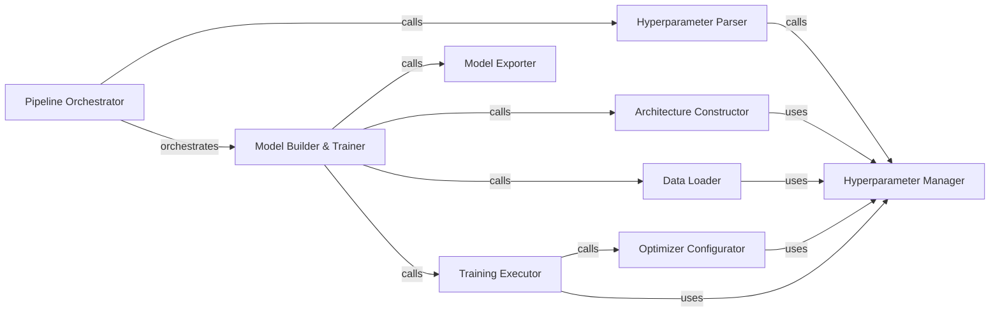

## Details

The `nsfw_model` training pipeline is orchestrated by the `Pipeline Orchestrator`, which initiates the entire process. It first directs the `Hyperparameter Parser` to load configuration settings, which are then managed by the `Hyperparameter Manager`. The `Model Builder & Trainer` acts as a central hub, coordinating the `Data Loader` for data preparation, the `Architecture Constructor` for model definition, and the `Training Executor` for the actual training process. The `Optimizer Configurator` is utilized by the `Training Executor` to set up the optimization algorithm. Finally, the `Model Exporter` handles saving the trained model in various deployable formats. The `Hyperparameter Manager` serves as a central repository, providing configuration parameters to the `Architecture Constructor`, `Data Loader`, `Training Executor`, and `Optimizer Configurator`.

### Pipeline Orchestrator
The primary entry point and coordinator for the entire model training process. It sequences and manages the execution of all other pipeline components.

**Related Classes/Methods**:

- <a href="https://github.com/GantMan/nsfw_model/blob/master/training/make_nsfw_model.py#L237-L306" target="_blank" rel="noopener noreferrer">`training.make_nsfw_model.main`:237-306</a>

### Hyperparameter Manager
Centralizes and provides access to all configurable parameters (hyperparameters) required for model training, ensuring consistency across the pipeline.

**Related Classes/Methods**:

- <a href="https://github.com/GantMan/nsfw_model/blob/master/training/make_nsfw_model_lib.py" target="_blank" rel="noopener noreferrer">`training.make_nsfw_model_lib.HParams`</a>
- <a href="https://github.com/GantMan/nsfw_model/blob/master/training/make_nsfw_model_lib.py#L136-L161" target="_blank" rel="noopener noreferrer">`training.make_nsfw_model_lib.get_default_hparams`:136-161</a>

### Hyperparameter Parser
Responsible for parsing external configuration inputs (e.g., command-line arguments) and populating the HParams object for use by the training pipeline.

**Related Classes/Methods**:

- <a href="https://github.com/GantMan/nsfw_model/blob/master/training/make_nsfw_model.py#L176-L201" target="_blank" rel="noopener noreferrer">`training.make_nsfw_model._get_hparams_from_flags`:176-201</a>

### Data Loader
Handles the efficient loading, preprocessing, and augmentation of image datasets, preparing them for consumption by the model training process.

**Related Classes/Methods**:

- <a href="https://github.com/GantMan/nsfw_model/blob/master/training/make_nsfw_model_lib.py#L164-L221" target="_blank" rel="noopener noreferrer">`training.make_nsfw_model_lib._get_data_with_keras`:164-221</a>

### Architecture Constructor
Defines and constructs the neural network architecture, potentially leveraging pre-trained base models (e.g., Inception V3, MobileNet V2) and adding custom layers for classification.

**Related Classes/Methods**:

- <a href="https://github.com/GantMan/nsfw_model/blob/master/training/make_nsfw_model_lib.py#L269-L306" target="_blank" rel="noopener noreferrer">`training.make_nsfw_model_lib.build_model`:269-306</a>

### Training Executor
Executes the core iterative training loop, managing epochs, batches, forward and backward passes, and loss calculation. It also handles the setup of the optimization algorithm.

**Related Classes/Methods**:

- <a href="https://github.com/GantMan/nsfw_model/blob/master/training/make_nsfw_model_lib.py#L485-L555" target="_blank" rel="noopener noreferrer">`training.make_nsfw_model_lib.make_image_classifier`:485-555</a>

### Model Exporter
Responsible for converting the trained Keras model into a deployable format, such as a TensorFlow frozen graph, suitable for inference engines.

**Related Classes/Methods**:

- <a href="https://github.com/GantMan/nsfw_model/blob/master/training/make_nsfw_model.py#L237-L306" target="_blank" rel="noopener noreferrer">`training.make_nsfw_model.main`:237-306</a>

### Model Builder & Trainer
A high-level component that orchestrates the sequential steps of model construction, data preparation, training execution, and initial evaluation. It acts as a facade for the core training logic, coordinating the `Architecture Constructor`, `Data Loader`, `Training Executor`, and `Model Exporter`.

**Related Classes/Methods**:

- <a href="https://github.com/GantMan/nsfw_model/blob/master/training/make_nsfw_model_lib.py#L485-L555" target="_blank" rel="noopener noreferrer">`training.make_nsfw_model_lib.make_image_classifier`:485-555</a>

### Optimizer Configurator
Configures the optimization algorithm for model training.

**Related Classes/Methods**:

- <a href="https://github.com/GantMan/nsfw_model/blob/master/training/make_nsfw_model_lib.py#L72-L112" target="_blank" rel="noopener noreferrer">`training.make_nsfw_model_lib.configure_optimizer`:72-112</a>

### [FAQ](https://github.com/CodeBoarding/GeneratedOnBoardings/tree/main?tab=readme-ov-file#faq)